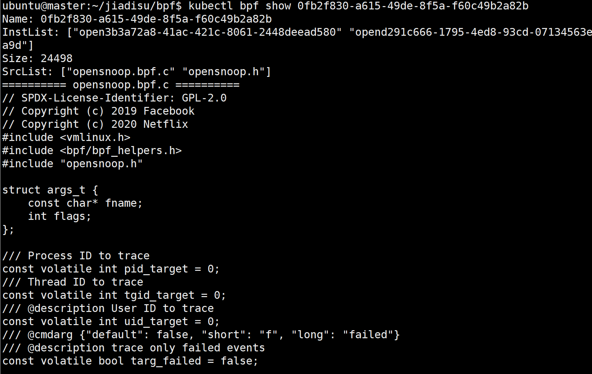

# proj205技术文档
- 赛题：[基于 Kubernetes 的云原生 eBPF 程序编排和部署框架](https://github.com/oscomp/proj205-eBPF-K8S)
- 队名：不当炮灰
- 成员：苏佳迪、王兆瀚、张涵星
- 学校：复旦大学

## 目录

- [目标描述与完成情况](#目标描述与完成情况)
    - [目标描述](#目标描述)
    - [完成情况](#完成情况)
- [项目概述](#项目概述)
- 项目时间线
    - 整体进展
    - 关键进展
    - 进度详情
- 仓库目录说明
- 结构设计
    - BPF抽象概念
    - Kubernetes资源
    - 文件路径
    - 文件结构设计
- 关键逻辑设计
    - 编译与运行BPF
    - 启动逻辑
        - 创建package + 编译
        - 挂载
        - 创建instance + 运行
- 运行与效果
    - 编译运行
    - 指令说明
    - 运行示例
- 项目优点
    - CICD与TDD
    - 高质量编码
    - 类容器化体验
- 遇到的问题与解决
    - 设计上的问题
        - 编译运行BPF的过程
        - 集群中BPF相关资源的管理
        - 指令实现相关的问题
    - 运行环境上的问题

- 参赛体会

## 目标描述与完成情况<a name="目标描述与完成情况"></a>

#### 目标描述<a name="目标描述"></a>

- 设计并实现一个基于 Kubernetes 的 eBPF 开发与部署框架，支持高效的 eBPF 程序管理和部署，包括程序的安装、动态加载、升级和回滚，提供类容器化的使用体验；
- 在此框架之上，构建一个专注于可观测性、网络、或者安全等方面的示例应用系统
- 支持在用户态或内核态运行eBPF程序
- 探索将 eBPF 与 WebAssembly（Wasm）结合的可能性，以改进eBPF程序的开发与部署体验。例如使用 wasm-bpf （https://github.com/eunomia-bpf/wasm-bpf）框架和 WASM 轻量级容器辅助 eBPF 程序开发，并借助 WASM 的沙箱和轻量级特性，在边缘端部署，或作为其他应用的插件动态加载。

#### 完成情况<a name="完成情况"></a>

在上述目标下，完成了基于Kubernetes的ebpf开发部署框架的开发，支持高效便捷地分发、加载、更新eBPF程序实例，提供了类容器化的体验，由于时间紧后续网络应用系统与Wasm结合并未完成。

## 项目概述<a name="项目概述"></a>

目标：在K8S集群上编排部署ebpf

成果形式：kubectl插件

依赖项目：eunomia-bpf（ecc与ecli）

参考项目：kubectl-trace（K8S集群上部署bpftrace）

基本功能：提供编译分发功能，将编写好的bpf.c编译构建到不同的Node上执行；抽象出package概念，提供类容器化体验；

## 项目时间线

#### 整体进展

自4月1日确定参赛选题以来，我们按照如下时间安排进行项目进入的开展与推进：

4月1日至4月16日：学习Kubernetes的知识与使用，并输出笔记文档

4月17日至5月7日：学习eBPF相关知识，并输出笔记文档

5月8日至5月13日：讨论ebpf与k8s的结合思路，并整理出项目结构的初步思路

5月14日至5月16日：学习Golang基础开发、学习Client-go提供的Kubenertes接口、利用cobra-cli脚手架初始化项目结构

5月16日至5月19日：完成镜像的打包，并构建kubenertes集群，在集群中配置需要的开发环境

5月20日至5月24日：第一次迭代，使用Golang完成通过master结点编译分发BPF到node的过程

5月25日至5月31日：第二次迭代，使用Golang完成run，list，delete和log指令的开发，提供对BPF实例的操作指令

6月1日至6月5日：第三次迭代，在原有的基础上抽象出package的对象，实现基于bpf instance与bpf package抽象的容器化操作

6月6日：整理项目，去除硬编码，添加初始化配置脚本，并进行最终测试

6月7日：整理文档并提交

#### 关键进展

- 5月13日：整理出分发部署的[初步思路](./doc/note/Su/初步思路.md)，将分发的过程分为compile、mount与run三个过程，三个过程分别使用Kubernetes的三种资源：Job、config-map与pod完成；
- 5月19日：完成一切开发环境的配置，包括Kubenertes集群搭建；compile与run的过程中需要用到的docker image；基于Cobra的Golang项目初始化
- 5月24日：使用Golang完成BPF程序的编译与分发过程
- 6月5日：参考docker image完成package的抽象，将已有的编译产物缓存并通过文件系统管理，为用户提供类容器化的体验

#### 进度详情

具体进展与遇到的问题，见[log目录](./doc/log)

学习笔记见[note目录](./doc/note)

## 仓库目录说明

仓库目录如下：

```bash
.
├── LICENSE
├── README.md
├── doc
│   ├── containers							# compile与run需要用到的镜像
│   ├── imgs								# 图片
│   ├── log									# 各个成员开发日志
│   ├── note								# 各个成员学习笔记
│   ├── 会议记录.md								# 会议记录
│   ├── 开发指南.md								# 基于Cobra与client-go的开发指南
│   ├── 时间安排.md								# 项目时间安排（已不维护，见每次会议记录）
│   └── 连接集群.md								# 连接集群指南
├── init
│   └── init.sh								# 初始化脚本
└── src										# 项目源码
    ├── LICENSE
    ├── cmd									# 实现的命令行指令
    ├── bpf									# 与bpf管理相关代码
    ├── kube								# Kubernetes接口
    ├── test								# 部分单元测试
    ├── go.mod
    ├── go.sum
    └── main.go								# 入口函数
```

## 结构设计

#### BPF抽象概念

1. bpf source file：bpf源代码
2. bpf instance：一个运行着的bpf-runner进程，key为instance name
3. bpf package：一个可以启动bpf instance的模板，包含src与编译产物，key为package name

#### Kubenerete资源

1. compiler-job：Kubernetes中执行bpf编译的Job控制器
2. runner-pod：Kubernetes中运行bpf的Pod实例
3. package-config-map：Kubernetes中挂载package数据使runner-pod读取的config-map
4. bpf-namespace：实现Kubernetes中资源隔离时设置的namespace

上述两部分图解如下：


#### 文件路径

1. bpf-home：control-plane上托管Kubnernetes集群bpf程序管理信息的根目录，设置为`~/.kube/bpf`
2. bpf-instance-home：托管Kubnernetes集群bpf instance的根目录，设置为`~/.kube/bpf/instances`
3. bpf-package-home：托管Kubnernetes集群bpf package的根目录，设置为`~/.kube/bpf/packages`

#### 文件结构设计

为避免对数据库的依赖，在控制结点上通过系统本身的文件系统实现bpf信息管理的持久化，基于上述的提到概念并参考Linux系统本身对proc的管理结构，文件结构设计如下：

在`BPF_INSTANCE_HOME`目录下管理所有正在运行的bpf instance，用instance name命名对应的文件夹便于直接寻址；每个instance目录下管理了一个名为package的链接文件，链接到了其依赖的bpf package目录；

在`BPF_PACKAGE_HOME`目录下管理所有被保存的bpf package，同样用package name命名对应的文件夹便于直接寻址；每个package目录下管理了三个文件：

- SRC_FILE：普通文件，该package对应bpf程序的源代码名
- DATA_DIR：目录文件，目录下管理了bpf源代码文件与编译产物（package.json）
- INSTANCES_DIR：目录文件，目录下管理了该package启动的所有instance（采取symbolic link的方式链接到对应的instance目录）

上述结构图解如下：


## 关键逻辑设计

#### 编译与运行BPF

本项目对BPF的编译与运行处理基于eunomia-bpf框架，采用ecc指令进行编译；采用ecli指令进行BPF的执行。

为了契合Kubernetes集群这一分发环境，将ecc与ecli（即编译与执行）分别打成镜像并上传到docker hub以供集群拉取使用，通过镜像启动容器并完成对应的任务。

#### 启动逻辑

本项目为用户提供run指令以供运行bpf instance，以opensnoop.bpf.c为例，它的执行分为以下几个步骤：创建package、编译、挂载、创建instance、运行。

其中，创建package与编译应该作为一个**原子操作**；创建instance与运行应该作为一个**原子操作**；

##### 创建package + 编译

基于上述的文件结构，在`BPF_PACKAGE_HOME`下创建package对应的管理信息，然后启动compile-job启动编译过程，job的核心点有两个：

- ecc镜像的使用；
- HostPath的挂载；（一方面避免污染用户路径，另一方面便于后续挂载，这里直接挂载刚刚创建的package/data到pod）

部分代码如下：

```go
// 挂载BPF_PACKAGE_HOME + package_name + "/" + DATA_DIR_NAME到volume
Volumes: []apiv1.Volume{
    {
        Name: "bpf-data",
        VolumeSource: apiv1.VolumeSource{
            HostPath: &apiv1.HostPathVolumeSource{
                Path: BPF_PACKAGE_HOME + package_name + "/" + DATA_DIR_NAME,
                Type: &hostpathdirectory,
            },
        },
    },
},
```

编译失败的处理：

上面提到，创建package与编译应该作为一个**原子操作**，若package创建完成后编译失败，则需要将已经创建的package卸载掉，以保证整个操作的原子性，这部分逻辑通过监控Job的状态来实现，启动Job后并不直接返回，而是直到Job的状态转换为Completed或Failed再返回，若转为Failed则启动清理package的过程，然后结束该指令，这部分代码如下：

```go
for {
    if kube.JobCompleted(BPF_NAMESPACE, package_name) {
        break
    }
    if kube.JobFailed(BPF_NAMESPACE, package_name) {
        fmt.Println("compile failed")
        // 手动删除job
        kube.JobDelete(BPF_NAMESPACE, package_name)
        // 回收已创建的package文件
        PackageDelete(package_name, false)
        return BPF_EMPTY_PACKAGE_NAME
    }
}
```

##### 挂载

挂载完成了使BPF数据在集群中全局可见的过程，由于源代码与编译产物都只存在控制平面结点上，因此想要在node上成功启动Runner-Pod必须保证编译产物对其可见，本项目中通过挂载config-map实现：

```go
// 将package的data部分挂载到config map以供后续运行
// cm的名称与package的名称一致
func MountPackageByConfigMap(package_name string) {
	kube.ConfigMapCreate(package_name, BPF_NAMESPACE, BPF_PACKAGE_HOME+package_name+"/"+DATA_DIR_NAME)
}
```

##### 创建instance + 运行

基于上述的文件结构，在`BPF_INSTANCE_HOME`下创建instance对应的管理信息，然后启动Pod启动编译过程，pod的核心点有四个：

- ecli镜像的使用；
- `/sys/kernel/debug`的挂载
- package-config-map的挂载
- 提权

部分代码如下：

```go
Containers: []apiv1.Container{
    {
        Name:    "bpf-runner",
        Image:   RunImage,							// ecli镜像的使用
        Command: RunCommand,
        VolumeMounts: []apiv1.VolumeMount{
            {
                Name:      "logs",
                MountPath: "/sys/kernel/debug",		// `/sys/kernel/debug`的挂载
            },
            {
                Name:      "bpf-package",
                MountPath: RunMountPath,			// - package-config-map的挂载
            },
        },
        SecurityContext: &apiv1.SecurityContext{	// 提权
            AllowPrivilegeEscalation: &allowPrivilegeEscalation,
            Privileged:               &privileged,
        },
    },
},
```

运行失败的处理：

与编译相同，创建instance与运行应该作为一个**原子操作**，若instance创建完成后运行失败，则需要将已经创建的instance卸载掉，以保证整个操作的原子性。这部分逻辑通过监控Pod的Status来实现，启动Pod后并不直接返回，而是直到Pod的状态转换为Running或Failed再返回，若转为Failed则启动清理instance的过程，这部分代码如下：

```go
for {
    if kube.PodRunning(BPF_NAMESPACE, inst_name) {
        break
    }
    if kube.PodFailed(BPF_NAMESPACE, inst_name) {
        // 删除pod
        kube.PodDelete(BPF_NAMESPACE, inst_name)
        // 回收pod的文件
        InstDelete(inst_name)
        fmt.Println("Bpf program run failed")
        return
    }
}
```

（其余逻辑如delete、list等基于上述文件结构与Kubernetes资源进行完善实现）

## 运行与效果

#### 编译运行

1、初始化

执行下面的指令对环境进行初始化：

````bash
$ sh init/init.sh
````

2、插件配置

编译产物在`build`目录下，可直接按照下面的方式集成到kubernetes集群中：

- 参考[krew官网](https://krew.sigs.k8s.io/docs/user-guide/setup/install/)在集群中安装krew；

- 在`/usr/local/bin`（或者是任意PATH的路径都可以）下执行下面的指令创建软链接：

    ```bash
    $ ln -s build/kubectl-bpf /usr/local/bin/kubectl-img
    ```

- 执行下面的指令验证bpf插件已经继承到kubectl：

    ```bash
    $ The following compatible plugins are available:
    
    /usr/local/bin/kubectl-bpf
    ```

后续即可在任意目录下通过`kubectl bpf command`执行不同的指令。

#### 指令说明

本项目是基于Cobra-cli脚手架的一个命令行工具，目前提供如下指令供用户使用，灵感来自于docker引擎：

##### run

运行bpf instance，可通过源代码也可通过已有的package启动一个实例；若通过源代码则需要指定当前路径下待编译的文件名。

该指令的flags如下：

- inst：指定inst name，若不指定后台会通过uuid随机生成一个可用的inst name
- node：指定bpf实例要运行到的Kubernetes结点，若不指定会随机生成一个node
- package：从指定的package启动一个instance
- all：指定将bpf实例运行到所有的node上

使用示例：

```bash
# 将当前目录下的opensnoop.bpf.c与opensnoop.h作为源码产生bpf instance到所有的node
$ kubectl bpf run opensnoop.bpf.c opensnoop.h -i open -a
# 从已有的test-package启动一个bpf instance到node01
$ kubectl bpf run -p test-package -d node01
```

##### list

列出当前集群正在运行的所有bpf实例。

使用示例：

```bash
$ kubectl bpf list
```

##### log

查看bpf实例的运行数据

使用示例：

```bash
# 查看open这一bpf instance的监控数据
$ kubectl bpf log open
```

##### delete

删除指定的bpf实例

使用示例：

```bash
# 删除open这一bpf instance
$ kubectl bpf delete open
```

##### packages

列出所有的package

使用示例：

```bash
$ kubectl bpf packages
```

##### show

显示package的详细信息，包括源代码的内容，灵感来自于kubectl describe指令

使用示例：

```bash
# 查看test-package这一package的详细信息
$ kubectl bpf show test-package
```

##### clear

清除指定的package信息，若已有对应启动的instance，则需要指定force才会连带它启动的instance一起删除，灵感来自pod的控制器

该指令对应的flag如下：

- all：删除所有的package
- force：连带instance强制删除

使用实例：

```bash
# 强制删除所有的package
$ kubectl bpf clear -al
```

#### 运行示例

运行opensnoop.bpf.c opensnoop.h，并分发到所有结点：


此时的instance，两个分别在node01和node02：


此时的package：


从已有的package启动一个instance，指定运行到node01：


此时的instance，多了一个运行在node01的：


此时的package的inst list下多了一个刚才产生的inst：


查看监控的数据：


删除一个指定的instance，可以看到删除后bpf instance和bpf package的信息都能够正确更新


显示package的详细信息，包括源代码内容：



删除一个已经启动instance的package，此时未指定强制删除，因此会删除失败：


删除一个已经启动instance的package，指定强制删除，会将其及启动的instance全部删除：


## 项目优点

#### CICD与TDD

本项目在推进的过程中，按照软件开发的思路进行，采用CICD与TDD的方式进行开发：

- 采用CICD的方式，做到持续集成持续交付，分为三次迭代逐步完善功能，首先是最重要的run的过程，其次是完善与instance相关的CRUD操作，最后是抽象出package的概念呈现出类容器化的体验；
- 测试驱动，在完成功能前首先编写测试，一方面利用测试明确函数与接口的规范，另一方面在完成功能后可直接测试；不足的点是由于不熟悉Golang的测试框架，因此并没有编写出非常规范的测试文件；

#### 高质量编码

本项目在明确需求后严格按照高内聚低耦合的标准进行编码，按照需求实现的逻辑进行模块的功能划分，保证各模块专注自身功能的实现，减少模块间的耦合，且对外暴露清晰明确的接口，如`kube`包专注与所有与Kubernetes集群交互的逻辑，提供`JobCreate`、`PodCreate()`等封装性良好的接口供外部使用；`bpf`包专注于bpf信息的管理，抽象了文件操作，对外提供`InstAdd()`、`PacakgeCreate()`等接口供外部使用。

另外在编码中所有用到的常量数据全部被封装到对应的包中，而不是作为magic number嵌在代码中，这样也可用方便地更换配置（如路径、Namespace），扩展性良好。

#### 类容器化体验

本项目抽象出package对象，该对象灵感来自于docker中的image对象，将bpf的src进打包被Kubernetes管理。用户可以将package作为一个bpf对象模板，从中启动一个instance来运行，也可以将一个bpf代码的不同版本可以被打成不同的包，从而实现更新操作。

## 遇到的问题与解决

#### 设计上的问题

##### 1、编译运行BPF的过程

关于编译运行的过程，在思路尚未清晰的情况下，我们遇到了如下问题，**括号内为最终的解决方案**：

在master上通过ecc编译：

1. ecc怎么来？需要提前安装好吗？还是说将ecc也封装为一个image？（ecc封装为一个image并推到docker hub上，以供编译使用）
2. master与node的内核版本不一致导致的环境问题怎么解决？（由BPF的CO-RE特性保证可以正确运行）
3. master与node结点的发行版不一样呢？（由于我们使用docker来分发和运行，docker中配置了一致的环境即可，只需要内核支持BTF）
4. 目录怎么办？怎样挂载

创建Pod：

1. Node怎么获取Pod对应的image？（与ecc一致，将ecli打包为一个image并推到docker hub上，以供运行使用）

Pod启动：

1. 一定是`ecli run`吗？有什么其他ecli方法与bpf交互？（暂未解决，下一步需要修改docker的启动指令，来兼容ecli的不同指令）

反馈回master：

1. 在master用怎样的指令看结果？（因为ecli是作为docker中一个前台进程执行的，通过检查pod的log信息得到执行信息即可；然后实现log指令，通过Golang的接口访问pod的信息）

##### 2、集群中bpf相关资源的管理

由于我们需要管理集群中的bpf实例信息并对外暴露一些指令，这部分的设计过程中我们遇到了如下问题，**括号内为最终解决方案**：

数据的持久化：

1. 需要保存bpf的什么数据？（保存bpf instance与bpf package的数据，其中bpf package包括src的数据和instance数据）
2. 用什么方式保存，数据库吗？这样会引入对数据库的依赖，还需要初始化（参考Linux对proc数据的管理方式，最终决定使用结点本身的文件系统保存，且为每一个instance或package专门开启一个目录管理其信息）
3. 如果用文件系统，怎样做到像数据库一样的方便查询并且减少保存数据的冗余，减少数据同步的繁琐？（灵活地使用Symbolic link，使得instance中不需要对package的文件进行备份，也不需要记录package然后再去读package）

Kubernetes资源的管理：

1. 怎样减少用户对bpf相关的Kubernetes资源的操作，如误删？（使用专门的namespace，将资源进行隔离）
2. pod和job和config-map的命名怎么做？（Pod与instance的name一致，job和cm与package的name一致，并使用uuid避免重复）
3. 校验name是否可用是通过读文件查找的，但可能存在不是bpf的pod名字与之冲突，怎么处理？（使用专门的namespace，使namespace中的资源名与文件系统管理的资源同步）
4. 如果bpf相关的Kubernetes资源被用户误删了怎么做？（鸵鸟定律，报错）

##### 3、指令实现相关的问题

1. 由于compile和run都需要修改文件系统资源和Kubernetes资源，怎样做失败时的资源回收？（创建后并不立即返回，而是等待状态为成功/失败后再根据状态回收资源后返回）
2. 怎样一对多，即--all怎么实现，通过一个deployment控制多个pod？（使用deployment一方面无保证每个node有一个，另一方面无法删除，删除pod后会重新启动；最终选择将compile和run的操作对象分离开，抽象出package，--all时遍历集群的所有node，并从一个package执行多次run，避免多次编译）
3. 怎样指定node？（通过在资源清单中设置调度策略，固定调度到某个结点，同时为了统一接口，兼容不指定node时的操作，将设置资源清单的函数中NodeName项改为参数传入，即每个pod其实都是指定node执行的，只不过未指定node的指令会先随机得到一个node再执行）
4. config-map需要等到compile完成后再挂载怎么做？（自旋锁，不断检测job的状态，直到编译成功或失败）

#### 运行环境上的问题

这部分详细问题见`/doc/log`下的记录。

## 参赛体会

苏佳迪：此次比赛让我真的收获很多，一方面在知识技术层面上，我在比赛过程中学习了K8S、eBPF、Golang相关的完整的知识，尝试了K8S集群的搭建，bpf程序的编写，go语言进行项目开发，对我来说这都是崭新的知识和技术；也了解了cobra-cli，krew等小工具，很大程度上扩充了我的视野；另一方面由于我们队员都没有相关的开发基础，所有东西都需要从头学起，因此此次赛题对我们来说是一个很大的挑战，需要在课程压力很大的学期中完成新知识的学习，并进行问题解决方案的探索；不过经此比赛，不管是在面对问题的心态，还是学习新内容的方法上，我都得到了很大的提高，也做到了为有一点希望的成果坚持下去。

张涵星：通过本次比赛，了解了k8s编排部署容器的机制以及ebpf开发相关知识，同时积累了宝贵的学习和研究经验。

王兆瀚：参加这次操作系统比赛，让我有机会深入了解了k8s编排部署容器的机制，这是一个现代化、高效的容器编排工具，它可以帮助管理和调度容器化应用程序。通过学习k8s的原理和实践，我对容器技术有了更深入的了解。
另外，我也有幸接触到了ebpf开发相关知识。eBPF是一种内核扩展技术，它可以让我们在内核层面运行自定义的代码，以实现各种功能，如网络分析、安全监测等。通过学习ebpf的开发和应用，我认识到它在操作系统和网络领域的潜力和重要性。
参加这次比赛不仅让我学习到了新的技术和知识，还让我意识到学习和研究的重要性。在比赛过程中，我不断探索和实践，积累了宝贵的经验。我学会了解决问题的能力，锻炼了自己的分析和解决复杂技术难题的能力。同时，比赛也促使我与其他参赛者进行交流和合作，从他们身上学习到了很多宝贵的经验和见解。
总的来说，这次操作系统比赛让我收获颇丰。我不仅扩展了自己的技术知识，还提升了自己的能力和视野。我深刻体会到学习和探索的重要性，以及持续不断地追求进步的动力。我相信，通过这次比赛的经历，我在未来的学习和研究中会更加有信心和勇气去面对各种挑战。
