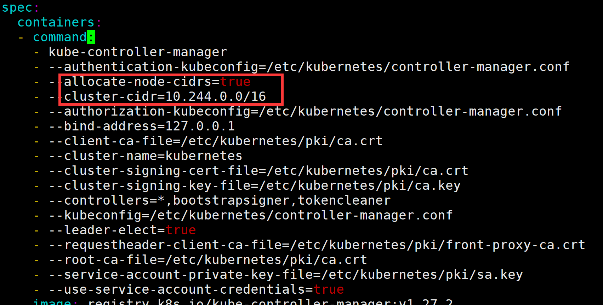

# k8s与docker安装搭建

## docker的安装

### 安装过程

1、删除旧版本

```bash
$ sudo apt-get remove docker docker-engine docker.io containerd runc
```

2、设置仓库

更新apt

```bash
$ sudo apt-get update
```

安装依赖包

```bash
$ sudo apt-get install apt-transport-https ca-certificates curl gnupg-agent software-properties-common
```

添加Docker官方密钥

```bash
$ curl -fsSL https://mirrors.ustc.edu.cn/docker-ce/linux/ubuntu/gpg | sudo apt-key add -
OK
```

验证密钥

```bash
$ apt-key fingerprint 0EBFCD88
pub   rsa4096 2017-02-22 [SCEA]
      9DC8 5822 9FC7 DD38 854A  E2D8 8D81 803C 0EBF CD88
uid           [ unknown] Docker Release (CE deb) <docker@docker.com>
sub   rsa4096 2017-02-22 [S]

```

设置稳定版仓库

```bash
$ add-apt-repository \
   "deb [arch=amd64] https://mirrors.ustc.edu.cn/docker-ce/linux/ubuntu/ \
  $(lsb_release -cs) \
  stable"
```

3、安装docker（最新版本）

```bash
$ sudo apt-get install docker-ce docker-ce-cli containerd.io
```

### 遇到的问题

"Cannot connect to the Docker daemon at unix:///var/run/docker.sock. Is the docker daemon running?"

原因是docker未启动，使用如下指令启动

```bash
$ systemctl start docker
```

报错："System has not been booted with systemd as init system (PID 1). Can't operate."

原因是不是用`systemctl`管理服务，修改指令：

```bash
$ service docker start
 * Starting Docker: docker           [ OK ]
```

启动后尝试运行hello-world容器：

```bash
$ sudo docker run hello-world

Unable to find image 'hello-world:latest' locally
latest: Pulling from library/hello-world
1b930d010525: Pull complete                                                                                                                                  Digest: sha256:c3b4ada4687bbaa170745b3e4dd8ac3f194ca95b2d0518b417fb47e5879d9b5f
Status: Downloaded newer image for hello-world:latest


Hello from Docker!
This message shows that your installation appears to be working correctly.


To generate this message, Docker took the following steps:
 1. The Docker client contacted the Docker daemon.
 2. The Docker daemon pulled the "hello-world" image from the Docker Hub.
    (amd64)
 3. The Docker daemon created a new container from that image which runs the
    executable that produces the output you are currently reading.
 4. The Docker daemon streamed that output to the Docker client, which sent it
    to your terminal.


To try something more ambitious, you can run an Ubuntu container with:
 $ docker run -it ubuntu bash


Share images, automate workflows, and more with a free Docker ID:
 https://hub.docker.com/


For more examples and ideas, visit:
 https://docs.docker.com/get-started/
```

出现如上结果，安装成功。

## K8S集群搭建（kubeadm方式）

参考[Ubuntu 22.04 搭建K8s集群](https://www.cnblogs.com/way2backend/p/16970506.html)

### 资源准备

三台Ubuntu虚拟机（一台master两台node），均为2核，内核版本5.15.0，ip分配如下（私有ip）：

| hostname |     IPv4     |
| :------: | :----------: |
|  master  | 172.31.30.8  |
|  node01  | 172.31.29.58 |
|  node02  | 172.31.27.28 |

三台虚拟机在同一个子网下，可以通过私有IPv4地址互相ping通，如果ping不通需要检查网络问题。（或者是安全组与防火墙设置）

### 一、网络初始化配置

（以下配置需要在每台机器上进行）

### 1、设置主机名

```bash
$ sudo hostnamectl set-hostname master		# node为node01/02
# 查看hostname
$ hostname
master
```

#### 2、配置hosts

编辑`/etc/hosts`配置ip与hostname直接的匹配关系：

```bash
$ sudo vi /etc/hosts
```

添加三行内容（ip修改为自己三台机器的ip）：

```tex
172.31.30.8 master
172.31.29.58 node01
172.31.27.28 node02
```

之后可以通过ping指令（这里就可以不通过ip而是**通过hostname**）判断是否成功。例如在master上：

```bash
$ ping node01
PING node01 (172.31.29.58) 56(84) bytes of data.
64 bytes from node01 (172.31.29.58): icmp_seq=1 ttl=64 time=0.424 ms
64 bytes from node01 (172.31.29.58): icmp_seq=2 ttl=64 time=1.36 ms
...
```

#### 3、安装ssh

```bash
$ sudo apt install openssh-server
```

这一步一般都可以忽略。

### 二、系统初始化配置

（以下配置需要在每台机器上执行）

#### 1、关闭防火墙与selinux

Ubuntu22.04默认关闭，不需要设置

```bash
$ sudo ufw disable
```

#### 2、禁用swap分区

```bash
$ sudo sed -i '/ swap / s/^(.*)$/#1/g' /etc/fstab
```

#### 3、系统时间设置

```bash
$ sudo timedatectl set-timezone Asia/Shanghai
#同时使系统日志时间戳也立即生效
$ sudo systemctl restart rsyslog
```

#### 4、修改内核参数

载入如下内核模块

```bash
$ sudo tee /etc/modules-load.d/containerd.conf <<EOF
> overlay
> br_netfilter
> EOF

$ sudo modprobe overlay
$ sudo modprobe br_netfilter
```

配置网络参数

```bash
$ sudo tee /etc/sysctl.d/kubernetes.conf <<EOF
> net.bridge.bridge-nf-call-ip6tables = 1
> net.bridge.bridge-nf-call-iptables = 1
> net.ipv4.ip_forward = 1
> EOF

# 执行如下指令确保修改生效
$ sudo sysctl --system
```

### 三、安装containerd

（以下配置需要在每台机器上执行）

Docker与Kubernetes在控制组件时都会使用containerd

#### 1、安装依赖

```bash
$ sudo apt update
$ sudo apt install -y curl gnupg2 software-properties-common apt-transport-https ca-certificates
```

#### 2、添加docker repo到apt

```bash
$ curl -fsSL https://download.docker.com/linux/ubuntu/gpg | sudo gpg --dearmour -o /etc/apt/trusted.gpg.d/docker.gpg
$ sudo add-apt-repository "deb [arch=amd64] https://download.docker.com/linux/ubuntu $(lsb_release -cs) stable"
$ sudo apt update
```

#### 3、安装containerd

```bash
$ sudo apt install -y containerd.io
```

#### 4、配置containerd使用systemd作为cgroup

```bash
$ containerd config default | sudo tee /etc/containerd/config.toml >/dev/null 2>&1
$ sudo sed -i 's/SystemdCgroup \= false/SystemdCgroup \= true/g' /etc/containerd/config.toml
```

#### 5、重启并设置开机自启

```bash
$ sudo systemctl restart containerd
$ sudo systemctl enable containerd
```

### 四、安装kube组件

（以下配置需要在每台机器上执行）

安装kubernetes需要的组件：kubelet（控制pod生命周期）、kubeadm（管理kubernetes集群）与kubectl（交互命令行）

#### 1、添加repo到apt

```bash
$ curl -s https://packages.cloud.google.com/apt/doc/apt-key.gpg | sudo apt-key add -
$ sudo apt-add-repository "deb http://apt.kubernetes.io/ kubernetes-xenial main"
$ sudo apt update
```

#### 2、安装kube组件

```bash
$ sudo apt install -y kubelet kubeadm kubectl
# 防止自动安装
$ sudo apt-mark hold kubelet kubeadm kubectl
```

### 五、初始化master节点

（以下配置需要在master节点上执行）

#### 1、kubeadm初始化

在master节点上执行如下命令即可完成初始化：

```bash
$ sudo kubeadm init --control-plane-endpoint=172.31.30.8
# 很多调试信息

Your Kubernetes control-plane has initialized successfully!

To start using your cluster, you need to run the following as a regular user:

  mkdir -p $HOME/.kube
  sudo cp -i /etc/kubernetes/admin.conf $HOME/.kube/config
  sudo chown $(id -u):$(id -g) $HOME/.kube/config

Alternatively, if you are the root user, you can run:

  export KUBECONFIG=/etc/kubernetes/admin.conf

You should now deploy a pod network to the cluster.
Run "kubectl apply -f [podnetwork].yaml" with one of the options listed at:
  https://kubernetes.io/docs/concepts/cluster-administration/addons/

You can now join any number of control-plane nodes by copying certificate authorities
and service account keys on each node and then running the following as root:

  kubeadm join 172.31.30.8:6443 --token b3ihy4.5gtibkjtr3jzetn9 \
	--discovery-token-ca-cert-hash sha256:ed43aade576bd65a18a4dd5b825153ca3e7b06dec2955bac394fdfbba8581fe7 \
	--control-plane 

Then you can join any number of worker nodes by running the following on each as root:

kubeadm join 172.31.30.8:6443 --token b3ihy4.5gtibkjtr3jzetn9 \
	--discovery-token-ca-cert-hash sha256:ed43aade576bd65a18a4dd5b825153ca3e7b06dec2955bac394fdfbba8581fe7
```

这里面有两个需要重点关注的部分：

（1）配置config

```bash
To start using your cluster, you need to run the following as a regular user:

  mkdir -p $HOME/.kube
  sudo cp -i /etc/kubernetes/admin.conf $HOME/.kube/config
  sudo chown $(id -u):$(id -g) $HOME/.kube/config
```

执行上面的指令用来配置集群

（2）添加结点

```bash
Then you can join any number of worker nodes by running the following on each as root:

kubeadm join 172.31.30.8:6443 --token b3ihy4.5gtibkjtr3jzetn9 \
	--discovery-token-ca-cert-hash sha256:ed43aade576bd65a18a4dd5b825153ca3e7b06dec2955bac394fdfbba8581fe7
```

以root权限执行上述指令，添加结点到集群。

#### 2、配置config文件

按照提示信息，进行后续config初始化：

```bash
$ mkdir -p $HOME/.kube
$ sudo cp -i /etc/kubernetes/admin.conf $HOME/.kube/config
$ sudo chown $(id -u):$(id -g) $HOME/.kube/config
```

这时已经可以通过kubectl查看集群状态：

```bash
$ kubectl get nodes
NAME     STATUS     ROLES           AGE    VERSION
master   NotReady   control-plane   110s   v1.27.2
```

### 六、加入node节点

（以下配置需要在node节点上执行）

在node上执行下面的指令（取自master初始化时的输出）

```bash
$ kubeadm join 172.31.30.8:6443 --token b3ihy4.5gtibkjtr3jzetn9 \
	--discovery-token-ca-cert-hash sha256:ed43aade576bd65a18a4dd5b825153ca3e7b06dec2955bac394fdfbba8581fe7
# 一些调试信息	
This node has joined the cluster:
* Certificate signing request was sent to apiserver and a response was received.
* The Kubelet was informed of the new secure connection details.

Run 'kubectl get nodes' on the control-plane to see this node join the cluster.
```

（需要以root权限执行）

此时可以在master节点上通过`kubectl get nodes`查看到加入的node：

```bash
$ kubectl get nodes
NAME     STATUS     ROLES           AGE   VERSION
master   NotReady   control-plane   57m   v1.27.2
node01   NotReady   <none>          80s   v1.27.2
node02   NotReady   <none>          15s   v1.27.2
```

但此时的结点上还不能使用kubectl指令，会有网络问题（这也是为什么所有节点的STATUS都是NotReady），下一步配置集群的网络

### 七、配置集群网络

（以下配置需要在master节点上执行）

通过安装Calico、Flannel和Weave-net等插件配置集群网络，这里我们的集群采用Flannel：

#### 1、下载flannel的资源清单文件：

```bash
$ wget https://raw.githubusercontent.com/coreos/flannel/master/Documentation/kube-flannel.yml
# 查看yaml内容
$ cat kube-flannel.yml 
---
kind: Namespace
apiVersion: v1
metadata:
  name: kube-flannel
  labels:
    k8s-app: flannel
    pod-security.kubernetes.io/enforce: privileged
---
kind: ClusterRole
apiVersion: rbac.authorization.k8s.io/v1
metadata:
  labels:
    k8s-app: flannel
  name: flannel
rules:
- apiGroups:
  - ""
  resources:
  - pods
  verbs:
  - get
- apiGroups:
  - ""
  resources:
  - nodes
  verbs:
  - get
  - list
  - watch
- apiGroups:
  - ""
  resources:
  - nodes/status
  verbs:
  - patch
- apiGroups:
  - networking.k8s.io
  resources:
  - clustercidrs
  verbs:
  - list
  - watch
---
kind: ClusterRoleBinding
apiVersion: rbac.authorization.k8s.io/v1
metadata:
  labels:
    k8s-app: flannel
  name: flannel
roleRef:
  apiGroup: rbac.authorization.k8s.io
  kind: ClusterRole
  name: flannel
subjects:
- kind: ServiceAccount
  name: flannel
  namespace: kube-flannel
---
apiVersion: v1
kind: ServiceAccount
metadata:
  labels:
    k8s-app: flannel
  name: flannel
  namespace: kube-flannel
---
kind: ConfigMap
apiVersion: v1
metadata:
  name: kube-flannel-cfg
  namespace: kube-flannel
  labels:
    tier: node
    k8s-app: flannel
    app: flannel
data:
  cni-conf.json: |
    {
      "name": "cbr0",
      "cniVersion": "0.3.1",
      "plugins": [
        {
          "type": "flannel",
          "delegate": {
            "hairpinMode": true,
            "isDefaultGateway": true
          }
        },
        {
          "type": "portmap",
          "capabilities": {
            "portMappings": true
          }
        }
      ]
    }
  net-conf.json: |
    {
      "Network": "10.244.0.0/16",
      "Backend": {
        "Type": "vxlan"
      }
    }
---
apiVersion: apps/v1
kind: DaemonSet
metadata:
  name: kube-flannel-ds
  namespace: kube-flannel
  labels:
    tier: node
    app: flannel
    k8s-app: flannel
spec:
  selector:
    matchLabels:
      app: flannel
  template:
    metadata:
      labels:
        tier: node
        app: flannel
    spec:
      affinity:
        nodeAffinity:
          requiredDuringSchedulingIgnoredDuringExecution:
            nodeSelectorTerms:
            - matchExpressions:
              - key: kubernetes.io/os
                operator: In
                values:
                - linux
      hostNetwork: true
      priorityClassName: system-node-critical
      tolerations:
      - operator: Exists
        effect: NoSchedule
      serviceAccountName: flannel
      initContainers:
      - name: install-cni-plugin
        image: docker.io/flannel/flannel-cni-plugin:v1.1.2
       #image: docker.io/rancher/mirrored-flannelcni-flannel-cni-plugin:v1.1.2
        command:
        - cp
        args:
        - -f
        - /flannel
        - /opt/cni/bin/flannel
        volumeMounts:
        - name: cni-plugin
          mountPath: /opt/cni/bin
      - name: install-cni
        image: docker.io/flannel/flannel:v0.21.5
       #image: docker.io/rancher/mirrored-flannelcni-flannel:v0.21.5
        command:
        - cp
        args:
        - -f
        - /etc/kube-flannel/cni-conf.json
        - /etc/cni/net.d/10-flannel.conflist
        volumeMounts:
        - name: cni
          mountPath: /etc/cni/net.d
        - name: flannel-cfg
          mountPath: /etc/kube-flannel/
      containers:
      - name: kube-flannel
        image: docker.io/flannel/flannel:v0.21.5
       #image: docker.io/rancher/mirrored-flannelcni-flannel:v0.21.5
        command:
        - /opt/bin/flanneld
        args:
        - --ip-masq
        - --kube-subnet-mgr
        resources:
          requests:
            cpu: "100m"
            memory: "50Mi"
        securityContext:
          privileged: false
          capabilities:
            add: ["NET_ADMIN", "NET_RAW"]
        env:
        - name: POD_NAME
          valueFrom:
            fieldRef:
              fieldPath: metadata.name
        - name: POD_NAMESPACE
          valueFrom:
            fieldRef:
              fieldPath: metadata.namespace
        - name: EVENT_QUEUE_DEPTH
          value: "5000"
        volumeMounts:
        - name: run
          mountPath: /run/flannel
        - name: flannel-cfg
          mountPath: /etc/kube-flannel/
        - name: xtables-lock
          mountPath: /run/xtables.lock
      volumes:
      - name: run
        hostPath:
          path: /run/flannel
      - name: cni-plugin
        hostPath:
          path: /opt/cni/bin
      - name: cni
        hostPath:
          path: /etc/cni/net.d
      - name: flannel-cfg
        configMap:
          name: kube-flannel-cfg
      - name: xtables-lock
        hostPath:
          path: /run/xtables.lock
          type: FileOrCreate
```

#### 2、执行yaml文件，启动pod

通过kubectl命令行工具执行yaml：

```bash
$ kubectl apply -f kube-flannel.yml
namespace/kube-flannel created
clusterrole.rbac.authorization.k8s.io/flannel created
clusterrolebinding.rbac.authorization.k8s.io/flannel created
serviceaccount/flannel created
configmap/kube-flannel-cfg created
daemonset.apps/kube-flannel-ds created
```

可以发现创建了namespace和相关的pod，此时查看各个node：

```bash
$ kubectl get nodes
NAME     STATUS   ROLES           AGE   VERSION
master   Ready    control-plane   67m   v1.27.2
node01   Ready    <none>          11m   v1.27.2
node02   Ready    <none>          10m   v1.27.2
```

可以发现三个节点都已经ready。

### 八、问题

发现kube-flannel下的pod都是CrashLoopBackOff状态，也就是启动失败：

```bash
$ kubectl get pods -n kube-flannel
NAME                    READY   STATUS             RESTARTS      AGE
kube-flannel-ds-66fkg   0/1     CrashLoopBackOff   5 (27s ago)   3m38s
kube-flannel-ds-cttvn   0/1     CrashLoopBackOff   5 (30s ago)   3m38s
kube-flannel-ds-qk7gj   0/1     CrashLoopBackOff   5 (30s ago)   3m38s
```

查看log：

```bash
$ kubectl logs kube-flannel-ds-66fkg -n kube-flannel
Defaulted container "kube-flannel" out of: kube-flannel, install-cni-plugin (init), install-cni (init)
I0519 06:00:29.055049       1 main.go:211] CLI flags config: {etcdEndpoints:http://127.0.0.1:4001,http://127.0.0.1:2379 etcdPrefix:/coreos.com/network etcdKeyfile: etcdCertfile: etcdCAFile: etcdUsername: etcdPassword: version:false kubeSubnetMgr:true kubeApiUrl: kubeAnnotationPrefix:flannel.alpha.coreos.com kubeConfigFile: iface:[] ifaceRegex:[] ipMasq:true ifaceCanReach: subnetFile:/run/flannel/subnet.env publicIP: publicIPv6: subnetLeaseRenewMargin:60 healthzIP:0.0.0.0 healthzPort:0 iptablesResyncSeconds:5 iptablesForwardRules:true netConfPath:/etc/kube-flannel/net-conf.json setNodeNetworkUnavailable:true useMultiClusterCidr:false}
W0519 06:00:29.055304       1 client_config.go:617] Neither --kubeconfig nor --master was specified.  Using the inClusterConfig.  This might not work.
I0519 06:00:29.066799       1 kube.go:144] Waiting 10m0s for node controller to sync
I0519 06:00:29.067207       1 kube.go:485] Starting kube subnet manager
I0519 06:00:30.067374       1 kube.go:151] Node controller sync successful
I0519 06:00:30.067411       1 main.go:231] Created subnet manager: Kubernetes Subnet Manager - master
I0519 06:00:30.067418       1 main.go:234] Installing signal handlers
I0519 06:00:30.067790       1 main.go:542] Found network config - Backend type: vxlan
I0519 06:00:30.067824       1 match.go:206] Determining IP address of default interface
I0519 06:00:30.068160       1 match.go:259] Using interface with name eth0 and address 172.31.30.8
I0519 06:00:30.068185       1 match.go:281] Defaulting external address to interface address (172.31.30.8)
I0519 06:00:30.068274       1 vxlan.go:140] VXLAN config: VNI=1 Port=0 GBP=false Learning=false DirectRouting=false
E0519 06:00:30.068694       1 main.go:334] Error registering network: failed to acquire lease: node "master" pod cidr not assigned
W0519 06:00:30.068852       1 reflector.go:347] github.com/flannel-io/flannel/pkg/subnet/kube/kube.go:486: watch of *v1.Node ended with: an error on the server ("unable to decode an event from the watch stream: context canceled") has prevented the request from succeeding
I0519 06:00:30.068883       1 main.go:522] Stopping shutdownHandler...
```

提取到关键信息：

```bash
E0519 06:00:30.068694       1 main.go:334] Error registering network: failed to acquire lease: node "master" pod cidr not assigned
```

即创建网段的时候失败，查看`/etc/kubernetes/manifests/kube-controller-manager.yaml `文件，发现其没有网段的配置。

会看flannel的yaml，这一部分是指定Pod的网段的：

```yaml
net-conf.json: |
    {
      "Network": "10.244.0.0/16",
      "Backend": {
        "Type": "vxlan"
      }
    }
```

于是在`/etc/kubernetes/manifests/kube-controller-manager.yaml`中添加如下两行：

```yaml
- --allocate-node-cidrs=true
- --cluster-cidr=10.244.0.0/16
```

添加后部分截图如下：



红色部分为添加的内容，然后重启kubelet：

```bash
$ sudo systemctl restart kubelet
```

（这个问题应该是在kubeadm init时应该要指定初始化参数，但没有指定导致的问题）

此时再查看flannel相关的pod，已经全部running：

```bash
$ kubectl get pods -n kube-flannel
NAME                    READY   STATUS    RESTARTS         AGE
kube-flannel-ds-66fkg   1/1     Running   18 (4m33s ago)   57m
kube-flannel-ds-cttvn   1/1     Running   16 (5m22s ago)   57m
kube-flannel-ds-qk7gj   1/1     Running   16 (5m36s ago)   57m
```


### 八、测试

#### 1、查看pod信息

查看kube-system命名空间下的pod：

```bash
$ kubectl get pods -n kube-system
NAME                             READY   STATUS    RESTARTS   AGE
coredns-5d78c9869d-lhgkq         1/1     Running   0          124m
coredns-5d78c9869d-n5x9h         1/1     Running   0          124m
etcd-master                      1/1     Running   0          124m
kube-apiserver-master            1/1     Running   0          124m
kube-controller-manager-master   1/1     Running   0          5m43s
kube-proxy-7gnl6                 1/1     Running   0          67m
kube-proxy-q6xcb                 1/1     Running   0          124m
kube-proxy-xzl6f                 1/1     Running   0          68m
kube-scheduler-master            1/1     Running   0          124m
```

查看kube-flannel命名空间下的pod：

```bash
$ kubectl get pods -n kube-flannel
NAME                    READY   STATUS    RESTARTS         AGE
kube-flannel-ds-66fkg   1/1     Running   18 (5m51s ago)   58m
kube-flannel-ds-cttvn   1/1     Running   16 (6m40s ago)   58m
kube-flannel-ds-qk7gj   1/1     Running   16 (6m54s ago)   58m
```

#### 2、部署一个nginx测试

创建一个deployment（不通过资源清单）

```bash
$ kubectl create deployment nginx-app --image=nginx --replicas=2
deployment.apps/nginx-app created
```

查看nginx的状态：

```bash
$ kubectl get deployment nginx-app
NAME        READY   UP-TO-DATE   AVAILABLE   AGE
nginx-app   2/2     2            2           53m
```

利用NodePort的方式将nginx暴露出去

```bash
$ kubectl expose deployment nginx-app --type=NodePort --port=80
service/nginx-app exposed
```

查看service的状态：

```bash
$ kubectl get svc nginx-app
NAME        TYPE       CLUSTER-IP     EXTERNAL-IP   PORT(S)        AGE
nginx-app   NodePort   10.103.255.6   <none>        80:31905/TCP   52m
$ kubectl describe svc nginx-app
Name:                     nginx-app
Namespace:                default
Labels:                   app=nginx-app
Annotations:              <none>
Selector:                 app=nginx-app
Type:                     NodePort
IP Family Policy:         SingleStack
IP Families:              IPv4
IP:                       10.103.255.6
IPs:                      10.103.255.6
Port:                     <unset>  80/TCP
TargetPort:               80/TCP
NodePort:                 <unset>  31905/TCP					# 这里是说挂载到了物理机的32905端口
Endpoints:                10.244.1.2:80,10.244.2.2:80
Session Affinity:         None
External Traffic Policy:  Cluster
Events:                   <none>
```

查看Pod的状态：

```bash
$ kubectl get pod
NAME                         READY   STATUS    RESTARTS   AGE
nginx-app-5c64488cdf-g8z42   1/1     Running   0          54m
nginx-app-5c64488cdf-k46dk   1/1     Running   0          54m
```

访问nginx服务：

```bash
$ curl node01:31905								# 取自于上面服务的node port
<!DOCTYPE html>
<html>
<head>
<title>Welcome to nginx!</title>
<style>
html { color-scheme: light dark; }
body { width: 35em; margin: 0 auto;
font-family: Tahoma, Verdana, Arial, sans-serif; }
</style>
</head>
<body>
<h1>Welcome to nginx!</h1>
<p>If you see this page, the nginx web server is successfully installed and
working. Further configuration is required.</p>

<p>For online documentation and support please refer to
<a href="http://nginx.org/">nginx.org</a>.<br/>
Commercial support is available at
<a href="http://nginx.com/">nginx.com</a>.</p>

<p><em>Thank you for using nginx.</em></p>
</body>
</html>
```

访问成功，集群搭建完成。