# Kubernetes

首先是对K8S的定位理解（目前很粗浅，后面继续逐步补充更新）：

K8S是为了解决容器化部署集群时的各种困难，如服务重启、端口映射、滚动升级、服务发现与更新等等；K8S提供了一种部署容器集群的解决方案，可以通过组件间的配合调度管理不同的容器，减小开发运维时的复杂性，可以自动完成在部署、管理和扩展容器化应用过程中涉及的许多手动操作。（有点类似云环境下的操作系统）

### K8S组件说明

K8S基于谷歌的Borg系统升级而来，Borg架构如下：

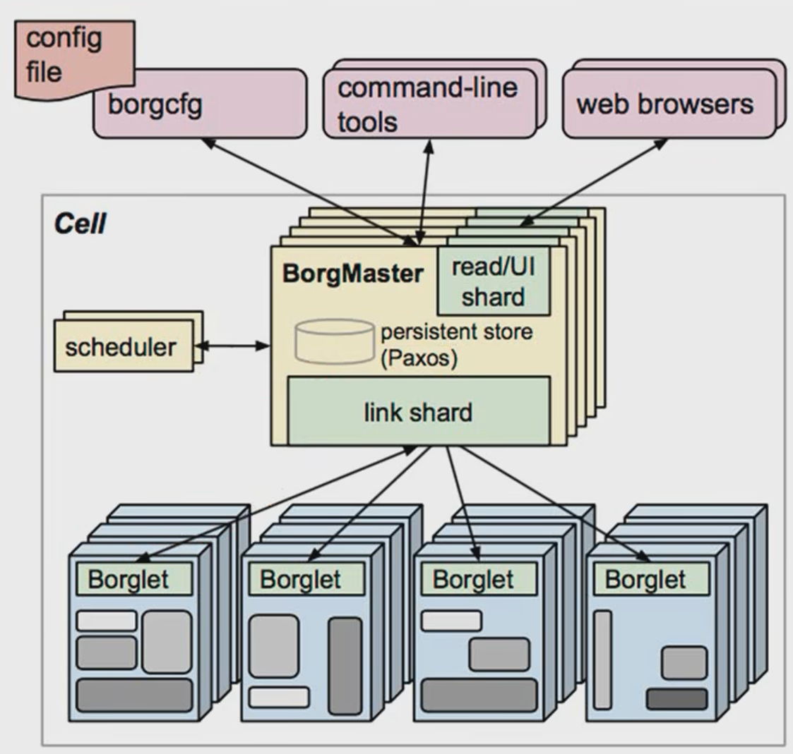

Borg系统架构由两部分组成，负责控制的BorgMaster结点和真正的工作负载结点Borglet，前者负责对容器化集群的管理工作，后者真正提供算力服务。

BorgMaster负责对请求的分发的（distribute），为防止单节点故障导致系统宕机，BorgMaster会由很多副本。且对于高可用集群来说，最好有2n + 1个副本结点（3，5，……）。BorgMaster是对外暴露的接口，请求都由BorgMaster首先处理，然后分发给不同的Borglet进行处理。分发时需要用到组件scheduler调度器，scheduler会将调度信息（即请求待处理信息）写入数据库Paxos，负载结点Borglet会从Paxos中监听请求并处理，即scheduler不直接与borglet交互，而是通过一种异步的方式，类似于消息队列的结构进行调度的控制。

而对于K8S，其结构如下：

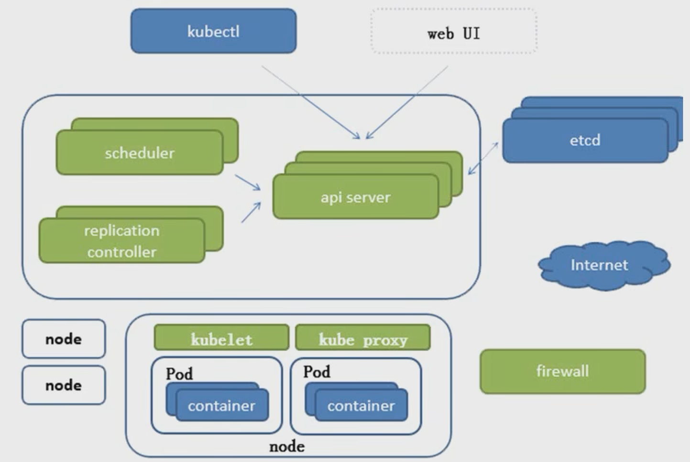

K8S系统本身就是一个C/S结果，由两个服务器（Master服务器和Node服务器）组成，前者的角色定位相当于Borg中的BorgMaster，后者相当于Borglet。

（Master结点）

**Scheduler**

对于Master服务器，同样存在调度器组件scheduler，负责请求的调度执行。与Borg不同的是，Borg中的scheduler组件直接将调度信息写入数据库Paxos，而在k8s中调度器会将调度信息交给API Server，由其与数据库etcd进行交互。

**Replication Controller**

Replication Controller（简称RC）是应用的控制器，负责管理Pod实例的运行期望值。

**API Server**

API Server是一切服务的访问入口，负载很大，异常繁忙。

**etcd**

k8s分布式集群信息的持久化方案，键值对存储，保存集群正常运转所需要的持久化配置信息，保证集群死亡后可以通过etcd中的信息进行恢复。

（Node结点）

**kubelet**

与CRI（container runtime interface）交互，操作docker创建对应的容器，即kubelet会真正控制Pod实例的生命周期。

**kube proxy**

负载组件

**container**

容器引擎，如docker

另一张架构图：

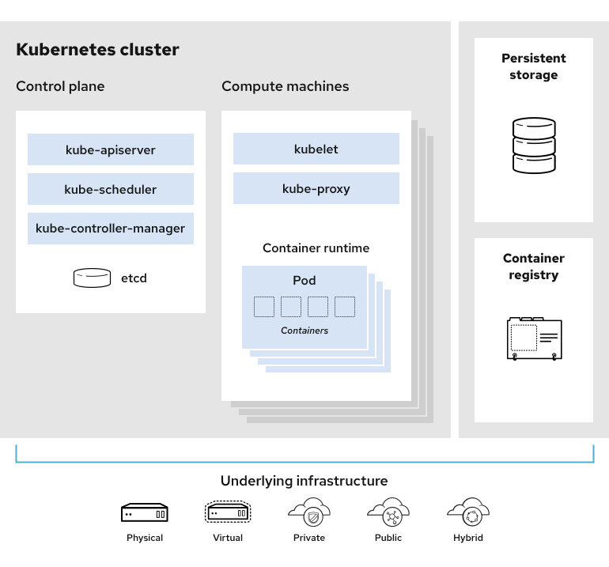

### K8S基础概念

##### Pod概念

对于docker，有些组件需要绑定在一起（互相调用，访问服务），但在过去的生产环境下，不同的进程运行在不同的docker上，拥有不同的网络栈，需要跨主机访问才可以进行通信，即不能用localhost的方式直接交互。这导致不同的服务内部需要配置不同的ip代理，在运维时会很麻烦。K8S通过引入Pod解决了这个问题。

Pod是一组container的集合，Pod在启动时会启动一个默认容器pause，只要Pod被创建，这个容器就会被启动，且它与服务业务无关，只是提供一个共享的网络栈和共享卷，不提供实质性的服务。pause提供了Pod内所有container共享的网络和存储（也就是说一个Pod内的所有容器全部使用pause为其提供的ip与存储，这创造出了一种一个Pod是一个物理机，而一个container是一个进程的抽象）

PDO可以分为自主式Pod与控制器管理的Pod。前者一切的生命周期完全由自己控制，如果挂掉没有组件会将其重新启动；而控制器管理的Pod会由控制器（如RC/RS/Deployment等）管理其生命周期与运行个数。

##### Pod控制器

以下为各种Pod控制器：

**RC / RS / Deployment**

Replication Controller（RC）用来确保容器的**实际运行副本数保持在期望副本数**，即异常容器会被回收或被创建。

ReplicaSet（RS）与RC没有本质区别，区别在于RS支持**集合式的selector**（通过版本version或标签tag来集合式地管理Pod）

Deployment可以理解为对RS的一种服务封装，可以来自动管理RS，扩充其不支持的功能，如滚动更新（rolling-update）。但Deployment本身并不会直接创建Pod，而是会**通过RS创建Pod**，这也是为什么可以把Deployment理解为对RS的一层封装。

**HPA**

Horizontal Pod Auto scaling（HPA）动态扩容，基于Deployment和RS，提供了一种根据资源利用率进行**弹性伸缩**的策略（弹性是重点）

**StatefulSet**

StatefulSet是为了解决有状态服务的问题，需要实时进行数据的更新和存储。它为Pod提供了以下服务：

- 稳定的持久化存储；Pod调度后可以访问到相同的数据（即有历史状态信息）
- 稳定的网络标志；Pod调度后其PodName和HostName不变，这一项基于Headless Service（统一抽象接口？？）
- 有序部署，有序回收；Pod的启动顺序（container本身的依赖关系）

**DaemonSet**

确保**全部的Node上运行一个Pod副本**。当有Node加入集群时，会为他们创建一个新的Pod；当有Node移除集群时，也会回收它们上运行的Pod。删除DaemonSet会删除其管理的所有Pod。

对于DaemonSet的功能理解：首先，DaemonSet是一种Pod控制器，上述功能是为Pod提供的管理功能，控制Pod的运行和回收。其次，对于Node，回顾上面的架构图，Node是K8S中的负载结点，提供真正的算力服务，一个Node有Kubelet、Kube proxy和若干个Pod组成，也就是说，Pod会运行在Node中。结合两点，DaemonSet的功能就比较清晰，DaemonSet会为Pod提供一种控制服务，这种服务会保证由DaemonSet控制的Pod会在所有Node上都运行有且只有一个，当新的Node加入时，DaemonSet会为其创建一个Pod；当新的Node退出时，DaemonSet也会回收它上面的Pod。

**Job与Corn Job**

任务和批处理任务

##### 服务发现

服务发现的概念是在client试图访问一组Pod时（这里的一组比如说是同一种服务的多个副本，用来做负载均衡减少单节点负载），由service搜集Pod标签并将其暴露为统一的接口，service有自己的IP和port，client访问service而不访问具体的Pod（有点依赖抽象而不依赖具体的感觉），service与Pod打交道。

对于服务发现的举例，集群结构如下：

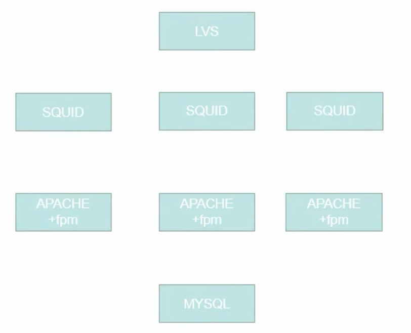

四层服务结构：负载 + 缓存 + 程序服务器 + 数据库，这四层容器均需要启动，由K8S搭建的集群：

创建一个Deployment管理3个APACHE副本（SQUID同理），由于三个服务的互相访问需要配置代理，因此在服务上加一层Service统一接口（两个service，分别管理apache和squid的标签，squid访问apache service的地址）。最终结构：

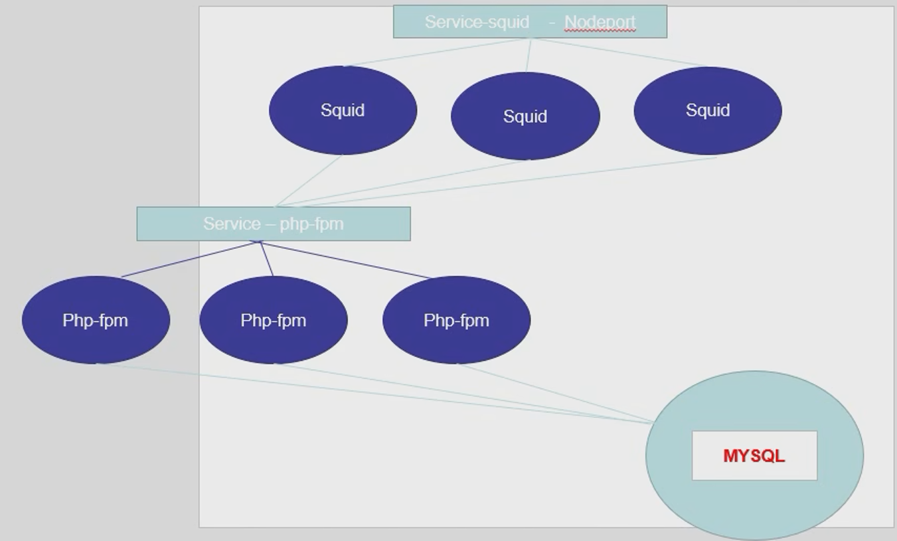

##### 网络通讯方式

k8s的网络模型，假定了所有的Pod都在一个可以**直接连通**的扁平化网络空间中（具有转换机制，但在Pod的抽象层是一个ip直接到达）。

不同模式的通信：

- 同一个Pod中的内部通讯：共享pause容器的网络栈，通过localhost访问；

- 各个Pod之间的通信：Overlay Network；

- Pod与Service（具体的Pod与抽象的Service之间通信）：各个节点的iptables规则；

Overlay Network的搭建：**Flannel组件**，它会将集群中不同结点主机（**似乎是架构图里的Node？**）创建的容器具有全局唯一的虚拟IP地址。两个点：1、**全局唯一**；2、虚拟**IP地址**；这两点将通过`ip:port`的确定进程（容器container）的方式，修改为了通过唯一IP可以直接确定一个容器，而不需要进行端口映射。

总结Pod间的通讯：

同一个Node上的不同Pod，由Docker0网桥直接请求转发到Pod2，不需要经过Flannel；

不同Node上的Pod，Pod的地址与Docker0在同一个网段，将Pod的IP与Node的IP关联起来，通过这个关联经由Flannel增加的一层封装和解封装令Pod可以互相访问；

图解如下：

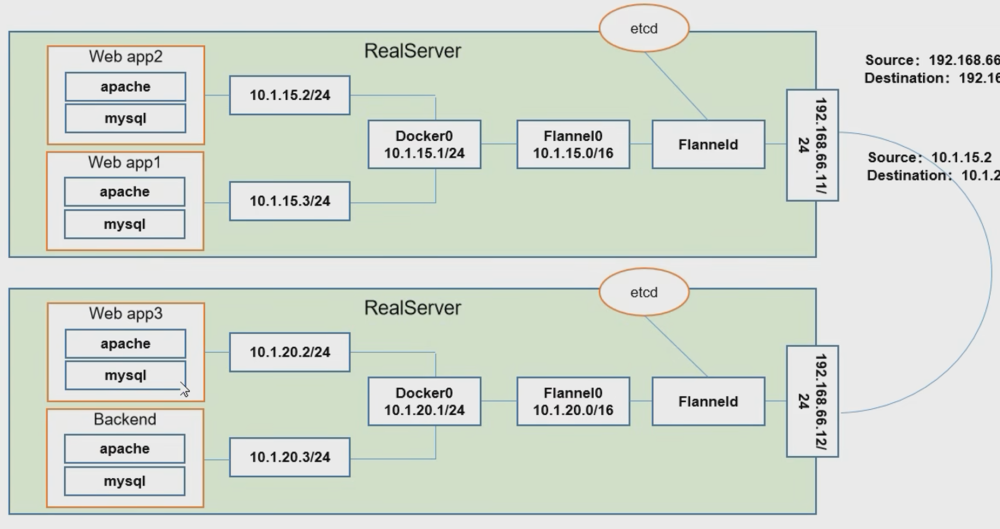

Flannel服务的正确提供需要etcd的支持，etcd会为Flannel存储可分配的IP地址段资源，同时会监控每个Pod的实际地址（ip:port？）并建立维护Pod结点的**路由表**（虚拟ip：真实ip？）。

K8S集群中的网络结构：

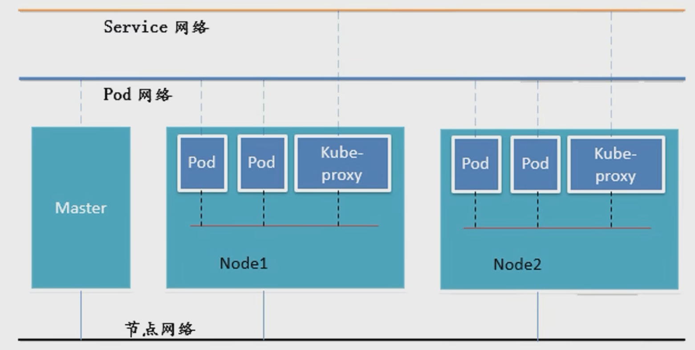

只有Node网络是真实的网络，其余两层网络均为虚拟网络。

### K8S集群安装

（没看懂）

### K8S资源清单

##### K8S中的资源

K8S中的所有内容都抽象为资源，资源实例化之后叫做对象。

命名空间级别资源、集群级别资源、元数据型资源；

##### Pod创建资源清单

yaml格式文件配置Pod模板，eg：

```yaml
apiVersion: v1
kind: Pod
metadata: 
  name: myapp-pod
  labels:
    app: myapp
    version: v1
spec:
  containers:
  - name: app
    image: mysql:latest
```

通过yaml配置文件创建Pod指令

```shell
kubectl create -f xxx.yaml
```

##### Pod生命周期

生命周期：pause => init C（init C也是一个容器） => main C（主容器）；

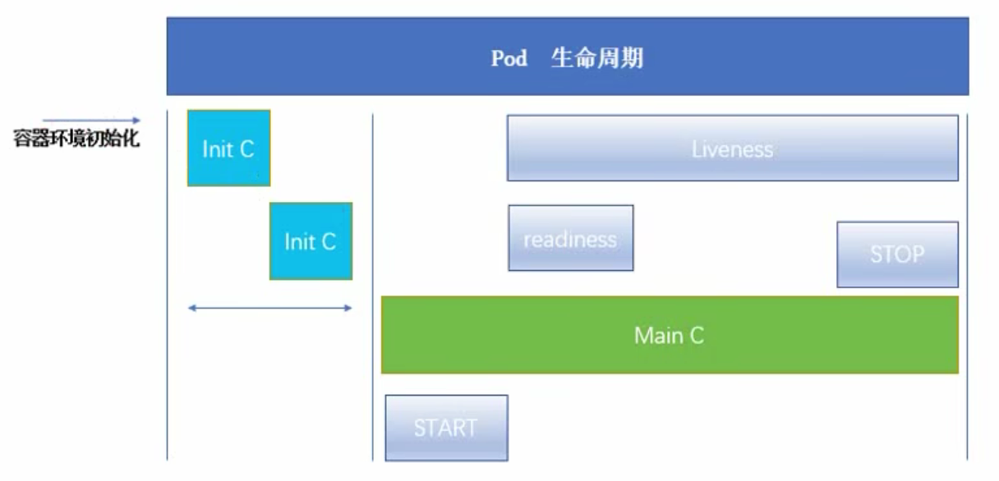

##### init C

Pod能够具有多个容器，应用运行在容器中，init C容器是一个先于main C容器运行的容器；

- init C总是能够运行到成功完成为止；
- 每个init C必须在下一个init C启动前完成并结束；

init C的退出并不会导致Pod的生命周期结束，但Main C会。另外，init C并不是真正第一个启动的容器，他会在pause容器启动后开始，

**init C作用**

为了在Main C之前做一些**前置工作**，如文件的设置，资源的建立，或者对存在依赖关系容器启动顺序的控制，就绪探测等。

**其他说明**

init C会按顺序启动，前一个init C完成前后一个不会启动；

init C启动失败时，会根据Pod的Restart Policy指定策略进行重试，默认为Always；

在所有的init C成功之前，Pod永远不会变成Ready状态，即**不会在Service的调度队列中出现**（这里也体现了Service是一组Pod的对外统一接口）

如果Pod重启，所有的init C必须重新执行，即init C的执行必须是一个幂等状态；

在Pod中的应用程序容器app和初始化容器init共享命名空间，即如果app和init的name重复会导致错误；但端口不会，因为init在启动成功后会退出，所占**端口被释放**，后续容器也可用。

**init C使用示例**

以下是一个Pod的配置yaml文件，其中包括一个Main C和两个init C：

```yaml
apiVersion: v1
kind: Pod
metadata: 
  name: myapp-pod
  labels:
    app: myapp
spec:
  containers:
  - name: myapp-container
    image: busybox
    command: ['sh', '-c', 'echo The app is running && sleep 3600']
  initContainers:
  - name: init-myservice
    image: busybox
    command: ['sh', '-c', 'until nslookup myservice; do echo waiting for myservice; sleep 2; done;']
  - name: init-mydb
    image: busybox
    command: ['sh', '-c', 'until nslookup mydb; do echo waiting for mydb; sleep2; done;']
```

两个init分别执行检测`myservice`和`mydb`的连接，只有两个Service成功启动后才会启动Main C；

两个Service的启动配置文件如下：

```yaml
apiVersion: v1
kind: Service
metadata:
  name: myservice
spec:
  ports:
    - protocol: TCP
      port: 80
      targetPort: 9376
---
apiVersion: v1
kind: Service
metadata:
  name: mydb
spec:
  ports:
    - protocol: TCP
      port: 80
      targetPort: 9377
```

##### 探针

探针是由kubelet（回顾上面的k8s架构图）对该Node下的Pod，按照Pod创建时指定的检测方式进行检测（这个检测是绑定在对应的container下的，不是Pod下，每个container有不同的检测），包括就绪检测和存活检测。

两种检测均提供了三种检测action：

- exec：在容器内执行对应命令，返回码为0则通过；
- httpGet：对指定端口的和路径上的容器IP地址执行http get请求，响应码>=200且<=400则通过；
- TcpSocket：对指定端口的容器IP地址进行TCP检查，若端口打开则通过;

就绪检测不通过时，会把Ready状态取消，从对应Service的就绪队列中删除该Pod；

存活检测不通过时，会把container杀死（只会杀死container，重启的状态受重启策略影响）。

**就绪检测示例**

以下是一个Pod的yaml配置文件，该Pod启动一个myapp容器，并设置就绪检测的信息为httpGet：

```yaml
apiVersion: v1
kind: Pod
metadata:
  name: readiness-httpget-pod
spec:
  containers:
  - name: readiness-httpget-container
    image: myapp:v1
    imagePullPolicy: IfNotPresent
    readinessProbe:
      httpGet:
        port: 80
        path: /index1.html
      initialDelaySeconds: 1
      periodSeconds: 3
```

该Pod会在容器启动1秒后进行就绪检测（readiness probe），检测httpGet是否成功。若检测失败，该Pod的状态是Running，但并不会Ready。

**存活检测示例**

以下是一个Pod的yaml配置文件，该Pod启动一个myapp容器，并设置存活检测的信息为exec：

```yaml
apiVersion: v1
kind: Pod
metadata:
  name: liveness-exec-pod
spec:
  containers:
  - name: liveness-exec-container
    image: myapp:v1
    imagePullPolicy: IfNotPresent
    command: ['/bin/sh', '-c', 'touch /tmp/live; sleep 60; rm -rf /tmp/live; sleep 3600;']
    livenessProbe:
      exec:
        command: ['test', '-e', '/tmp/live']
      initialDelaySeconds: 1
      periodSeconds: 3
```

该Pod会在容器启动1秒后进行就绪检测（readiness prob），检测文件`/tmp/live`是否存在，若不存在则不通过存活检测，重启Pod。

##### Pod状态

Pod在整个生命周期中的状态有如下几种：

- Pending： Pod已经被K8S系统管控，但容器未创建完成；
- Running： 该Pod已经绑定到了一个结点上，Pod的所有容器都已经被创建，且至少有一个容器正在运行或启动或重启；（这个状态并不代表Pod能正常访问，正常访问应该是Ready？？？）；
- Succeed：  Pod所有容器被成功终止；
- Failed： Pod所有容器已终止，但并不是都成功终止；
- Unknown：无法获取Pod状态，通常是通信中断；

### K8S资源控制器

资源控制器的存在是为了为Pod的生命周期提供更方便的管理，自主式的Pod退出后不会被重新拉起，而控制器管理的Pod在控制器的生命周期里始终维持一个期望的副本数。对于控制器，可以将其理解为一个状态机，**用来控制Pod的状态和行为**。

##### RC与RS

RC主要作用是确保容器应用的副本数始终保持在用户定义的期望数。RS和RC并没有本质不同，相较于RC，RS会支持集合式的selector。另外一个比较重要的理解：以RS为例，RS作为一个Pod的控制器，它本身的创建与Pod是分离的，但并不需要人为将其连接起来，意思就是说，当创建一个RS时（如通过yaml配置文件），会在RS的配置中嵌套它管理的Pod信息，当RS创建完成后，它管理的Pod信息也已经固定，就会自动开始Pod的创建，RS和Pod的在创建过程上是分离的，但将它们两者连接起来的过程是自动化的。下面是一个创建RS并管控对应Pod的例子：

```yaml
apiVersion: extensions/v1beta1
kind: ReplicaSet
metadata:
  name: frontend
spec: 
  replicas: 3
  selector:
    matchLabels:
      tier: frontend
  template:
    metadata:
      labels:
        tier: frontend
    spec:
      containers:
      - name: myapp
        image: busybox:v1
        env:
        - name: GET_HOSTS_FROM
          value: dns
        ports:
        - containerPort: 80
```

该配置文件会创建一个名为frontend的RS，RS管理的Pod配置信息在template下，维护个数为3，标签为`tier = frontend`；与自主式的Pod区别是，当RS创建的Pod被删除后，会由RS自动补上缺少的个数，而自主式的Pod会直接删除。

注意：template中配置的标签`tier = frontend`是RS创建出的Pod所带的标签，selector中配置的标签`tier = frontend`是RS需要监测的标签。当RS监测到`frontend`的Pod数量不是3时，会创建或销毁Pod。但如果这两个标签不一致，如template中配置的是`tier = frontend1`，但selector中配置的是`tier = frontend2`，那么RS会一直通过创建`frontend1`的Pod来试图满足`frontend2`的要求，这就会导致循环。

##### Deployment

Deployment为Pod和RS提供了一个声明式定义的方法，通过RS创建和管理Pod，并在RS的基础上进行了服务的扩充。

Deployment创建示例：

```yaml
apiVersion: extensions/v1beta1
kind: Deployment
metadata:
  name: nginx-deployment
spec:
  replicas: 3
  selector:
    matchLabels:
      app: nginx
  template:
    metadata:
      labels:
        app: nginx
    spec:
      containers:
      - name: nginx
        image: nginx:1.7.9
        ports:
        - containerPort: 80
```

该文件会创建一个Deployment，并创建一个对应的RS，由RS创建并管理3个Pod，标签为`app = nginx`。

Deployment管理Pod的其他操作：

1、扩容

```shell
kubectl scale deployment nginx-deployment --replicas 10 # 扩容到10个，且RS不变（即Pod的模板不变）
```

2、更新

```shell
kubectl set image deployment/nginx-deployment nginx=nginx:1.9.1	# 容器名为nginx，更新为镜像名nginx:1.9.1
```

镜像的修改会触发RS的创建，即Pod的模板改变。

3、回滚

```shell
kubectl rollout undo deployment/nginx-deployment 	# 默认回滚到之前一次的老旧版本
```

回滚可选参数`--to-version=x`会回到第X个版本。

**TODO**： Deployment的更新策略

##### DaemonSet

在集群的每个Node上都运行一个指定Pod，示例如下：

```yaml
apiVersion: app/1
kind: DaemonSet
metadata:
  name: daemon-example
spec:
  selector:
    matchLabels:
      name: deamon-example
  template:
    metadata:
      labels:
        name: deamon-example
    spec:
      containers:
      - name: deamon-example
        image: busybox:v1
```

DaemonSet不需要指定`replicas`参数，因为其会在每个Node上创建一个副本。

##### Job

Job负责批处理任务，即仅执行一次的任务，它保证批处理任务的一个或多个Pod成功结束（结束后容器进入Succeed状态？？）。

**Job示例**

```yaml
apiVersion: batch/v1
kind: Job
metadata: 
  name: pi
spec:
  template:
    metadata:
      name: pi
    spec:
      containers:
      - name: pi
        image: perl
        command: ['perl', '-Mbignum=bpi', '-wle', 'print bpi(2000)']
      restartPolicy: Never
```

该Job会管理一个Pod，计算圆周率pi的小数点后2000位而后退出。

##### Corn Job

Corn Job是**基于时间管理**的job，即：

- 在给定时间里只运行一次
- 周期性地在给定时间点运行

TODO：Corn Job示例

### K8S服务发现

##### Service概念

Service是一组逻辑Pod的抽象，为一组Pod提供统一的入口，用户只与Service打交道，而不需要真实的Pod信息。上层服务依赖于抽象的Service而不是具体的Pod，这保证了底层具体的扩容、更新等操作不会影响到上层服务（依赖抽象而不依赖于具体）。

Service是K8S定义的一种抽象，一个Pod的逻辑分组，一种服务的访问策略，这一组Pod通过**标签选择**（label selector）的方式被Service访问，并对外暴露一个服务。原理图解：

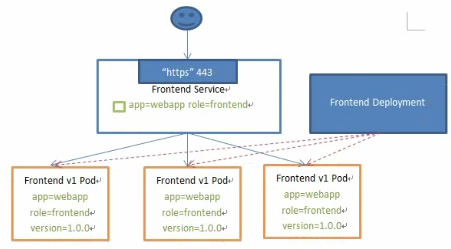

Service维护一个Pod的就绪队列（可以提供真正算力服务的Pod），并提供Pod的负载均衡能力，采用轮询算法（RR）。但Service只提供一个4层的负载均衡，没有七层功能，可以通过后续添加ingress来实现七层负载均衡。（TODO：负载均衡的四层和七层代表什么？）

##### Service的类型

在K8S中，Service根据其代理（将一组服务抽象成一个统一的访问入口）的模式不同分为四种：Cluster IP、NodePort、Load Balancer与External Name。

- Cluster IP：定义一个只能由集群内部访问的service，service具有一个集群内部IP可以由集群内的其他Pod访问，而集群外部无法访问该Service。
- Node Port：在Cluster IP的基础上，为Service在**每个物理机Node**上绑定一个外部端口outer port，这个端口通过端口映射，映射到Service的内部端口inner port（个人感觉，这里准确来讲是**最终**映射到Service代理的**Pod的内部端口**，因为Pod中的容器共用一套网络栈，所以可以看作一个独立网络设备），也就是说，集群外部或内部的服务，都可以通过`Node IP : Node Port`的方式，经由端口映射访问到内部服务，发送到物理机outer port的请求会被kube proxy路由到Service的inner port（选中被调度的Pod实例的端口）。Node Port是**K8S默认暴露内部服务供外部访问的方式**。
- Load Balancer：在Node Port的基础上（说明也是向集群外暴露服务），借助云服务商提供的负载均衡路由器，实现真正的负载均衡（Node负载和Node内部的Pod均衡）。
- External Name：与上面三种Service不同，External Name是**将集群外部的服务代理到集群内部**，同样起到一个抽象的作用，使得服务的调用者可以不受服务扩容更新等操作的影响。

##### 个人对Service具体运行的理解

在K8S中，Service与Pod这种组件不太一样，Pod是实打实创建了一个由多个container组成的运行实例，它可以看作一个进程（可能有点不准确）运行在其对应的物理机上（Node上），而Service并不像是一个进程，它更像是一组配置信息，这组配置信息由kube proxy访问和控制，通过这些控制信息将请求路由到对应的服务上，也就是说Service虽然是一组运行中Pod的逻辑抽象，但它并不是一个运行的进程实体，而是一组记录访问入口与服务之间映射关系的配置信息（有可能是记录在etcd数据库里）。组件之间的配合逻辑图解：

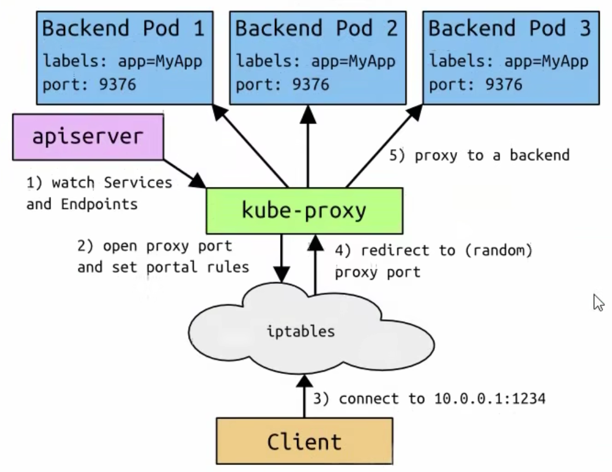

另外还有一个可能和初始印象不同的点，我们可能很自然地认为Service是和一个Node相关联的（也就是一个Service管理了一个Node上的Pod），但实际上的一个Service管理了所有通过标签选择（tag selector）选中的Pod，这并不局限在一个Node上。并且一组Pod不一定只能由一个Service选择，可以匹配多个Service。

**TODO：iptables与ipvs代理**

**TODO：K8S网络模式**

##### Service代理模式

在K8S集群中，每个Node运行了一个kube proxy进程，该进程为Service实现了一种虚拟IP（Virtual IP）的形式，可以使集群内部服务直接访问（是在说之前网络通讯方式里提到的**扁平化网络**吗？）

> 为什么不使用round-robin DNS？
>
> DNS会有缓存

Service的三种代理模式：

- user space
- iptables
- ipvs

（然而看完之后并不理解，后面再看吧……）

##### Service示例

###### Cluster IP

Cluster IP在**每个Node**上使用iptables，将发向cluster ip对应端口的数据转发到kube proxy中（注：1、kube proxy是一个进程，也有其监听的端口，2、kube proxy是一个Node上运行一个，所以个人猜测这里的发向cluster ip对应端口的数据应该是发给了master，也就是有API Server的结点，然后由该Node上的kube proxy结合etcd进行Service对应Pod的调度，然后将请求发到对应的Pod，这里通过集群内部那个扁平化网络）。示例图：

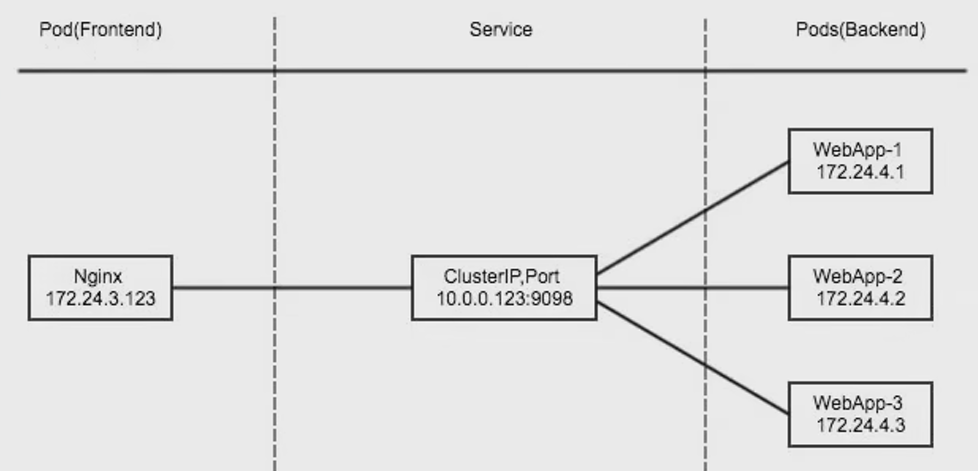

在K8S中实现上图的功能，需要多个组件协同：

1. 用户通过`kubectl`向api server发送创建Service的命令，api server将Service创建的信息**写入etcd**（api Server并不直接执行指令，而是下发给其他组件处理）；
2. 每个Node上的kube proxy进程感知Service和Pod的变化（应该是监控etcd中的信息，但**变化具体指什么？？？**），并将变化的信息写入本地的iptables中（注意，这里是本地的信息，也就是该信息只局限在一个Node中）；
3. iptables通过NAT等技术将virtual IP的流量导入真是服务的端点中；

资源清单示例（对应的Pod创建忽略了，只关注Service的资源清单）：

```yaml
apiVersion: v1
kind: Service
metadata:
  name: myapp
  namespace: default
spec:
  type: ClusterIP
  selector:
    app: myapp
    release: stabel
  ports:
  - name: http
    port: 80
    targetPort: 80
```

一些参数的解释，该Service为Cluster IP类型，会分配一个集群内部ip，同时该Service选择所有标签为`app = myapp`并且`release = stabel`的Pod，该Service暴露的服务端口为80端口，通过这个80端口可以访问的其管理的一组Pod的80端口（targetPort代表后端真实服务所在的端口）服务。

Cluster IP —— headless service（无头服务）

可以通过将cluster ip设置为none，实现一个无头Service

```yaml
apiVersion: v1
kind: Service
metadata:
  name: myapp-headless
  namespace: default
spec:
  selector:
    app: myapp
  clusterIP: "None"
  ports:
  - port: 80
    targetPort: 80
```

对于Service，一旦创建成功会写入DNS中去，即不需要通过ip访问，而是可以**通过一个局部的service域名访问**，这也是Headless Service的访问方式。

###### Node Port

Node Port会在**物理机上暴露一个端口**，将该端口的流量导入kube proxy，并由kube proxy进一步导入对应Pod，资源清单示例：

```yaml
apiVersion: v1
kind: Service
metadata:
  name: myapp
  namespace: default
spec:
  type: NodePort
  selector:
    app: myapp
    release: stabel
  ports:
  - name: http
    port: 80
    targetPort: 80
```

###### External Name

这种Service将服务映射到externalName字段的内容，没有selector，也没有endpoint，它代理的是集群外部的服务，通过返回该外部服务的别名的方式来提供服务：

```yaml
apiVersion: v1
kind: Service
metadata:
  name: my-service
  namespace: default
spec:
  type: ExternalName
  externalName: my.database.example.com
```

可以理解为给外部服务创建一个集群内部别名。

##### Service - Ingress

**TODO：https服务访问**

### K8S存储

##### K8S存储机制

K8S的存储主要是为了解决**有状态服务**的问题（如MySQL），将数据持久化，维护服务的状态。（同时也可以通过存储机制，将一些外部配置注入到Pod内部，从而实现灵活的部署）

##### Config Map

Config Map的提供了一种灵活地向容器中**注入配置信息**的机制。（类似与生产环境中的**配置文件注册中心**，统一管理配置文件，并分配给对应的服务）

Config Map是一种K8S集群中的资源，不是一个运行的实例，可以由Pod在资源清单中引入，从而达成注入Pod的目的。

**Config Map的创建**

可以通过目录、文件与字面值的方式，如下：

```bash
# 目录创建 --from-file=
$ kubectl create configmap config-map-name --from-file=/doc/file
# 目录创建出config-map后，config-map中会存在若干对key:value，key为文件名，value为文件内容

# 文件创建 --from-file=
$ kubectl create configmap config-map-name --from-file=/doc/file/my.properties
# 文件创建出config-map后，config-map中会存在若干对key:value，key为文件名，value为文件内容

# 字面值创建 --from-literal=key=value
$ kubectl create config-map config-map-name --from-literal=key1=value --from-literal=key2=value2
# 字面值创建出config-map后，key:value均为指定的内容
```

**Config Map的使用 - 注入Docker**

首先创建一个Config Map

```yaml
apiVersion: v1
kind: ConfigMap
metadata:
  name: env-config
  namespace: default
data:
  log_level: INFO		# key=log_level，value=INFO
```

创建Pod，并将`env-config`注入到其中作为环境变量（注：这里的注入应该是注入到一个docker中，因为docker是一个运行实体，具有一个完整的虚拟出的操作系统，而Pod只是将若干个docker绑定起来，并没有创建出一个新的操作系统）

```yaml
apiVersion: v1
kind: Pod
metadata:
  name: my-app
spec:
  containers:
  - name: test-container
    image: xxx
    command: ["/bin/sh", "-c", "env"]
    env:
      - name: LOG_FROM_CONFIG			# 注入一个LOG_FROM_CONFIG的环境变量
        valueFrom: 
          configMapKeyRef:
            name: env-config
            key: log_level
    envFrom:
      - configMapRef:
          name: env-config				# 注入一个log_level的环境变量
```

**Config Map的使用 - 加载为共享卷**

在数据卷中使用Config Map，将其作为文件填入Pod的共享卷（注：这里的单位是Pod而不是Docker，因为一个Pod中的docker共享网络栈和存储卷），key为文件名，value为文件内容。

```yaml
apiVersion: v1
kind: Pod
metadata:
  name: my-app
spec:
  volumes:
    - name: config-volume
      configMap:
        name: env-config		# 从config Map创建pod的共享卷
  containers:
  - name: test-container
    image: xxx
    command: ["/bin/sh", "-c", "cat /etc/config/log_level"]
    volumeMounts:
    - name: config-volume
      mountPath: /etc/config	# 将pod的共享卷挂在到docker的/etc/config下
```

该Pod根据Config Map创建一个共享卷`config-volume`，并在第一个容器`test-container`中，将`config-volume`挂载到`/etc/config`目录下，即在`/etc/config`下创建出了若干配置文件，文件名为Config Map的key，文件内容为value。

另外，Config Map可以结合Deployment实现Pod的热更新（直接修改Config Map的内容），但这只是将文件内容热更新，若服务对应服务不重新加载文件内容，则无法实现服务的滚动更新。

##### Secret

对加密信息通过密文保存，Secret同样是一种K8S资源，与Pod是否启动无关。当一个Secret创建完成后，Pod可以通过Secret加载配置信息。

##### Volume

Pod共享存储卷

##### PV与PVC

持久卷构建

### K8S集群调度

Scheduler组件是K8S的调度器，主要任务是把定义的Pod分配到集群对应的Node上，需要考虑以下问题：

- 公平：保证每个Node都被分配资源
- 资源高效利用：集群资源被最大化利用
- 效率：调度效率较快
- 灵活：允许自定义调度逻辑

##### K8S调度机制

K8S的调度机制由scheduler组件实现，scheduler作为一个单独的进程运行在Master结点上。进程启动后会始终监听API Server组件（K8S集群请求的入口），当需要创建Pod时，Scheduler获取并管理资源清单中声明`spec.NodeName`为空的Pod（该项为空，说明Pod未固定运行的结点，需要由Scheduler进行调度，将其分配到Node上），Scheduler会给每个Pod创建一个binding（binding是指什么还没有弄清楚），这个binding会表明Pod运行在了哪个物理机Node上。

Scheduler的调度过程：首先是预选（predicate），过滤掉不满足Pod指定条件的Node（如后面要提到的策略中的Node亲和性、污点等等）；其次是优选（priority），从符合条件（可以在该Node上运行该Pod）的Node中筛选出最优的；最后Scheduler会得到优先级最高的Node，在该Node上运行Pod（结合之前的K8S集群结构，这里在Node上创建Pod的过程应该是：Scheduler得到要创建Pod的Node，将该信息发给API Server，由API Server操作并写入etcd；接着待创建Pod的Node上运行的kubelet进程，会监听到etcd中的请求，真正控制在Node创建对应的Pod）。

注：调度是在Pod注册到K8S集群中之后（即集群开始管理该Pod）才开始的，因此若在预选过程中，不存在满足要求的Node，则Pod会被创建出来，但一致处于Pending状态，不被真正投入运行。

##### K8S调度策略

K8S的调度分为预选和优选两个过程，两个过程中均有一系列算法策略可供使用。

**预选**

- `PodFitsResources`：结点资源是否满足Pod需求；
- `PodFitsHost`：如果结点指定了NodeName，检查结点名称与NodeName是否匹配；
- `PodSelectorMatches`：过滤掉和Pod指定label标签不匹配的结点；
- ……

**优选**

- `LeastRequestedPriority`：通过计算CPU和Memory的使用率决定权重，使用率约低权重越高；
- `BalancedResourceAllocation`：节点上CPU和Memory使用率越接近，权重越高；
- `ImageLocalityPriority`：倾向于已经存在待使用镜像的结点
- ……

##### 节点亲和性

首先明确，包括节点亲和性在内的以下几种算法均是**调度策略**，用来指定调度的参数。

在调度层面上，节点亲和性是指Pod与某些满足特定条件的Node更亲和（因为调度的最终目的是将Pod分配到Node上，节点亲和性也是指定Pod与Node之间的亲和性，Pod会倾向于分配到亲和性更高的Node上），节点亲和性主要是为了解决这种问题。

另外一点就是，节点亲和性中的节点，是指在**一个指定的拓扑域中一致的节点**，并不一定是同一台物理机。解释一下就是，当指定Pod亲和的Node时，会指定Node的参数，当指定为`hostname=xxx`时就代表只会分配到物理机名字为`xxx`的Node上，即是指定了要分配的物理机；当指定为`dist=xxx`时就代表只会分配到带有`disk=xxx`标签的物理机，这并不要求一定是同一台物理机。

节点亲和性有软策略有硬策略，前者是preferred，在指定的亲和性不满足时，会分配到其他Node上；后者是required，亲和性不满足时，会处于Pending状态。硬策略示例：

```yaml
apiVersion: v1
kind: Pod
metadata:
  name: affinity
  labels:
    app: node-affinity-pod
spec:
  containers:
  - name: with-node-affinity
    image: xxx
  affinity:
    nodeAffinity:
      requiredDuringSchedulingIgnoredDuringExecution:
        nodeSelectorTerms:
        - matchExpressions:
          - key: kubenetes.io/hostname
            values:
            - k8s-node02
            operator: NotIn
```

该Pod声明了一个Node亲和硬策略为：不分配到`kubenetes.io/hostname = k8s-node02`的节点上，若该集群只有这一台工作节点的话，Pod会一直处于Pending状态。

软策略示例：

```yaml
apiVersion: v1
kind: Pod
metadata:
  name: affinity
  labels:
    app: node-affinity-pod
spec:
  containers:
  - name: with-node-affinity
    image: xxx
  affinity:
    nodeAffinity:
      preferredDuringSchedulingIgnoredDuringExecution:
      - weight: 1
        perference:
          matchExpressions:
          - key: source
            values:
            - qikaiak
            operator: In
```

与上面硬策略基本一致，**尽量**分配到`source=qikaiak`的节点上。

上述全部为Node的亲和性，之间指定Pod与物理机Node之间的条件关系。在这之外还存在Pod亲和性，指定Pod与其他Pod之间的亲和性（实质上还是与物理机Node的亲和性，只不过可以理解为这次的`matchExpressions`从物理机本身的特点变成了物理机上运行了满足特定条件的Pod），同样分为软策略和硬策略。示例：

```yaml
apiVersion: v1
kind: Pod
metadata:
  name: pod-3
  labels:
    app: pod-3
spec:
  containers:
  - name: pod-3
    image: xxx
  affinity:
    podAffinity:
      requiredDuringSchdulingIngoredDuringExecution:
      - labelSelector:
          matchExpression:
          - key: app
            operator: In
            values:
            - pod-1
        topologyKey: kubernetes.io/hostname
```

该Pod指定了一条调度亲和性硬策略：分配到的Node上要有打着标签`app = pod-1`的Pod，这里的Node的判断标签是`kubernetes.io/hostname`。换句话说，只要该Pod与另一个`app=pod-1`的Pod所在的两条物理机的`kubernetes.io/hostname`一致即可（在这个实例中其实就是要求在同一台物理机上）。

##### 污点与容忍

污点（Taint）同样是一种**调度策略**，它是隶属于物理机Node的特性，该特性排斥一部分Pod运行在Node上，只有Pod在创建时指明可以容忍（toleration）该污点，Pod才可以被调度到这台物理机上。

一个使用实例：K8S集群的Master节点会被默认设置一个污点，从而保证一般的Pod不会分配到Master节点上运行。

**污点（Taint）**

使用`kubectl taint`可以在Node上添加污点，每个污点的组成如下：

```tex
key=value:effect
```

effect表示该污点的具体作用，包括如下三种：

- `NoSchedule`：表示K8S不会将Pod调度到具有该污点的Node上；
- `PreferNoSchedule`：尽量避免调度；
- `NoExecute`：表示K8S不会将Pod调度到具有该污点的Node上，且会**将Node上已存在的Pod驱逐出去**；（该点可以利用在某台物理机需要停机时使用，先将Pod全部驱逐出去，然后再停机。被Pod控制器控制的Pod会再被创建到其他Node上，不会影响服务）

**容忍（Toleration）**

设置了污点的Node将会与Pod产生排斥作用，Pod在一定程度上不会被调度到该节点，但可以通过设置容忍的方式允许这种调度。

**pod.spec.tolerations**

```yaml
tolerations:
- key: "key1"
  value: "value1"
  effect: "NoSchedule"
  operator: "Equal"
  tolerationSeconds: 3600
- key: "key1"
  value: "value1"
  effect: "NoExecute"
  operator: "Equal"
- key: "key2"
  effect: "NoSchedule"
  operator: "Exists"
```

其中，key，value，effect要与Node上的taint一致（Equal），这样才会成功分配到对应的Node上；opeator指定的是容忍的taint与节点上的taint之间的对比操作，operator为Exists时会忽略value值。

另外，若一个Node上有多个taint，只有当多个taint都被容忍时才会调度Pod到该结点上。

##### 固定节点调度

指定结点调度会忽略Scheduler的其他调度策略（但同样还会由Scheduler参与管理）。

**Node Name**

使用`pod.spec.nodeName`将Pod强制调度到指定的Node节点上：

```yaml
apiVersion: v1
kind: Deployment
metadata:
  name: my-deployment
spec:
  replicas: 7
  template:
    metadata:
      name: myapp
      labels:
        app: my-app
    spec:
      nodeName: k8s-node01
      containers:
      - name: my-container
        image: xxx
        ports:
        - containerPort: 80
```

该Pod指定了分配到的Node需要满足`nodeName = k8s-node01`。

**Node Selector**

使用`pod.spec.nodeSelector`将Pod强制调度到指定标签的Node上：

```yaml
apiVersion: v1
kind: Deployment
metadata:
  name: my-deployment
spec:
  replicas: 7
  template:
    metadata:
      name: myapp
      labels:
        app: my-app
    spec:
      nodeSelector:
        type: my-node
      containers:
      - name: my-container
        image: xxx
        ports:
        - containerPort: 80
```

该Pod指定了分配到的Node节点需要打有`type=my-node`的标签。

### K8S集群安全

##### K8S安全管理机制

##### 认证

##### 鉴权

##### 准入控制

### Helm及其他功能性组件

K8S集群中的一切资源都可以由`yaml`文件以资源清单的格式创建与管理，一个完备的`yaml`文件即可完成一个K8S集群的部署。

但这个过程是较为复杂的，而Helm的存在就解决了复杂的管理问题。Helm的角色定位有点类似Linux系统中的yum与apt这种包管理工具。


### 高可用K8S集群构建


### 其他理解

kubectl：通过对Master结点（一台服务器，专门管理k8s的集群信息和接收指令）的操作（这里由API Server组件接收指令），会执行对应的操作，比如说创建Pod或Service，Master结点会处理创建Pod的指令，在管理的Node结点中创建一个指定的Pod（如通过yaml文件格式设置），这一切是在Master主机上进行，Pod的信息也只在Master节点上可读。创建完成后，某一个Node上会成功运行起来一个指定的Pod，并按照对应的设置提供服务。（这里的操作**体现了K8S对容器集群的管理**，我不需要去管理node结点的信息，而是通过Master结点去操作管理Pod的运行和更新等）

