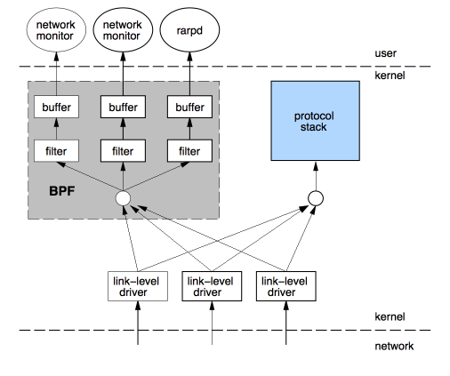
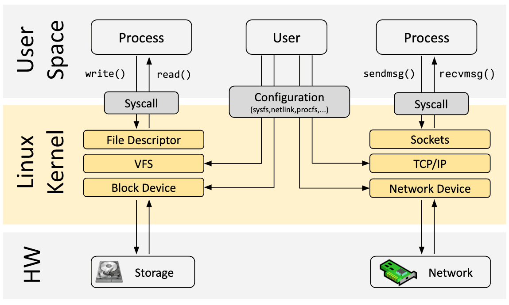
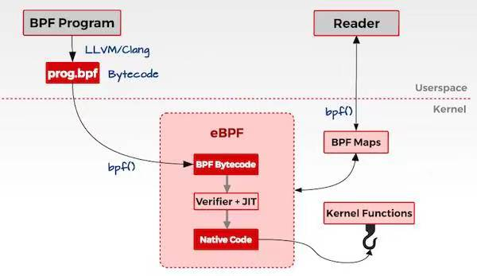

# eBPF

## 一、eBPF是什么？

### BPF

BPF全称为Berkeley Packet Filter（伯克利包过滤器），起源于1992年的一篇论文，该论文提出了一种对网络包进行过滤的框架，如下：



早期从网卡中接收到很多的数据包，要想从中过滤出想要的数据包，就需要将网卡接收的数据包都要**从内核空间拷贝一份到用户空间**（因为过滤的业务逻辑是用户指定的，其运行在用户态），然后由**用户程序对这些进行过滤**。这其中存在的问题是：无论是否有效，网络的数据包必须全部拷贝，然后再过滤出所需的数据包，这其中就产生了对无效数据包的无效拷贝，浪费CPU资源。BPF技术产生在这个问题背景下，BPF会在内核中直接过滤，从而避免一些无用的、浪费的拷贝。其背后的思想其实就是：与其把数据包复制到用户空间执行用户态程序过滤，不如把**过滤程序注入到内核**去（即扩展了内核的功能，后面会将eBPF的方式与编写内核模块的方式进行对比）。

### eBPF

eBPF即extend BPF，是在BPF技术的基础上进行扩展，丰富了BPF的功能，使其**不仅能够进行网络数据包的过滤**，而是**基本上可以使用在Linux各个子系统中**（如监控系统调用，系统行为等等）。在eBPF出现后，过去的BPF被称为cBPF（classic BPF）。在eBPF技术的支持下，内核变得可编程。

详细介绍eBPF之前，先简单看一下Linux内核的架构：



Linux 内核的主要目的是**抽象硬件或虚拟硬件并提供一致的 API**（系统调用），允许应用程序运行和共享资源。为了实现这一点，Linux维护了广泛的子系统和层集来分配这些职责。一般来说，用户可以配置每个子系统的具体行为，如果无法配置所需的行为，则需要根据需求来扩展内核的功能。

传统的内核扩展方式有两种：

- **更改内核源代码**并说服 Linux 内核社区需要更改，并在若干时间后作为新的Linux版本发布；
- **开发内核模块**，利用Linux可以灵活地装载和卸载模块来实现功能扩展，但具有安全风险，且需要针对Linux的不同版本进行维护；

eBPF提供了这两种方式之外的一种方式，将要扩展的功能用**eBPF的指令**来实现（eBPF的指令是什么后面再说），并将该指令加载到内核中，从而实现内核功能的扩展。这里有几个问题：

**1、同样是把要写的功能挂载到内核中，这与内核模块有什么区别？**

到目前来看，eBPF和内核模块的行为方式很像，都是开发对应要扩展的功能，然后将其加载进内核使用。但这两者有一个根本的区别就是：内核模块是直接以硬件可以执行的字节码（如arm汇编）加载到内核，内核可以将其作为内核代码的一部分直接由处理器取指执行。因此，内核模块加载到内核之后执行时会很快，但它存在两个问题：第一，需要针对不同的Linux版本进行维护；第二、由于模块加载时没有经过安全检查，具有安全风险。而eBPF利用与内核模块不同的扩展机制解决了这两个问题，机制如下：

首先要明确，eBPF技术其实是一个沙箱（sandbox）技术，它与Java的运行机制很相似。Java是在本机上运行了jvm（Java virtual machine，Java虚拟机），将Java的字节码文件（也就是由.java文件经过javac指令后生成的.class文件）运行在jvm上，由jvm完成与物理机的交互，从而实现了跨平台的执行。eBPF也是类似，该技术是在**内核态**运行了一个**基于eBPF指令架构的虚拟机（暂时可以简单理解为一种指令集ISA，它与本机是arm还是x86_64还是risc-v都无关）**（这个虚拟机可以类比jvm），由eBPF指令编写好的字节码程序（也就是用户想要给内核扩展的功能）会由该虚拟机**解释执行**（划重点：这里是解释执行，后面会说），从而实现功能的扩展，因为该虚拟机的存在，eBPF不需要像内核模块一样需要根据不同的Linux内核版本维护不同的版本，因此eBPF解决了内核模块存在的第一个问题。接下来是第二个问题：安全性的保证。前面提到过，eBPF对内核的扩展需要将eBPF字节码加载到内核中，在加载时内核就会有一个Verification的过程，Verification会检查该eBPF是否会对系统作出损害且可以保证运行完成（不会以死循环的方式占据系统资源），Verification保证了加载到内核的eBPF的一定是安全的（这里的检查机制我还没详细地查过，简单知道有个安全检查的过程就好）。于是eBPF的安全性也得到了保证，内核模块的第二个问题解决。

图解：



好，现在回到刚才划重点的地方：eBPF虚拟机的**解释执行**，没错，这里的用词是解释执行，因此它在执行起来会很慢。为了加速这个过程，有一个大神（忘了是哪个大神了）提出了“即使编译”（JIT）技术，目前就个人理解来说，JIT其实就是eBPF字节码被加载并经过Verification后，会经过一个编译的过程，将eBPF字节码编译为物理机的机器码，从而加速了eBPF程序的执行。当然，Verification与JIT都是在内核里做的（后面会说这里的细节，其实是通过系统调用的方式，系统调用里会完成这两个过程），因此肯定需要内核提供的支持，Verification是肯定有的，而JIT是一个加速的过程，似乎有些Linux版本不支持，但因为JIT只是为了加速，不影响功能的实现，所以也问题不大。

**2、什么是eBPF指令？**

前面提到，eBPF其实是一个运行在内核的虚拟机（看到的文章都说它是个沙箱，我其实不清楚和虚拟机有什么区别，为了后面说的方便点就当虚拟机了），既然是虚拟机，肯定有**可以执行指令**以及**对应的寄存器**的规范。eBPF虚拟机的这些规范是自己设计的，与arm、risc-v这种没有关系，它是一个自己独立的指令集，规定了一些eBPF虚拟机才可以执行的指令。举个例子，这是一个cBPF的字节码，用来完成对tcp网络包的过滤（基于端口过滤）：

```assembly
ldh      [12]
jeq      #0x86dd          jt 2    jf 6
ldb      [20]
jeq      #0x6             jt 4    jf 15
ldh      [56]
jeq      #0x50            jt 14   jf 15
jeq      #0x800           jt 7    jf 15
ldb      [23]
jeq      #0x6             jt 9    jf 15
ldh      [20]
jset     #0x1fff          jt 15   jf 11
ldxb     4*([14]&0xf)
ldh      [x + 16]
jeq      #0x50            jt 14   jf 15
ret      #262144
ret      #0
```

不用懂这一段eBPF汇编具体每条是什么含义，只需要知道eBPF设计了一个独一无二的指令集，包括一些指令以及寄存器的数据（想了解详细的虚拟机架构可以去看[eBPF概述第二部分：机器和字节码](https://www.collabora.com/news-and-blog/blog/2019/04/15/an-ebpf-overview-part-2-machine-and-bytecode/)）。也就是说，eBPF程序的最原生的表现形式就是eBPF字节码。

另外提前插一句：在cBPF时期，由于程序的功能单一，只是做网络包的过滤，因此没有出现专门的编译器，cBPF程序的开发都是用字节码完成，因此编程难度很大。而到了eBPF时期，程序的功能越来越丰富，都用字节码来实现并不现实，于是出现了像`clang / llvm`这种把高级语言程序（如C）编译成eBPF字节码的编译器，从而可以利用高级语言开发eBPF程序。（这一部分在后面eBPF开发部分会说）

**3、内核模块可以通过Linux加载模块的指令加载进内核，那eBPF程序是怎么加载到内核的？**

eBPF程序加载到内核，一般是通过`bpf()`系统调用（现在的各种简化开发的框架，如bcc和libbpf，都在不同程度上封装了`bpf()`系统调用），该系统调用的参数以及具体功能后面会详细地说，现在只结合`bpf()`对eBPF的加载过程做一个简单的说明。

要加载一个eBPF程序，首先要有一个待加载的**eBPF字节码**。在最原生的方式下，eBPF的字节码不是一个单独的文件，而是一个结构体，该结构体被当作`bpf()`系统调用的参数传入后在内核中完成加载。为了便于理解，这里给出一个例子：

```c
// BPF程序就是一个bpf_insn数组, 一个struct bpf_insn代表一条bpf指令
struct bpf_insn bpf_prog[] = {
    { 0xb7, 0, 0, 0, 0x2 }, //初始化一个struct bpf_insn, 指令含义: mov r0, 0x2;
    { 0x95, 0, 0, 0, 0x0 }, //初始化一个struct bpf_insn, 指令含义: exit;
};
```

`struct bpf_insn`就是一条eBPF字节码指令，用上面的方式可以设置两条指令`mov r0 0x2; exit;`。这两条指令对应的数组就可以看作是一个eBPF字节码程序（这可能也是为什么这个数组命名为`bpf_prog`，含义应该就是bpf program）。最终这个eBPF字节码数组会被作为`bpf()`系统调用的参数，经系统调用把这段字节码加载到内核，完成内核功能的扩展。（另外要说明一下，这里的数组`bpf_prog`在被真正作为`bpf()`的参数时，其实会被另一个结构体在外面封装一层，封装这一层会包含另外一些需要用到的信息，如`bpf_type`，`bpf_license`这种，但最终这个字节码数组`bpf_prog`肯定会传给kernel的）。

## 二、eBPF程序接口

不管是原生的eBPF程序还是借助其他库书写的eBPF程序，在组成上都有三个部分：内核态功能实现（做一些内核函数的调用处理等等）、用户态功能实现（在用户态利用内核态数据）、将内核态功能代码（即eBPF字节码）挂载到内核上。一般eBPF程序（kernel）都是被用户进程（user）加载，并在用户进程退出时自动卸载。

### bpf-map

bpf-map是为了保存多类型数据的通用数据结构（是一个可以存取数据的**域对象**），bpf-map的数据可以理解为eBPF全局的，能够在kernel和user的eBPF程序之间**共享数据**（用来通信，从而在user得到kernel的信息），也能够在不同的eBPF内核程序间**共享数据**。数据类型都被是为二进制的，用户在创建map时需要指明key和value的**大小**（只需要大小，而不需要类型），也就是说，一个映射的key或者value可以是任意类型的数据，只需要符合创建map时指定的大小即可。

用户进程可以创建多个map并且通过文件描述符fd访问（创建和访问方式后面说，其实都是通过bpf系统调用），不同的eBPF程序可以并行访问相同的map，map里面保存什么取决于用户进程和eBPF程序。

每一个eBPF程序都是可以安全执行的指令集合，内核中的Verification会静态的检查一个BPF程序是否会终止，是否安全。在验证期间, 内核会增加这个eBPF程序**使用的所有map的引用计数**, 因此附加的map不能被移除，直到程序被卸载。

每个map都由以下几个属性：

```c
enum bpf_map_type map_type;		/* bpf map的类型 */
unsigned int key_size;			/* map存取数据的key的大小，字节为单位 */
unsigned int value_size;		/* map存取数据的key的大小，字节为单位 */
unsigned int max_entries;		/* map中最多存取的数据项个数 */
```

以上四个对象在创建map时需要指定，创建完成后便可以根据map的key和value大小存取对应数据。`key_size`、`value_size`和`max_entries`很清楚，type是指定了map的类型，在Linux源码（`linux6.0/include/uapi/bpf.h`，其余很多结构体和枚举类的定义也是在该文件下）中type有如下取值：

```c
enum bpf_map_type {
	BPF_MAP_TYPE_UNSPEC,
	BPF_MAP_TYPE_HASH,
	BPF_MAP_TYPE_ARRAY,
	BPF_MAP_TYPE_PROG_ARRAY,
	BPF_MAP_TYPE_PERF_EVENT_ARRAY,
	BPF_MAP_TYPE_PERCPU_HASH,
	BPF_MAP_TYPE_PERCPU_ARRAY,
	BPF_MAP_TYPE_STACK_TRACE,
	BPF_MAP_TYPE_CGROUP_ARRAY,
	BPF_MAP_TYPE_LRU_HASH,
	BPF_MAP_TYPE_LRU_PERCPU_HASH,
	BPF_MAP_TYPE_LPM_TRIE,
	BPF_MAP_TYPE_ARRAY_OF_MAPS,
	BPF_MAP_TYPE_HASH_OF_MAPS,
	BPF_MAP_TYPE_DEVMAP,
	BPF_MAP_TYPE_SOCKMAP,
	BPF_MAP_TYPE_CPUMAP,
	BPF_MAP_TYPE_XSKMAP,
	BPF_MAP_TYPE_SOCKHASH,
	BPF_MAP_TYPE_CGROUP_STORAGE,
	BPF_MAP_TYPE_REUSEPORT_SOCKARRAY,
	BPF_MAP_TYPE_PERCPU_CGROUP_STORAGE,
	BPF_MAP_TYPE_QUEUE,
	BPF_MAP_TYPE_STACK,
	BPF_MAP_TYPE_SK_STORAGE,
	BPF_MAP_TYPE_DEVMAP_HASH,
	BPF_MAP_TYPE_STRUCT_OPS,
	BPF_MAP_TYPE_RINGBUF,
	BPF_MAP_TYPE_INODE_STORAGE,
	BPF_MAP_TYPE_TASK_STORAGE,
	BPF_MAP_TYPE_BLOOM_FILTER,
};
```

主要了解一下第二到第四这三个：`BPF_MAP_TYPE_HASH`、`BPF_MAP_TYPE_ARRAY`与`BPF_MAP_TYPE_PROG_ARRAY`。

- `BPF_MAP_TYPE_HASH`：
- `BPF_MAP_TYPE_ARRAY`：数组映射，有如下特征：在初始化时, 所有的数组元素都被预先分配并0初始化（即array不是一个动态表）；映射的键就是数组的下标, 必须是4字节的（int的大小）。常见的用途：定义为一个全局的eBPF变量，只有一个元素, 键为0的数组，value是全局变量的集合，eBPF程序可使用这些变量保存时间的状态，聚合追踪事件到一组固定的桶中。
- `BPF_MAP_TYPE_PROG_ARRAY`：程序数组映射，该map比较特殊，其映射的value只包含引用其他eBPF程序的文件描述符（即key是int大小的数组下标，value是int大小的文件描述符，因此`key_size`和`value_size`都是4）。在这个map中进行查找时, 程序执行流会被就地**重定位到另一个eBPF程序的开头**（即数组中存放的文件描述符对应的program）, 并且不会返回到调用程序。

以上是对map的一个简单认识，只需要直到map可以存取数据，且是全局共享，并且有不同的类型即可。后面会说对map的一系列操作。

### bpf-syscall

在了解map的操作前，先看一下`bpf()`系统调用，这是一切操作的入口。`bpf()`系统调用定义如下：

```c
int bpf(int cmd, union bpf_attr *attr, unsigned int size);
```

> 注：原定义似乎应该是：
>
> ```c
> asmlinkage long sys_bpf(int cmd, union bpf_attr *attr, unsigned int size);
> ```
>
> 取自`linux6.0/include/linux/syscalls.h`，这里就按上面第一个系统调用来解释。

解释一下各个参数：

`cmd`：int型，用来表示bpf系统调用操作的类型，决定该系统调用应该执行什么操作，定义在`linux6.0/include/uapi/linux/bpf.h`下，该文件中同样可以找到对应的注释文本说明，也有不同的操作对应参数、返回值以及出错的一些说明：

```c
enum bpf_cmd {
	BPF_MAP_CREATE,
	BPF_MAP_LOOKUP_ELEM,
	BPF_MAP_UPDATE_ELEM,
	BPF_MAP_DELETE_ELEM,
	BPF_MAP_GET_NEXT_KEY,
	BPF_PROG_LOAD,
	BPF_OBJ_PIN,
	BPF_OBJ_GET,
	BPF_PROG_ATTACH,
	BPF_PROG_DETACH,
	BPF_PROG_TEST_RUN,
	BPF_PROG_RUN = BPF_PROG_TEST_RUN,
	BPF_PROG_GET_NEXT_ID,
	BPF_MAP_GET_NEXT_ID,
	BPF_PROG_GET_FD_BY_ID,
	BPF_MAP_GET_FD_BY_ID,
	BPF_OBJ_GET_INFO_BY_FD,
	BPF_PROG_QUERY,
	BPF_RAW_TRACEPOINT_OPEN,
	BPF_BTF_LOAD,
	BPF_BTF_GET_FD_BY_ID,
	BPF_TASK_FD_QUERY,
	BPF_MAP_LOOKUP_AND_DELETE_ELEM,
	BPF_MAP_FREEZE,
	BPF_BTF_GET_NEXT_ID,
	BPF_MAP_LOOKUP_BATCH,
	BPF_MAP_LOOKUP_AND_DELETE_BATCH,
	BPF_MAP_UPDATE_BATCH,
	BPF_MAP_DELETE_BATCH,
	BPF_LINK_CREATE,
	BPF_LINK_UPDATE,
	BPF_LINK_GET_FD_BY_ID,
	BPF_LINK_GET_NEXT_ID,
	BPF_ENABLE_STATS,
	BPF_ITER_CREATE,
	BPF_LINK_DETACH,
	BPF_PROG_BIND_MAP,
};
```

主要会用到以下几个值：

- `BPF_MAP_CREATE`：**创建一个映射**，返回一个引用此map的文件描述符（后续通过文件描述符访问map），close-on-exec标志会自动设置（这个是文件描述符的标识符，含义是在执行exec函数族时关闭该文件描述符）；
- `BPF_MAP_LOOKUP_ELEM`：在指定的映射（通过文件描述符指定）中**根据key查找一个元素**，并返回他的值；
- `BPF_MAP_UPDATE_ELEM`：在指定映射中**创建或者更新**一个元素（创建和更新两个操作，后面会有与之对应的flags）；
- `BPF_MAP_DELETE_ELEM`：在指定映射中根据key查找并删除一个元素；
- `BFP_MAP_GET_NEXT_KEY`：在指定映射中根据key查找一个元素, 并返回下一个元素的key；
- `BPF_PROG_LOAD`：**验证并加载一个eBPF程序**，返回一个与此程序关联的新文件描述符，close-on-exec标志也会自动加上；

`attr`：bpf系统调用执行由cmd指定的操作时需要用到的参数信息，类型为`union bpf_attr`，联合体能够使其灵活地为不同类型的操作传参，接口统一。该联合体定义在`linux6.0/include/uapi/linux/bpf.h`文件下，完整定义很长，摘取和上面提到的几种bpf操作相关的参数，如下：

```c
union bpf_attr {
	struct { /* anonymous struct used by BPF_MAP_CREATE command */
		__u32	map_type;	/* one of enum bpf_map_type */
		__u32	key_size;	/* size of key in bytes */
		__u32	value_size;	/* size of value in bytes */
		__u32	max_entries;	/* max number of entries in a map */
		__u32	map_flags;	/* BPF_MAP_CREATE related
					 * flags defined above.
					 */
		__u32	inner_map_fd;	/* fd pointing to the inner map */
		__u32	numa_node;	/* numa node (effective only if
					 * BPF_F_NUMA_NODE is set).
					 */
		char	map_name[BPF_OBJ_NAME_LEN];
		__u32	map_ifindex;	/* ifindex of netdev to create on */
		__u32	btf_fd;		/* fd pointing to a BTF type data */
		__u32	btf_key_type_id;	/* BTF type_id of the key */
		__u32	btf_value_type_id;	/* BTF type_id of the value */
		__u32	btf_vmlinux_value_type_id;/* BTF type_id of a kernel-
						   * struct stored as the
						   * map value
						   */
		/* Any per-map-type extra fields
		 *
		 * BPF_MAP_TYPE_BLOOM_FILTER - the lowest 4 bits indicate the
		 * number of hash functions (if 0, the bloom filter will default
		 * to using 5 hash functions).
		 */
		__u64	map_extra;
	};

	struct { /* anonymous struct used by BPF_MAP_*_ELEM commands */
		__u32		map_fd;
		__aligned_u64	key;
		union {
			__aligned_u64 value;
			__aligned_u64 next_key;
		};
		__u64		flags;
	};

	struct { /* anonymous struct used by BPF_PROG_LOAD command */
		__u32		prog_type;	/* one of enum bpf_prog_type */
		__u32		insn_cnt;
		__aligned_u64	insns;
		__aligned_u64	license;
		__u32		log_level;	/* verbosity level of verifier */
		__u32		log_size;	/* size of user buffer */
		__aligned_u64	log_buf;	/* user supplied buffer */
		__u32		kern_version;	/* not used */
		__u32		prog_flags;
		char		prog_name[BPF_OBJ_NAME_LEN];
		__u32		prog_ifindex;	/* ifindex of netdev to prep for */
		/* For some prog types expected attach type must be known at
		 * load time to verify attach type specific parts of prog
		 * (context accesses, allowed helpers, etc).
		 */
		__u32		expected_attach_type;
		__u32		prog_btf_fd;	/* fd pointing to BTF type data */
		__u32		func_info_rec_size;	/* userspace bpf_func_info size */
		__aligned_u64	func_info;	/* func info */
		__u32		func_info_cnt;	/* number of bpf_func_info records */
		__u32		line_info_rec_size;	/* userspace bpf_line_info size */
		__aligned_u64	line_info;	/* line info */
		__u32		line_info_cnt;	/* number of bpf_line_info records */
		__u32		attach_btf_id;	/* in-kernel BTF type id to attach to */
		union {
			/* valid prog_fd to attach to bpf prog */
			__u32		attach_prog_fd;
			/* or valid module BTF object fd or 0 to attach to vmlinux */
			__u32		attach_btf_obj_fd;
		};
		__u32		core_relo_cnt;	/* number of bpf_core_relo */
		__aligned_u64	fd_array;	/* array of FDs */
		__aligned_u64	core_relos;
		__u32		core_relo_rec_size; /* sizeof(struct bpf_core_relo) */
	};
} __attribute__((aligned(8)));
```

下面按照不同的bpf操作梳理一下各个结构的作用：

**BPF_MAP_CREATE**

该操作是用来根据`attr`中的信息创建一个map，执行此操作时，联合体中起作用的是第一个结构体（部分参数省略了）：

```c
struct { /* BPF_MAP_CREATE操作使用 */
    __u32	map_type;		/* bpf map的类型 */
    __u32	key_size;		/* map存取数据的key的大小，字节为单位 */
    __u32	value_size;		/* map存取数据的key的大小，字节为单位 */
    __u32	max_entries;	/* map中最多存取的数据项个数 */
};
```

这里的四个参数就是上面介绍map的属性时提到的四个参数，其他的参数可以暂时不考虑（创建时也是用默认的值）。由以上四个值，bpf系统调用就可以创建一个全局的bpf-map以供存取和共享数据。

**BPF_MAP___*___ELEM 与 BFP_MAP_GET_NEXT_KEY **

包括lookup、update和delete三个操作，用来操作map中的数据。执行此操作时，联合体起作用的是第二个结构体：

```c
struct { /* BPF_MAP_*_ELEM与BFP_MAP_GET_NEXT_KEY操作使用 */
    __u32		map_fd;			/* 操作的map文件描述符 */
    __aligned_u64	key;		/* 操作数据的key */
    union {
        __aligned_u64 value;	/* 存放value */
        __aligned_u64 next_key;	/* 存放next_key */
    };
    __u64		flags;			/* 对key操作的类型 */
};
```

着重说一下`flags`这个参数，这个参数主要用在update时起作用，用来指定更新和创建操作的类型，取值有以下几个：

- `BPF_ANY`：创建一个新元素或者更新一个已有的（无论是否有，都将key设为value）；
- `BPF_NOEXIST`：只在元素不存在的情况下创建一个新的元素（无则创建，有则忽略）；
- `BPF_EXIST`：更新一个已经存在的元素（有则更新，无则忽略）；

该操作通过map的文件描述符（万物皆文件嘛）与预设的key操作map中的数据。

**BPF_PROG_LOAD**

该操作用来给内核中加载一个bpf_prog对象（也就是一个eBPF字节码程序）。在解释这个系统调用操作的参数前，先简单说一下一个结构体：`struct bpf_insn`（同样定义在`linux6.0/include/uapi/linux/bpf.h`下）。

```c
struct bpf_insn {
	__u8	code;		/* opcode */
	__u8	dst_reg:4;	/* dest register */
	__u8	src_reg:4;	/* source register */
	__s16	off;		/* signed offset */
	__s32	imm;		/* signed immediate constant */
};
```

结构很简单，可以很清晰地看出是一个汇编指令的格式：`code`字段指明操作类型，`src_reg`指明源寄存器，`dst_reg`指明目的寄存器，`off`和`imm`分别指明符号偏移和立即数。因此`bpf_insn`其实对eBPF的字节码进行了拆分，提高了可读性与数据的控制粒度，本质上就是一条eBPF指令。

所谓的bpf_prog对象并不是有一个名为bpf_prog结构体，而是描述了一个bpf_insn的数组。因为bpf_insn为一条单独的eBPF指令，因此其对应的数组就是一连串eBPF字节码，一般就是一个完整的eBPF内核程序，因此被称为bpf_prog。

然后再看eBPF的加载操作，执行此操作时，联合体起作用的是第三个结构体（部分参数忽略了）：

```c
struct { /* BPF_PROG_LOAD操作使用 */
    __u32		prog_type;		/* BPF程序的类型 */
    __u32		insn_cnt;		/* BPF字节码包含的指令个数 */
    __aligned_u64	insns;		/* 其实是const struct bpf_insn* 包含了指令的数据 */
    __aligned_u64	license;	/* 其实是const char* 证书，验证安全性会用到 */
    __u32		log_level;		/* verifier的详细等级（也就是说什么级别的信息会被作为日志输出） */
    __u32		log_size;		/* 用户缓冲区的大小 */
    __aligned_u64	log_buf;	/* 用户提供的缓冲区（应该是用来放verifier的输出信息） */
};
```

第一个参数为`prog_type`，代表了BPF程序的类型，可以的取值定义在`linux6.0/include/uapi/linux/bpf.h`（这个文件堪称eBPF程序的万物起源）

```c
enum bpf_prog_type {
	BPF_PROG_TYPE_UNSPEC,
	BPF_PROG_TYPE_SOCKET_FILTER,
	BPF_PROG_TYPE_KPROBE,
	BPF_PROG_TYPE_SCHED_CLS,
	BPF_PROG_TYPE_SCHED_ACT,
	BPF_PROG_TYPE_TRACEPOINT,
	BPF_PROG_TYPE_XDP,
	BPF_PROG_TYPE_PERF_EVENT,
	BPF_PROG_TYPE_CGROUP_SKB,
	BPF_PROG_TYPE_CGROUP_SOCK,
	BPF_PROG_TYPE_LWT_IN,
	BPF_PROG_TYPE_LWT_OUT,
	BPF_PROG_TYPE_LWT_XMIT,
	BPF_PROG_TYPE_SOCK_OPS,
	BPF_PROG_TYPE_SK_SKB,
	BPF_PROG_TYPE_CGROUP_DEVICE,
	BPF_PROG_TYPE_SK_MSG,
	BPF_PROG_TYPE_RAW_TRACEPOINT,
	BPF_PROG_TYPE_CGROUP_SOCK_ADDR,
	BPF_PROG_TYPE_LWT_SEG6LOCAL,
	BPF_PROG_TYPE_LIRC_MODE2,
	BPF_PROG_TYPE_SK_REUSEPORT,
	BPF_PROG_TYPE_FLOW_DISSECTOR,
	BPF_PROG_TYPE_CGROUP_SYSCTL,
	BPF_PROG_TYPE_RAW_TRACEPOINT_WRITABLE,
	BPF_PROG_TYPE_CGROUP_SOCKOPT,
	BPF_PROG_TYPE_TRACING,
	BPF_PROG_TYPE_STRUCT_OPS,
	BPF_PROG_TYPE_EXT,
	BPF_PROG_TYPE_LSM,
	BPF_PROG_TYPE_SK_LOOKUP,
	BPF_PROG_TYPE_SYSCALL, /* a program that can execute syscalls */
};
```

一个eBPF的类型决定了它能调用哪些helper函数（helper具体的结构和定义是什么后面再说，可以理解为就是它能访问内核结构的范围，就好像一个用来做网络包处理的eBPF程序，不能访问到内核中和调度相关的结构），一定程度上保证了eBPF程序的安全性。举个例子就是，一个做网络包过滤的eBPF程序，type为`BPF_PROG_TYPE_SOCKET_FILTER`，它可以用的helper函数如下：

```c
bpf_map_lookup_elem(map_fd, void *key);					//在map_fd中寻找key
bpf_map_update_elem(map_fd, void *key, void *value); 	// 更新key或者value
bpf_map_delete_elem(map_fd, void *key); 				//在map_fd中删除一个键
```

`insn_cnt`代表了eBPF指令的条数，`insns`实际就是一个`struct insn`数组，保存了eBPF的指令数据。`license`是程序的许可字符串。

后面是log相关的三个参数，用来控制verifier保存的信息。`log_buf`是一个调用者分配的缓冲区，verifier可以在里面保存验证的log信息. 这个log信息由多行字符串组成，目的是让程序作者明白为什么verifier认为这个程序是不安全的(相当于编译器的日志）；`log_size`是`log_buf`的缓冲区大小，要是缓冲区不足以保存全部的验证器日志，那么会返回-1，并把`errno`设置为`ENOSPC`；`log_level`是verifier日志的详细级别，00表示验证器不会提供日志，在这种情况下`log_buf`必须是空指针，`log_size`必须是0。

以上参数供`BPF_PROG_LOAD`操作使用，为内核加载一个eBPF字节程序。

bpf系统调用的最后一个参数`size`，代表`attr`参数的大小。

于是，通过最原生的`bpf()`系统调用，我们可以完成对map的创建和访问，对eBPF程序的加载。但这个操作是比较复杂的，需要我们了解并配置很多参数，使用起来并不友好，于是在syscall的基础上出现了一些helper函数，用来帮助我们简化对`bpf()`的使用。

### bpf-helper


### 原生eBPF

原生的eBPF程序由一个简单的`.c`文件完成以上三个部分，通过


## 参考

eBPF概念性介绍：[What is eBPF?](https://ebpf.io/what-is-ebpf/)、[eBPF介绍](http://kerneltravel.net/blog/2021/zxj-ebpf1/)

eBPF代码实现介绍：[eBPF概述第一部分：简介](https://www.collabora.com/news-and-blog/blog/2019/04/05/an-ebpf-overview-part-1-introduction/)、[eBPF概述第二部分：机器和字节码](https://www.collabora.com/news-and-blog/blog/2019/04/15/an-ebpf-overview-part-2-machine-and-bytecode/)、[XDP和eBPF简介](https://blogs.igalia.com/dpino/2019/01/07/introduction-to-xdp-and-ebpf/)、[BPF之路一bpf系统调用](https://www.anquanke.com/post/id/263803)

eBPF开发参考项目：[官方入门Lab](https://play.instruqt.com/embed/isovalent/tracks/ebpf-getting-started?token=em_9nxLzhlV41gb3rKM&show_challenges=true)、[awesome-ebpf](https://github.com/zoidbergwill/awesome-ebpf)、[bpf-developer-tutorial](https://github.com/eunomia-bpf/bpf-developer-tutorial)、[libbpf-bootstrap](https://github.com/libbpf/libbpf-bootstrap)、[bcc](https://github.com/iovisor/bcc)（该项目主要关注其中的文档：[tutorial_bcc_python_developer.md](https://github.com/iovisor/bcc/blob/master/docs/tutorial_bcc_python_developer.md)）

Linux源码：[linux kernel](https://www.kernel.org/)（看的是6.0版本）
