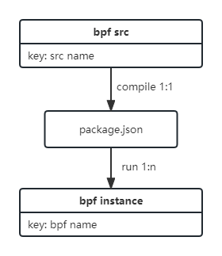

# 结构设计

### 一、基本概念

1. 源代码：bpf.c
2. 中间产物：package.json
3. bpf实例：一个运行着的bpf-runner进程
4. bpf name：唯一对应一个bpf实例
5. src：一次编译运行的所有源代码，是bpf实例的模板，类似于image

### 二、对应关系

如图：

### 三、指令说明

1. run：根据src运行一个或多个bpf实例；
2. list：列出当前集群所有bpf实例；
3. log：输出指定bpf实例的执行结果；
4. delete：从集群中删除指定bpf实例；
5. build：待实现；

### 四、文件存储

在`~/.kube/bpf/`下存储需要的配置信息：

- bpf_name：每个bpf实例对应的信息，包括pod与src；
- bpf_src：每个bpf_src对应的信息，包括源文件与package.json；