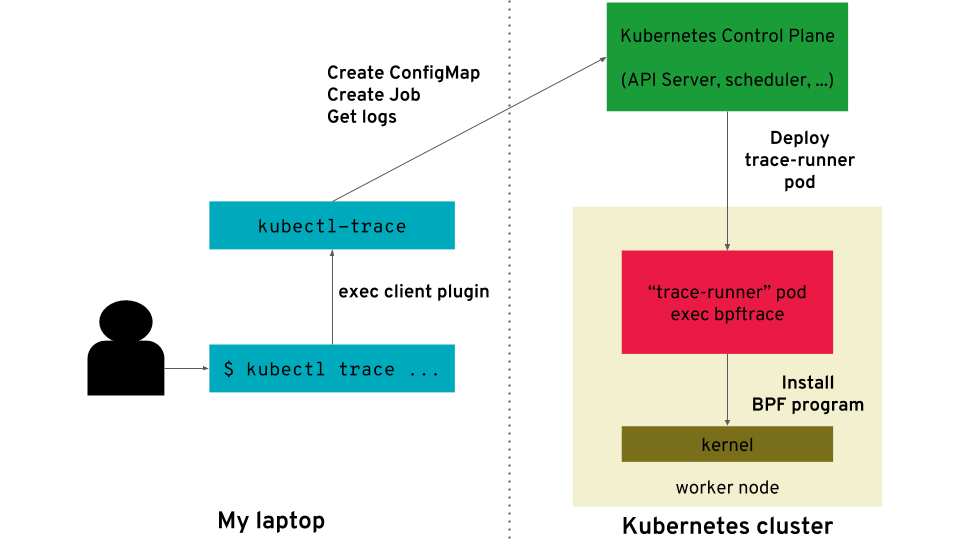

# proj205-ebpf-k8s

1. K8S和docker基础知识 							√  
2. eBPF基础知识 								          √
3. eBPF应用场景与代码实现
    - libbpf                                                  √
    - libbpf-bootstrap                               √
    - bcc                                                       √
    - bpftrace                                              √
4. K8S与eBPF结合（kubectl-trace，在k8s集群上调度部署bpftrace）√
5. eunomia-ebpf项目结构（bumblebee）
6. （optional：Wasm与wasm-bpf）

过去两周：

- 搭建k8s集群
- 运行libbpf-bootstrap
- libbpf下的ebpf程序编译安装过程
- k8s插件（kubectl-trace）
- 讨论需求：
    - 中间产物（package.json）
    - 监控docker
    - 直接在node上bpf
    - 升级和回滚怎么做

下一步安排：

首先是逐步通过kubectl指令

1. 创建config-map（挂载package.json）
2. 在master上编译ebpf得到中间产物package.json（ecc）
3. 在node上创建pod，通过package.json安装bpf（ecli）

（手动完成在master上编写bpf，使得在node上执行bpf）

