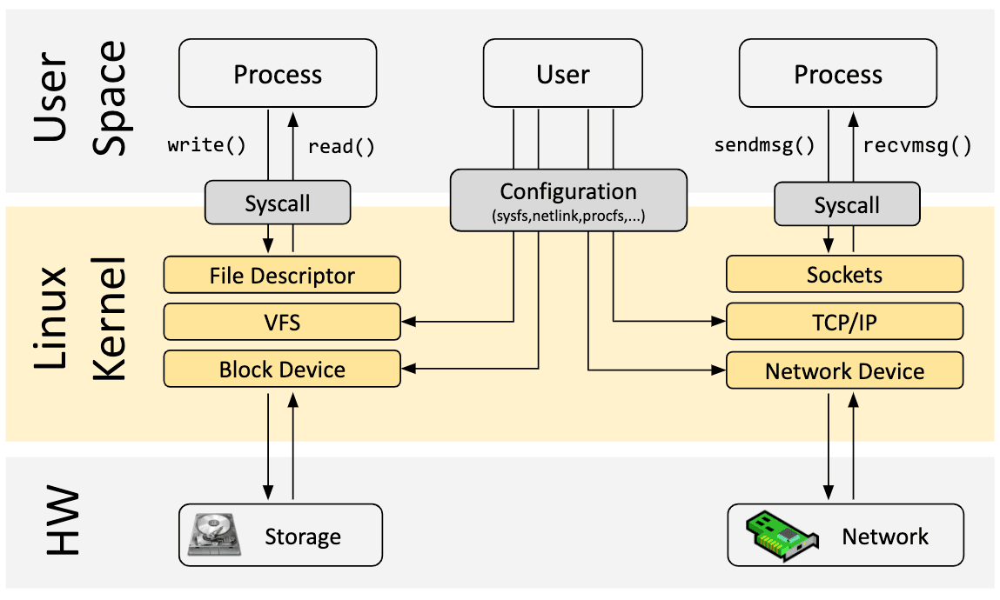
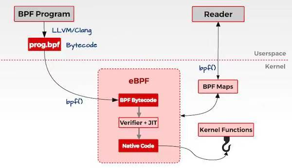
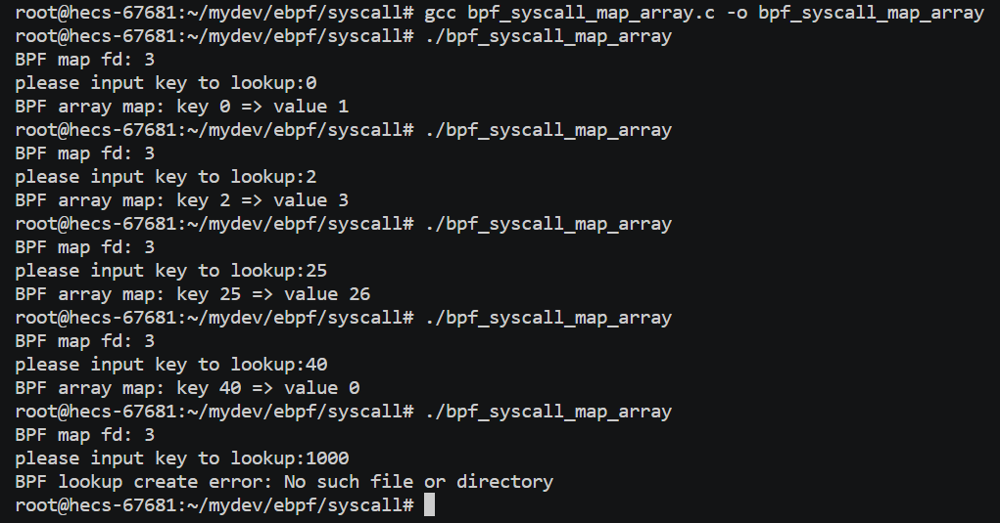
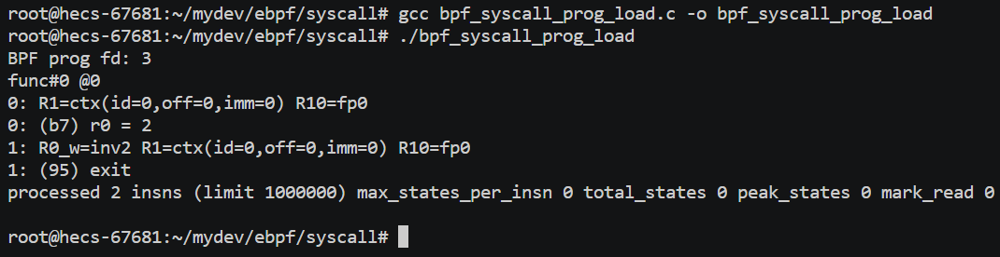

# eBPF

## 一、eBPF是什么？

### BPF

BPF全称为Berkeley Packet Filter（伯克利包过滤器），起源于1992年的一篇论文，该论文提出了一种对网络包进行过滤的框架，如下：


早期从网卡中接收到很多的数据包，要想从中过滤出想要的数据包，就需要将网卡接收的数据包都要**从内核空间拷贝一份到用户空间**（因为过滤的业务逻辑是用户指定的，其运行在用户态），然后由**用户程序对这些进行过滤**。这其中存在的问题是：无论是否有效，网络的数据包必须全部拷贝，然后再过滤出所需的数据包，这其中就产生了对无效数据包的无效拷贝，浪费CPU资源。BPF技术产生在这个问题背景下，BPF会在内核中直接过滤，从而避免一些无用的、浪费的拷贝。其背后的思想其实就是：与其把数据包复制到用户空间执行用户态程序过滤，不如把**过滤程序注入到内核**去（即扩展了内核的功能，后面会将eBPF的方式与编写内核模块的方式进行对比）。

### eBPF

eBPF即extend BPF，是在BPF技术的基础上进行扩展，丰富了BPF的功能，使其**不仅能够进行网络数据包的过滤**，而是**基本上可以使用在Linux各个子系统中**（如监控系统调用，系统行为等等）。在eBPF出现后，过去的BPF被称为cBPF（classic BPF）。在eBPF技术的支持下，内核变得可编程。

详细介绍eBPF之前，先简单看一下Linux内核的架构：



Linux 内核的主要目的是**抽象硬件或虚拟硬件并提供一致的 API**（系统调用），允许应用程序运行和共享资源。为了实现这一点，Linux维护了广泛的子系统和层集来分配这些职责。一般来说，用户可以配置每个子系统的具体行为，如果无法配置所需的行为，则需要根据需求来扩展内核的功能。

传统的内核扩展方式有两种：

- **更改内核源代码**并说服 Linux 内核社区需要更改，并在若干时间后作为新的Linux版本发布；
- **开发内核模块**，利用Linux可以灵活地装载和卸载模块来实现功能扩展，但具有安全风险，且需要针对Linux的不同版本进行维护；

eBPF提供了这两种方式之外的一种方式，将要扩展的功能用**eBPF的指令**来实现（eBPF的指令是什么后面再说），并将该指令加载到内核中，从而实现内核功能的扩展。这里有几个问题：

**1、同样是把要写的功能挂载到内核中，这与内核模块有什么区别？**

到目前来看，eBPF和内核模块的行为方式很像，都是开发对应要扩展的功能，然后将其加载进内核使用。但这两者有一个根本的区别就是：==内核模块是直接以硬件可以执行的字节码（如arm汇编）加载到内核，内核可以将其作为内核代码的一部分直接由处理器取指执行==。因此，内核模块加载到内核之后执行时会很快，但它存在两个问题：第一，需要针对不同的Linux版本进行维护；第二、由于模块加载时没有经过安全检查，具有安全风险。而eBPF利用与内核模块不同的扩展机制解决了这两个问题，机制如下：

首先要明确，eBPF技术其实是一个沙箱（sandbox）技术，它与Java的运行机制很相似。Java是在本机上运行了jvm（Java virtual machine，Java虚拟机），将Java的字节码文件（也就是由.java文件经过javac指令后生成的.class文件）运行在jvm上，由jvm完成与物理机的交互，从而实现了跨平台的执行。eBPF也是类似，该技术是在**内核态**运行了一个**基于eBPF指令架构的虚拟机（暂时可以简单理解为一种指令集ISA，它与本机是arm还是x86_64还是risc-v都无关）**（这个虚拟机可以类比jvm），由eBPF指令编写好的字节码程序（也就是用户想要给内核扩展的功能）会由该虚拟机**解释执行**（划重点：这里是解释执行，后面会说），从而实现功能的扩展，因为该虚拟机的存在，eBPF不需要像内核模块一样需要根据不同的Linux内核版本维护不同的版本，因此eBPF解决了内核模块存在的第一个问题。接下来是第二个问题：安全性的保证。前面提到过，eBPF对内核的扩展需要将eBPF字节码加载到内核中，在加载时内核就会有一个Verification的过程，Verification会检查该eBPF是否会对系统作出损害且可以保证运行完成（不会以死循环的方式占据系统资源），Verification保证了加载到内核的eBPF的一定是安全的（这里的检查机制我还没详细地查过，简单知道有个安全检查的过程就好）。于是eBPF的安全性也得到了保证，内核模块的第二个问题解决。

可以列一下eBPF和内核模块的对比：

|        维度         |            Linux 内核模块            |                      eBPF                      |
| :-----------------: | :----------------------------------: | :--------------------------------------------: |
| kprobes/tracepoints |                 支持                 |                      支持                      |
|     **安全性**      |   可能引入安全漏洞或导致内核 Panic   |      通过验证器进行检查，可以保障内核安全      |
|      内核函数       |           可以调用内核函数           |          只能通过 BPF Helper 函数调用          |
|       编译性        |             需要编译内核             |         不需要编译内核，引入头文件即可         |
|        运行         |           基于相同内核运行           | 基于稳定 ABI 的 BPF 程序可以编译一次，各处运行 |
|   与应用程序交互    |            打印日志或文件            |          通过 perf_event 或 map 结构           |
|   数据结构丰富性    |                 一般                 |                      丰富                      |
|    **入门门槛**     |                  高                  |                       低                       |
|      **升级**       | 需要卸载和加载，可能导致处理流程中断 |       原子替换升级，不会造成处理流程中断       |
|      内核内置       |              视情况而定              |                  内核内置支持                  |

图解：



好，现在回到刚才划重点的地方：eBPF虚拟机的**解释执行**，没错，这里的用词是解释执行，因此它在执行起来会很慢。为了加速这个过程，有一个大神（忘了是哪个大神了）提出了“即使编译”（JIT）技术，目前就个人理解来说，JIT其实就是eBPF字节码被加载并经过Verification后，会经过一个编译的过程，将eBPF字节码编译为物理机的机器码，从而加速了eBPF程序的执行。当然，Verification与JIT都是在内核里做的（后面会说这里的细节，其实是通过系统调用的方式，系统调用里会完成这两个过程），因此肯定需要内核提供的支持，Verification是肯定有的，而JIT是一个加速的过程，似乎有些Linux版本不支持，但因为JIT只是为了加速，不影响功能的实现，所以也问题不大。

**2、什么是eBPF指令？**

前面提到，==eBPF其实是一个运行在内核的虚拟机==（看到的文章都说它是个==沙箱==，我其实不清楚和虚拟机有什么区别，为了后面说的方便点就当虚拟机了），既然是虚拟机，肯定有**可以执行指令**以及**对应的寄存器**的规范。eBPF虚拟机的这些规范是自己设计的，与arm、risc-v这种没有关系，它是一个自己独立的指令集，规定了一些eBPF虚拟机才可以执行的指令。举个例子，这是一个cBPF的字节码，用来完成对tcp网络包的过滤（基于端口过滤）：

```assembly
ldh      [12]
jeq      #0x86dd          jt 2    jf 6
ldb      [20]
jeq      #0x6             jt 4    jf 15
ldh      [56]
jeq      #0x50            jt 14   jf 15
jeq      #0x800           jt 7    jf 15
ldb      [23]
jeq      #0x6             jt 9    jf 15
ldh      [20]
jset     #0x1fff          jt 15   jf 11
ldxb     4*([14]&0xf)
ldh      [x + 16]
jeq      #0x50            jt 14   jf 15
ret      #262144
ret      #0
```

不用懂这一段eBPF汇编具体每条是什么含义，只需要知道eBPF设计了一个独一无二的指令集，包括一些指令以及寄存器的数据（想了解详细的虚拟机架构可以去看[eBPF概述第二部分：机器和字节码](https://www.collabora.com/news-and-blog/blog/2019/04/15/an-ebpf-overview-part-2-machine-and-bytecode/)）。也就是说，eBPF程序的最原生的表现形式就是eBPF字节码。

另外提前插一句：在cBPF时期，由于程序的功能单一，只是做网络包的过滤，因此没有出现专门的编译器，cBPF程序的开发都是用字节码完成，因此编程难度很大。而到了eBPF时期，程序的功能越来越丰富，都用字节码来实现并不现实，于是出现了像`clang / llvm`这种把高级语言程序（如C）编译成eBPF字节码的编译器，从而可以利用高级语言开发eBPF程序。（这一部分在后面eBPF开发部分会说）

**3、内核模块可以通过Linux加载模块的指令加载进内核，那eBPF程序是怎么加载到内核的？**

eBPF程序加载到内核，一般是通过`bpf()`系统调用（现在的各种简化开发的框架，如bcc和libbpf，都在不同程度上封装了`bpf()`系统调用），该系统调用的参数以及具体功能后面会详细地说，现在只结合`bpf()`对eBPF的加载过程做一个简单的说明。

要加载一个eBPF程序，首先要有一个待加载的**eBPF字节码**。在最原生的方式下，eBPF的字节码不是一个单独的文件，而是一个结构体，该结构体被当作`bpf()`系统调用的参数传入后在内核中完成加载。为了便于理解，这里给出一个例子：

```c
// BPF程序就是一个bpf_insn数组, 一个struct bpf_insn代表一条bpf指令
struct bpf_insn bpf_prog[] = {
    { 0xb7, 0, 0, 0, 0x2 }, //初始化一个struct bpf_insn, 指令含义: mov r0, 0x2;
    { 0x95, 0, 0, 0, 0x0 }, //初始化一个struct bpf_insn, 指令含义: exit;
};
```

`struct bpf_insn`就是一条eBPF字节码指令，用上面的方式可以设置两条指令`mov r0 0x2; exit;`。这两条指令对应的数组就可以看作是一个eBPF字节码程序（这可能也是为什么这个数组命名为`bpf_prog`，含义应该就是bpf program）。最终这个eBPF字节码数组会被作为`bpf()`系统调用的参数，经系统调用把这段字节码加载到内核，完成内核功能的扩展。（另外要说明一下，这里的数组`bpf_prog`在被真正作为`bpf()`的参数时，其实会被另一个结构体在外面封装一层，封装这一层会包含另外一些需要用到的信息，如`bpf_type`，`bpf_license`这种，但最终这个字节码数组`bpf_prog`肯定会传给kernel的）。

## 二、eBPF程序接口

不管是原生的eBPF程序还是借助其他库书写的eBPF程序，在组成上都有三个部分：内核态功能实现（做一些内核函数的调用处理等等）、用户态功能实现（在用户态利用内核态数据）、将内核态功能代码（即eBPF字节码）挂载到内核上。一般eBPF程序（kernel）都是被用户进程（user）加载，并在**用户进程退出时自动卸载**。

### bpf-map

bpf-map是为了保存多类型数据的通用数据结构（是一个可以存取数据的**域对象**），bpf-map的数据可以理解为eBPF全局的，能够在kernel和user的eBPF程序之间**共享数据**（用来通信，从而在user得到kernel的信息），也能够在不同的eBPF内核程序间**共享数据**。数据类型都被是为二进制的，用户在创建map时需要指明key和value的**大小**（只需要大小，而不需要类型），也就是说，一个映射的key或者value可以是任意类型的数据，只需要符合创建map时指定的大小即可。

用户进程可以创建多个map并且通过文件描述符fd访问（创建和访问方式后面说，其实都是通过bpf系统调用），不同的eBPF程序可以并行访问相同的map，map里面保存什么取决于用户进程和eBPF程序。

每一个eBPF程序都是可以安全执行的指令集合，内核中的Verification会静态的检查一个BPF程序是否会终止，是否安全。在验证期间, 内核会增加这个eBPF程序**使用的所有map的引用计数**, 因此附加的map不能被移除，直到程序被卸载。

每个map都由以下几个属性：

```c
enum bpf_map_type map_type;		/* bpf map的类型 */
unsigned int key_size;			/* map存取数据的key的大小，字节为单位 */
unsigned int value_size;		/* map存取数据的value的大小，字节为单位 */
unsigned int max_entries;		/* map中最多存取的数据项个数 */
```

以上四个对象在创建map时需要指定，创建完成后便可以根据map的key和value大小存取对应数据。`key_size`、`value_size`和`max_entries`很清楚，type是指定了map的类型，在Linux源码中type有如下取值：

```c
enum bpf_map_type {
	BPF_MAP_TYPE_UNSPEC,
	BPF_MAP_TYPE_HASH,
	BPF_MAP_TYPE_ARRAY,
	BPF_MAP_TYPE_PROG_ARRAY,
	BPF_MAP_TYPE_PERF_EVENT_ARRAY,
	BPF_MAP_TYPE_PERCPU_HASH,
	BPF_MAP_TYPE_PERCPU_ARRAY,
	BPF_MAP_TYPE_STACK_TRACE,
	BPF_MAP_TYPE_CGROUP_ARRAY,
	BPF_MAP_TYPE_LRU_HASH,
	BPF_MAP_TYPE_LRU_PERCPU_HASH,
	BPF_MAP_TYPE_LPM_TRIE,
	BPF_MAP_TYPE_ARRAY_OF_MAPS,
	BPF_MAP_TYPE_HASH_OF_MAPS,
	BPF_MAP_TYPE_DEVMAP,
	BPF_MAP_TYPE_SOCKMAP,
	BPF_MAP_TYPE_CPUMAP,
	BPF_MAP_TYPE_XSKMAP,
	BPF_MAP_TYPE_SOCKHASH,
	BPF_MAP_TYPE_CGROUP_STORAGE,
	BPF_MAP_TYPE_REUSEPORT_SOCKARRAY,
	BPF_MAP_TYPE_PERCPU_CGROUP_STORAGE,
	BPF_MAP_TYPE_QUEUE,
	BPF_MAP_TYPE_STACK,
	BPF_MAP_TYPE_SK_STORAGE,
	BPF_MAP_TYPE_DEVMAP_HASH,
	BPF_MAP_TYPE_STRUCT_OPS,
	BPF_MAP_TYPE_RINGBUF,
	BPF_MAP_TYPE_INODE_STORAGE,
	BPF_MAP_TYPE_TASK_STORAGE,
	BPF_MAP_TYPE_BLOOM_FILTER,
};
```

> 注：源码在`linux6.0/include/uapi/linux/bpf.h`，其余很多结构体和枚举类的定义也是在该文件下。另外，在下载下的源码结构中是在这个文件下，不过实验发现在vscode下写代码时，应该include的文件是`linux/bpf.h`，文件内容和`linux6.0/include/uapi/linux/bpf.h`一致，包含相同的结构体定义，后面所有的`linux6.0/include/uapi/linux/bpf.h`文件中的定义在编写代码时都写成`#include <linux/bpf.h>`。另外就是，该文件下的定义全部是struct、union与enum的定义，并没有对应相关的bpf函数定义，这也说明原生的bpf函数只有一个系统调用入口，并没有方便的函数可供使用，后续才有了helper函数。

主要了解一下第二到第四这三个：`BPF_MAP_TYPE_HASH`、`BPF_MAP_TYPE_ARRAY`与`BPF_MAP_TYPE_PROG_ARRAY`。

- `BPF_MAP_TYPE_HASH`：
- `BPF_MAP_TYPE_ARRAY`：数组映射，有如下特征：在初始化时, 所有的数组元素都被预先分配并0初始化（即array不是一个动态表）；映射的键就是数组的下标, 必须是4字节的（int的大小）。常见的用途：定义为一个全局的eBPF变量，只有一个元素, 键为0的数组，value是全局变量的集合，eBPF程序可使用这些变量保存时间的状态，聚合追踪事件到一组固定的桶中。
- `BPF_MAP_TYPE_PROG_ARRAY`：程序数组映射，该map比较特殊，其映射的value只包含引用其他eBPF程序的文件描述符（即key是int大小的数组下标，value是int大小的文件描述符，因此`key_size`和`value_size`都是4）。在这个map中进行查找时, 程序执行流会被就地**重定位到另一个eBPF程序的开头**（即数组中存放的文件描述符对应的program）, 并且不会返回到调用程序（这个程序跳转的过程也被称为**尾调用**过程）。

以上是对map的一个简单认识，只需要直到map可以存取数据，且是全局共享，并且有不同的类型即可。后面会说对map的一系列操作。

### bpf-syscall

在了解map的操作前，先看一下`bpf()`系统调用，这是一切操作的入口。`bpf()`系统调用定义如下：

```c
int bpf(int cmd, union bpf_attr *attr, unsigned int size);
```

> 注：在Linux下，系统调用的原生调用应该是通过`syscall()`函数的方式，指定系统调用号与参数。至于像`read()`这种是在其他头文件中对`syscall(SYS_read)`进行了封装，从而能够忽略系统调用的细节。但bpf系统调用似乎没有这个封装，因此在使用bpf系统调用时的原生方式应该是`syscall(SYS_bpf, cmd, attr, size)`。（也有可能是有这个封装但我没找到）
>
> （不过linux下，以read为例，用户进程具体细节的系统调用过程没有研究过，包括read()是在哪里封装的`syscall(SYS_read)`后续再查吧，现在很自然地理解到read()肯定最后是调用了`syscall(SYS_read)`就好。）

解释一下各个参数：

`cmd`：int型，用来表示bpf系统调用操作的类型，决定该系统调用应该执行什么操作，定义在`linux6.0/include/uapi/linux/bpf.h`下，该文件中同样可以找到对应的注释文本说明，也有不同的操作对应参数、返回值以及出错的一些说明：

```c
enum bpf_cmd {
	BPF_MAP_CREATE,
	BPF_MAP_LOOKUP_ELEM,
	BPF_MAP_UPDATE_ELEM,
	BPF_MAP_DELETE_ELEM,
	BPF_MAP_GET_NEXT_KEY,
	BPF_PROG_LOAD,
	BPF_OBJ_PIN,
	BPF_OBJ_GET,
	BPF_PROG_ATTACH,
	BPF_PROG_DETACH,
	BPF_PROG_TEST_RUN,
	BPF_PROG_RUN = BPF_PROG_TEST_RUN,
	BPF_PROG_GET_NEXT_ID,
	BPF_MAP_GET_NEXT_ID,
	BPF_PROG_GET_FD_BY_ID,
	BPF_MAP_GET_FD_BY_ID,
	BPF_OBJ_GET_INFO_BY_FD,
	BPF_PROG_QUERY,
	BPF_RAW_TRACEPOINT_OPEN,
	BPF_BTF_LOAD,
	BPF_BTF_GET_FD_BY_ID,
	BPF_TASK_FD_QUERY,
	BPF_MAP_LOOKUP_AND_DELETE_ELEM,
	BPF_MAP_FREEZE,
	BPF_BTF_GET_NEXT_ID,
	BPF_MAP_LOOKUP_BATCH,
	BPF_MAP_LOOKUP_AND_DELETE_BATCH,
	BPF_MAP_UPDATE_BATCH,
	BPF_MAP_DELETE_BATCH,
	BPF_LINK_CREATE,
	BPF_LINK_UPDATE,
	BPF_LINK_GET_FD_BY_ID,
	BPF_LINK_GET_NEXT_ID,
	BPF_ENABLE_STATS,
	BPF_ITER_CREATE,
	BPF_LINK_DETACH,
	BPF_PROG_BIND_MAP,
};
```

主要会用到以下几个值：

- `BPF_MAP_CREATE`：**创建一个映射**，返回一个引用此map的文件描述符（后续通过文件描述符访问map），close-on-exec标志会自动设置（这个是文件描述符的标识符，含义是在执行exec函数族时关闭该文件描述符）；
- `BPF_MAP_LOOKUP_ELEM`：在指定的映射（通过文件描述符指定）中**根据key查找一个元素**，并返回他的值；
- `BPF_MAP_UPDATE_ELEM`：在指定映射中**创建或者更新**一个元素（创建和更新两个操作，后面会有与之对应的flags）；
- `BPF_MAP_DELETE_ELEM`：在指定映射中根据key查找并删除一个元素；
- `BFP_MAP_GET_NEXT_KEY`：在指定映射中根据key查找一个元素, 并返回下一个元素的key；
- `BPF_PROG_LOAD`：**验证并加载一个eBPF程序**，返回一个与此程序关联的新文件描述符，close-on-exec标志也会自动加上；

`attr`：bpf系统调用执行由cmd指定的操作时需要用到的参数信息，类型为`union bpf_attr`，联合体能够使其灵活地为不同类型的操作传参，接口统一。该联合体定义在`linux6.0/include/uapi/linux/bpf.h`文件下，完整定义很长，摘取和上面提到的几种bpf操作相关的参数，如下：

```c
union bpf_attr {
	struct { /* anonymous struct used by BPF_MAP_CREATE command */
		__u32	map_type;	/* one of enum bpf_map_type */
		__u32	key_size;	/* size of key in bytes */
		__u32	value_size;	/* size of value in bytes */
		__u32	max_entries;	/* max number of entries in a map */
		__u32	map_flags;	/* BPF_MAP_CREATE related
					 * flags defined above.
					 */
		__u32	inner_map_fd;	/* fd pointing to the inner map */
		__u32	numa_node;	/* numa node (effective only if
					 * BPF_F_NUMA_NODE is set).
					 */
		char	map_name[BPF_OBJ_NAME_LEN];
		__u32	map_ifindex;	/* ifindex of netdev to create on */
		__u32	btf_fd;		/* fd pointing to a BTF type data */
		__u32	btf_key_type_id;	/* BTF type_id of the key */
		__u32	btf_value_type_id;	/* BTF type_id of the value */
		__u32	btf_vmlinux_value_type_id;/* BTF type_id of a kernel-
						   * struct stored as the
						   * map value
						   */
		/* Any per-map-type extra fields
		 *
		 * BPF_MAP_TYPE_BLOOM_FILTER - the lowest 4 bits indicate the
		 * number of hash functions (if 0, the bloom filter will default
		 * to using 5 hash functions).
		 */
		__u64	map_extra;
	};

	struct { /* anonymous struct used by BPF_MAP_*_ELEM commands */
		__u32		map_fd;
		__aligned_u64	key;
		union {
			__aligned_u64 value;
			__aligned_u64 next_key;
		};
		__u64		flags;
	};

	struct { /* anonymous struct used by BPF_PROG_LOAD command */
		__u32		prog_type;	/* one of enum bpf_prog_type */
		__u32		insn_cnt;
		__aligned_u64	insns;
		__aligned_u64	license;
		__u32		log_level;	/* verbosity level of verifier */
		__u32		log_size;	/* size of user buffer */
		__aligned_u64	log_buf;	/* user supplied buffer */
		__u32		kern_version;	/* not used */
		__u32		prog_flags;
		char		prog_name[BPF_OBJ_NAME_LEN];
		__u32		prog_ifindex;	/* ifindex of netdev to prep for */
		/* For some prog types expected attach type must be known at
		 * load time to verify attach type specific parts of prog
		 * (context accesses, allowed helpers, etc).
		 */
		__u32		expected_attach_type;
		__u32		prog_btf_fd;	/* fd pointing to BTF type data */
		__u32		func_info_rec_size;	/* userspace bpf_func_info size */
		__aligned_u64	func_info;	/* func info */
		__u32		func_info_cnt;	/* number of bpf_func_info records */
		__u32		line_info_rec_size;	/* userspace bpf_line_info size */
		__aligned_u64	line_info;	/* line info */
		__u32		line_info_cnt;	/* number of bpf_line_info records */
		__u32		attach_btf_id;	/* in-kernel BTF type id to attach to */
		union {
			/* valid prog_fd to attach to bpf prog */
			__u32		attach_prog_fd;
			/* or valid module BTF object fd or 0 to attach to vmlinux */
			__u32		attach_btf_obj_fd;
		};
		__u32		core_relo_cnt;	/* number of bpf_core_relo */
		__aligned_u64	fd_array;	/* array of FDs */
		__aligned_u64	core_relos;
		__u32		core_relo_rec_size; /* sizeof(struct bpf_core_relo) */
	};
} __attribute__((aligned(8)));
```

下面按照不同的bpf操作梳理一下各个结构的作用：

**BPF_MAP_CREATE**

该操作是用来根据`attr`中的信息创建一个map，执行此操作时，联合体中起作用的是第一个结构体（部分参数省略了）：

```c
struct { /* BPF_MAP_CREATE操作使用 */
    __u32	map_type;		/* bpf map的类型 */
    __u32	key_size;		/* map存取数据的key的大小，字节为单位 */
    __u32	value_size;		/* map存取数据的value的大小，字节为单位 */
    __u32	max_entries;	/* map中最多存取的数据项个数 */
};
```

这里的四个参数就是上面介绍map的属性时提到的四个参数，其他的参数可以暂时不考虑（创建时也是用默认的值）。由以上四个值，bpf系统调用就可以创建一个全局的bpf-map以供存取和共享数据。

**BPF_MAP___*___ELEM 与 BFP_MAP_GET_NEXT_KEY **

包括lookup、update和delete三个操作，用来操作map中的数据。执行此操作时，联合体起作用的是第二个结构体：

```c
struct { /* BPF_MAP_*_ELEM与BFP_MAP_GET_NEXT_KEY操作使用 */
    __u32		map_fd;			/* 操作的map文件描述符 */
    __aligned_u64	key;		/* 操作数据的key */
    union {
        __aligned_u64 value;	/* 存放value */
        __aligned_u64 next_key;	/* 存放next_key */
    };
    __u64		flags;			/* 对key操作的类型 */
};
```

着重说一下`flags`这个参数，这个参数主要用在update时起作用，用来指定更新和创建操作的类型，取值有以下几个：

- `BPF_ANY`：创建一个新元素或者更新一个已有的（无论是否有，都将key设为value）；
- `BPF_NOEXIST`：只在元素不存在的情况下创建一个新的元素（无则创建，有则忽略）；
- `BPF_EXIST`：更新一个已经存在的元素（有则更新，无则忽略）；

该操作通过map的文件描述符（万物皆文件嘛）与预设的key操作map中的数据。

**BPF_PROG_LOAD**

该操作用来给内核中加载一个bpf_prog对象（也就是一个eBPF字节码程序）。在解释这个系统调用操作的参数前，先简单说一下一个结构体：`struct bpf_insn`（同样定义在`linux6.0/include/uapi/linux/bpf.h`下）。

```c
struct bpf_insn {
	__u8	code;		/* opcode */
	__u8	dst_reg:4;	/* dest register */
	__u8	src_reg:4;	/* source register */
	__s16	off;		/* signed offset */
	__s32	imm;		/* signed immediate constant */
};
```

结构很简单，可以很清晰地看出是一个汇编指令的格式：`code`字段指明操作类型，`src_reg`指明源寄存器，`dst_reg`指明目的寄存器，`off`和`imm`分别指明符号偏移和立即数。因此`bpf_insn`其实对eBPF的字节码进行了拆分，提高了可读性与数据的控制粒度，本质上就是一条eBPF指令。

所谓的bpf_prog对象并不是有一个名为bpf_prog结构体，而是描述了一个bpf_insn的数组。因为bpf_insn为一条单独的eBPF指令，因此其对应的数组就是一连串eBPF字节码，一般就是一个完整的eBPF内核程序，因此被称为bpf_prog。

然后再看eBPF的加载操作，执行此操作时，联合体起作用的是第三个结构体（部分参数忽略了）：

```c
struct { /* BPF_PROG_LOAD操作使用 */
    __u32		prog_type;		/* BPF程序的类型 */
    __u32		insn_cnt;		/* BPF字节码包含的指令个数 */
    __aligned_u64	insns;		/* 其实是const struct bpf_insn* 包含了指令的数据 */
    __aligned_u64	license;	/* 其实是const char* 证书，验证安全性会用到 */
    __u32		log_level;		/* verifier的详细等级（也就是说什么级别的信息会被作为日志输出） */
    __u32		log_size;		/* 用户缓冲区的大小 */
    __aligned_u64	log_buf;	/* 用户提供的缓冲区（应该是用来放verifier的输出信息） */
};
```

第一个参数为`prog_type`，代表了BPF程序的类型，可以的取值定义在`linux6.0/include/uapi/linux/bpf.h`（这个文件堪称eBPF程序的万物起源）

```c
enum bpf_prog_type {
	BPF_PROG_TYPE_UNSPEC,
	BPF_PROG_TYPE_SOCKET_FILTER,
	BPF_PROG_TYPE_KPROBE,
	BPF_PROG_TYPE_SCHED_CLS,
	BPF_PROG_TYPE_SCHED_ACT,
	BPF_PROG_TYPE_TRACEPOINT,
	BPF_PROG_TYPE_XDP,
	BPF_PROG_TYPE_PERF_EVENT,
	BPF_PROG_TYPE_CGROUP_SKB,
	BPF_PROG_TYPE_CGROUP_SOCK,
	BPF_PROG_TYPE_LWT_IN,
	BPF_PROG_TYPE_LWT_OUT,
	BPF_PROG_TYPE_LWT_XMIT,
	BPF_PROG_TYPE_SOCK_OPS,
	BPF_PROG_TYPE_SK_SKB,
	BPF_PROG_TYPE_CGROUP_DEVICE,
	BPF_PROG_TYPE_SK_MSG,
	BPF_PROG_TYPE_RAW_TRACEPOINT,
	BPF_PROG_TYPE_CGROUP_SOCK_ADDR,
	BPF_PROG_TYPE_LWT_SEG6LOCAL,
	BPF_PROG_TYPE_LIRC_MODE2,
	BPF_PROG_TYPE_SK_REUSEPORT,
	BPF_PROG_TYPE_FLOW_DISSECTOR,
	BPF_PROG_TYPE_CGROUP_SYSCTL,
	BPF_PROG_TYPE_RAW_TRACEPOINT_WRITABLE,
	BPF_PROG_TYPE_CGROUP_SOCKOPT,
	BPF_PROG_TYPE_TRACING,
	BPF_PROG_TYPE_STRUCT_OPS,
	BPF_PROG_TYPE_EXT,
	BPF_PROG_TYPE_LSM,
	BPF_PROG_TYPE_SK_LOOKUP,
	BPF_PROG_TYPE_SYSCALL, /* a program that can execute syscalls */
};
```

一个eBPF的类型决定了它能调用哪些helper函数（helper具体的结构和定义是什么后面再说，可以理解为就是它能访问内核结构的范围，就好像一个用来做网络包处理的eBPF程序，不能访问到内核中和调度相关的结构），一定程度上保证了eBPF程序的安全性。举个例子就是，一个做网络包过滤的eBPF程序，type为`BPF_PROG_TYPE_SOCKET_FILTER`，它可以用的helper函数如下：

```c
bpf_map_lookup_elem(map_fd, void *key);					//在map_fd中寻找key
bpf_map_update_elem(map_fd, void *key, void *value); 	// 更新key或者value
bpf_map_delete_elem(map_fd, void *key); 				//在map_fd中删除一个键
```

`insn_cnt`代表了eBPF指令的条数，`insns`实际就是一个`struct insn`数组，保存了eBPF的指令数据。`license`是程序的许可字符串。

后面是log相关的三个参数，用来控制verifier保存的信息。`log_buf`是一个调用者分配的缓冲区，verifier可以在里面保存验证的log信息. 这个log信息由多行字符串组成，目的是让程序作者明白为什么verifier认为这个程序是不安全的(相当于编译器的日志）；`log_size`是`log_buf`的缓冲区大小，要是缓冲区不足以保存全部的验证器日志，那么会返回-1，并把`errno`设置为`ENOSPC`；`log_level`是verifier日志的详细级别，00表示验证器不会提供日志，在这种情况下`log_buf`必须是空指针，`log_size`必须是0。

以上参数供`BPF_PROG_LOAD`操作使用，为内核加载一个eBPF字节程序。

bpf系统调用的最后一个参数`size`，代表`attr`参数的大小。

于是，通过最原生的`bpf()`系统调用，我们可以完成对map的创建和访问，对eBPF程序的加载。但这个操作是比较复杂的，需要我们了解并配置很多参数，使用起来并不友好。于是`libbpf`库在使用syscall的基础上封装了一些函数，用来帮助我们简化对`bpf()`的使用。

### bpf-syscall程序示例

以下给出几个通过原生bpf系统调用（不涉及`bpf-helper`）来实现一些eBPF基础使用，并说明各个头文件的位置与作用，如下。

#### array_map的使用

完整的源代码，详情见注释，建议跟着敲一遍加深印象：

```c
/**
 * @file bpf_syscall_map_array.c
 * @author JiadiSu (20302010043@fudan.edu.cn)
 * @brief 通过bpf系统调用接口操作map_array
 * @version 0.1
 * @date 2023-04-24
 * 
 * @copyright Copyright (c) 2023
 * 编译：gcc bpf_syscall_map_array.c -o bpf_syscall_map_array
 * （原生的gcc编译说明不需要任何其他依赖）
 * 运行环境：Ubuntu20.04（不要WSL！不要WSL！不要WSL！）
 */

#include <errno.h>
#include <linux/bpf.h>      /* bpf相关的定义，如map type，cmd type等，和下载下的源码linux6.0/include/uapi/linux/bpf.h一致 */
#include <stdio.h>
#include <stdlib.h>         /* exit()函数 */
#include <stdint.h>         /* uint64_t等type */
#include <sys/syscall.h>    /* SYS_xxx (SYS_bpf) */
#include <unistd.h>         /* syscall() */

#define ptr_to_u64(x) ((uint64_t)x)     /* ptr -> uint64_t */

/**
 * @brief 对bpf系统调用的一个包装，一切对bpf子系统的操作都通过这个函数交互
 * （这个封装是自定义的而不是系统的）
 * （似乎是因为linux并没有一个像read和write这种封装好的bpf系统调用）
 * @param cmd 
 * @param attr 
 * @param size 
 * @return int 
 */
int bpf(enum bpf_cmd cmd, union bpf_attr* attr, unsigned int size)
{
    return syscall(SYS_bpf, cmd, attr, size);
}

/**
 * @brief 对bpf(BPF_MAP_CREATE)的一个自定义封装，完成map的创建
 * 
 * @param map_type 
 * @param key_size 
 * @param value_size 
 * @param max_entries 
 * @return int 
 */
int bpf_create_map(enum bpf_map_type map_type, unsigned int key_size, unsigned int value_size, unsigned int max_entries)
{
    union bpf_attr attr = 
    {
        .map_type = map_type,
        .key_size = key_size,
        .value_size = value_size,
        .max_entries = max_entries
    };
    
    return bpf(BPF_MAP_CREATE, &attr, sizeof(attr));
}

/**
 * @brief 对bpf(BPF_MAP_UPDATE_ELEM)的一个自定义封装，完成map数据的更新与创建
 * （这里并不是bpf-helper函数，bpf-helper提供了相同功能的函数：bpf_map_update_elem）
 * @param fd        map fd
 * @param key       key     (const pointer)
 * @param value     value   (const pointer)
 * @param flags     flags   (ANY / EXIST / NOT EXIST)
 * @return int 
 */
int bpf_update_elem(int fd, const void* key, const void* value, uint64_t flags) 
{
    union bpf_attr attr = 
    {
        .map_fd = fd,
        .key = ptr_to_u64(key),
        .value = ptr_to_u64(value),
        .flags = flags
    };

    return bpf(BPF_MAP_UPDATE_ELEM, &attr, sizeof(attr));
}

/**
 * @brief 对bpf(BPF_MAP_LOOKUP_ELEM)的一个自定义封装，完成对数据的查找
 * （这里并不是bpf-helper函数，bpf-helper提供了相同功能的函数：bpf_map_lookup_elem）
 * @param fd        map fd
 * @param key       key     (const pointer)
 * @param value     value   (pointer)
 * @return int      
 */
int bpf_lookup_elem(int fd, const void* key, void* value)
{
    union bpf_attr attr = 
    {
        .map_fd = fd,
        .key = ptr_to_u64(key),
        .value = ptr_to_u64(value)
    };

    return bpf(BPF_MAP_LOOKUP_ELEM, &attr, sizeof(attr));
}

int main(int argc, char const *argv[])
{
    /* 创建一个map */
    int map_fd;
    if ((map_fd = bpf_create_map(BPF_MAP_TYPE_ARRAY, 4, 4, 0x100)) < 0)
    {
        perror("BPF create map error");
        exit(-1);
    }
    printf("BPF map fd: %d\n", map_fd);

    /* 填充map的值 */
    for (int i = 0; i < 0x20; i++) 
    {
        int value = i + 1;
        /* 因为array的map是预定义max entries个项，因此都是exist的 */
        if (bpf_update_elem(map_fd, &i, &value, BPF_EXIST) < 0)
        {
            perror("BPF update create error");
            exit(-1);
        }
    }

    /* 查询map的值 */
    int key, value;
    printf("please input key to lookup:");
    scanf("%d", &key);

    if (bpf_lookup_elem(map_fd, &key, &value) < 0) 
    {
        perror("BPF lookup create error");
        exit(-1);
    }
    printf("BPF array map: key %d => value %d\n", key, value);

    exit(0);
}

```

该代码运行结果：



关注一个点：当输入1000时，由于超过了`map.max_entries`查找失败，但关注此时的报错：No such file or directory（找不到对应的文件）。这里解释了bpf-map和文件系统的关系，后面说。

#### hash_map的使用

完整的源代码，详情见注释：

```c
/**
 * @file bpf_syscall_map_hash.c
 * @author JiadiSu (20302010043@fudan.edu.cn)
 * @brief 通过bpf系统调用接口操作map_hash
 * @version 0.1
 * @date 2023-04-24
 * 
 * @copyright Copyright (c) 2023
 * 编译：gcc bpf_syscall_map_hash.c -o bpf_syscall_map_hash
 * （原生的gcc编译说明不需要任何其他依赖）
 * 运行环境：Ubuntu20.04（不要WSL！不要WSL！不要WSL！）
 */

#include <errno.h>
#include <linux/bpf.h>      /* bpf相关的定义，如map type，cmd type等，和下载下的源码linux6.0/include/uapi/linux/bpf.h一致 */
#include <stdio.h>
#include <stdlib.h>         /* exit()函数 */
#include <stdint.h>         /* uint64_t等type */
#include <sys/syscall.h>    /* SYS_xxx (SYS_bpf) */
#include <unistd.h>         /* syscall() */

#define ptr_to_u64(x) ((uint64_t)x)     /* ptr -> uint64_t */

/**
 * @brief 对bpf系统调用的一个包装，一切对bpf子系统的操作都通过这个函数交互
 * （这个封装是自定义的而不是系统的）
 * （似乎是因为linux并没有一个像read和write这种封装好的bpf系统调用）
 * @param cmd 
 * @param attr 
 * @param size 
 * @return int 
 */
int bpf(enum bpf_cmd cmd, union bpf_attr* attr, unsigned int size)
{
    return syscall(SYS_bpf, cmd, attr, size);
}

/**
 * @brief 对bpf(BPF_MAP_CREATE)的一个自定义封装，完成map的创建
 * 
 * @param map_type 
 * @param key_size 
 * @param value_size 
 * @param max_entries 
 * @return int 
 */
int bpf_create_map(enum bpf_map_type map_type, unsigned int key_size, unsigned int value_size, unsigned int max_entries)
{
    union bpf_attr attr = 
    {
        .map_type = map_type,
        .key_size = key_size,
        .value_size = value_size,
        .max_entries = max_entries
    };
    
    return bpf(BPF_MAP_CREATE, &attr, sizeof(attr));
}

/**
 * @brief 对bpf(BPF_MAP_UPDATE_ELEM)的一个自定义封装，完成map数据的更新与创建
 * 
 * @param fd        map fd
 * @param key       key     (const pointer)
 * @param value     value   (const pointer)
 * @param flags     flags   (ANY / EXIST / NOT EXIST)
 * @return int 
 */
int bpf_update_elem(int fd, const void* key, const void* value, uint64_t flags) 
{
    union bpf_attr attr = 
    {
        .map_fd = fd,
        .key = ptr_to_u64(key),
        .value = ptr_to_u64(value),
        .flags = flags
    };

    return bpf(BPF_MAP_UPDATE_ELEM, &attr, sizeof(attr));
}

/**
 * @brief 对bpf(BPF_MAP_LOOKUP_ELEM)的一个自定义封装，完成对数据的查找
 * 
 * @param fd        map fd
 * @param key       key     (const pointer)
 * @param value     value   (pointer)
 * @return int      
 */
int bpf_lookup_elem(int fd, const void* key, void* value)
{
    union bpf_attr attr = 
    {
        .map_fd = fd,
        .key = ptr_to_u64(key),
        .value = ptr_to_u64(value)
    };

    return bpf(BPF_MAP_LOOKUP_ELEM, &attr, sizeof(attr));
}

int main(int argc, char const *argv[])
{
    /* 创建一个 hash map，key为int，value为char* */
    int map_fd;
    if ((map_fd = bpf_create_map(BPF_MAP_TYPE_ARRAY, sizeof(int), sizeof(char*), 0x100)) < 0)
    {
        perror("BPF create map error");
        exit(-1);
    }
    printf("BPF map fd: %d\n", map_fd);

    /* 填充map的值 */
    char *strtab[] = {
        "This",
        "is",
        "eBPF",
        "hash",
        "map",
        "test",
    };
    for (int i = 0; i < 6; i++) 
    {
        char* value = strtab[i];
        /* 因为array的map是预定义max entries个项，因此都是exist的 */
        if (bpf_update_elem(map_fd, &i, &value, BPF_EXIST) < 0)
        {
            perror("BPF update create error");
            exit(-1);
        }
    }

    /* 查询map的值 */
    int key;
    char* value;
    printf("please input key to lookup:");
    scanf("%d", &key);

    if (bpf_lookup_elem(map_fd, &key, &value) < 0) 
    {
        perror("BPF lookup create error");
        exit(-1);
    }
    printf("BPF array map: key %d => value %s\n", key, value);

    exit(0);
}

```

与array基本一致，运行结果：


#### load_bpf的使用

完整的源代码如下，详情看注释：

```c
/**
 * @file bpf_syscall_prog_load.c
 * @author JiadiSu (20302010043@fudan.edu.cn)
 * @brief 通过bpf系统调用接口加载bpf prog
 * @version 0.1
 * @date 2023-04-24
 * 
 * @copyright Copyright (c) 2023
 * 编译：gcc bpf_syscall_prog_load.c -o bpf_syscall_prog_load
 * （原生的gcc编译说明不需要任何其他依赖）
 * 运行环境：Ubuntu20.04（不要WSL！不要WSL！不要WSL！）
 */

#include <errno.h>
#include <linux/bpf.h>      /* bpf相关的定义，如map type，cmd type等，和下载下的源码linux6.0/include/uapi/linux/bpf.h一致 */
#include <stdio.h>
#include <stdlib.h>         /* exit()函数 */
#include <stdint.h>         /* uint64_t等type */
#include <sys/syscall.h>    /* SYS_xxx (SYS_bpf) */
#include <unistd.h>         /* syscall() */

#define ptr_to_u64(x) ((uint64_t)x)     /* ptr -> uint64_t */

/**
 * @brief 对bpf系统调用的一个包装，一切对bpf子系统的操作都通过这个函数交互
 * （这个封装是自定义的而不是系统的）
 * （似乎是因为linux并没有一个像read和write这种封装好的bpf系统调用）
 * @param cmd 
 * @param attr 
 * @param size 
 * @return int 
 */
int bpf(enum bpf_cmd cmd, union bpf_attr* attr, unsigned int size)
{
    return syscall(SYS_bpf, cmd, attr, size);
}

#define LOG_BUF_SIZE 0x1000
char bpf_log_buf[LOG_BUF_SIZE];

/**
 * @brief 对bpf(BPF_PROG_LOAD)的一个自定义封装，完成bpf_prog的加载
 * 
 * @param type 
 * @param insns 
 * @param insn_cnt 
 * @param license 
 * @return int 
 */
int bpf_prog_load(enum bpf_prog_type type, const struct bpf_insn* insns, int insn_cnt, char* license)
{
    union bpf_attr attr = 
    {
        .prog_type = type,
        .insns = ptr_to_u64(insns),
        .insn_cnt = insn_cnt,
        .license = ptr_to_u64(license),
        .log_buf = ptr_to_u64(bpf_log_buf),
        .log_level = 2,
        .log_size = LOG_BUF_SIZE
    };

    return bpf(BPF_PROG_LOAD, &attr, sizeof(attr));
}

int main(int argc, char const *argv[])
{
    /* bpf prog */
    struct bpf_insn bpf_prog[] = {
        { 0xb7, 0, 0, 0, 0x2 },     /* mov r0, 0x2; */
        { 0x95, 0, 0, 0, 0x0 },     /* exit; */
    };

    /* 加载prog */
    int prog_fd;
    if ((prog_fd = bpf_prog_load(BPF_PROG_TYPE_SOCKET_FILTER, bpf_prog, sizeof(bpf_prog) / sizeof(bpf_prog[0]), "GPL")) < 0)
    {
        perror("BPF prog load error");
        exit(-1);
    }
    printf("BPF prog fd: %d\n", prog_fd);

    /* 读取log */
    printf("%s\n", bpf_log_buf);

    exit(0);
}

```

输出program信息，运行结果：



可以看到，此时为了加载一个eBPF程序，不仅需要使用原生的`bpf()`系统调用填参数，也需要自己手动设置字节码，这个过程使很不方便的。为了便于设置`struct bpf_insn`，linux系统提供了一系列的宏（头文件`<linux/filter.h>`下，源代码的目录结构`linux6.0/tools/include/linux/filter.h`），部分宏如下：

```c
#define BPF_ALU64_IMM(OP, DST, IMM)				\
	((struct bpf_insn) {					\
		.code  = BPF_ALU64 | BPF_OP(OP) | BPF_K,	\
		.dst_reg = DST,					\
		.src_reg = 0,					\
		.off   = 0,					\
		.imm   = IMM })

#define BPF_ENDIAN(TYPE, DST, LEN)				\
	((struct bpf_insn) {					\
		.code  = BPF_ALU | BPF_END | BPF_SRC(TYPE),	\
		.dst_reg = DST,					\
		.src_reg = 0,					\
		.off   = 0,					\
		.imm   = LEN })

#define BPF_LD_ABS(SIZE, IMM)					\
	((struct bpf_insn) {					\
		.code  = BPF_LD | BPF_SIZE(SIZE) | BPF_ABS,	\
		.dst_reg = 0,					\
		.src_reg = 0,					\
		.off   = 0,					\
		.imm   = IMM })

#define BPF_JMP_REG(OP, DST, SRC, OFF)				\
	((struct bpf_insn) {					\
		.code  = BPF_JMP | BPF_OP(OP) | BPF_X,		\
		.dst_reg = DST,					\
		.src_reg = SRC,					\
		.off   = OFF,					\
		.imm   = 0 })
```

这些宏便捷了字节码的设置，可以更方便地书写`struct insn`（当然是相对方便）。

补充说明：

头文件`<linux/bpf.h>`下提供了很多bpf相关的结构体，以供系统完成基本的bpf调用以及bpf子系统的功能，这其中并不包括便于编程者书写程序的一些辅助函数，原生的Linux系统并不提供这些，这些是由`libbpf`库提供。

**到现在为止，我们应该掌握通过`bpf()`系统调用和`struct bpf_insn`结构完成最原生的eBPF程序的加载操作与map相关的操作。**

### libbpf

libbpf是一个便于书写eBPF程序（包括用户态和内核态）的工具库，它封装了`bpf()`系统调用，并定义了一系列函数为eBPF程序的便捷书写提供了支持。

libbpf的环境配置

```bash
# for ubuntu
$ apt install clang llvm libelf-dev iproute2
# test clang
$ clang -v
# test llvm
$ llc --version
# test iproute2
$ ip link
# libbpf
$ apt-get install libbpf-dev
```

libbpf其实就包括了eBPF程序中常见的头文件`<bpf/bpf_helpers.h>`、`<bpf/bpf_tracing.h>`等，在安装好libbpf后上述文件会出现在`/usr/include/bpf`下供使用。

因为eBPF程序包括kernel和user两个部分，下面以两个部分说明libbpf对eBPF程序书写的支持。

#### user

先回顾一下之前的用户态程序怎么书写，以load一个eBPF字节码为例（已经把一些自定义封装的函数去掉了，看的清楚些）：

```c
/* bpf prog */
struct bpf_insn bpf_prog[] = {
    { 0xb7, 0, 0, 0, 0x2 },     /* mov r0, 0x2; */
    { 0x95, 0, 0, 0, 0x0 },     /* exit; */
};

/* buffer */
#define LOG_BUF_SIZE 0x1000
char bpf_log_buf[LOG_BUF_SIZE];

/* set attr */
union bpf_attr attr = 
{
    .prog_type = BPF_PROG_TYPE_SOCKET_FILTER,
    .insns = ptr_to_u64(bpf_prog),
    .insn_cnt = sizeof(bpf_prog) / sizeof(bpf_prog[0]),
    .license = ptr_to_u64("GPL"),
    .log_buf = ptr_to_u64(bpf_log_buf),
    .log_level = 2,
    .log_size = LOG_BUF_SIZE
};

/* load */
int prog_fd = syscall(SYS_bpf, BPF_PROG_LOAD, &attr, sizeof(attr));
```

简单理一下，关键步骤有以下几个：

1. 创建eBPF字节码，即`struct bpf_insn`数组，这个数组包含了eBPF程序kernel态的功能；
2. 设置bpf系统调用需要的参数，即`union bpf_attr`联合体，包含eBPF加载需要用到的数据；
3. 进行`bpf()`系统调用，陷入内核完成加载；

很明显这些步骤可以封装为一个方便的函数供外部调用，从而就可以省去书写复杂的调用过程。libbpf在对user的支持上就实现了这一点，它将这一系列过程封装成了一个函数`bpf_prog_load()`，定义在`linux6.0/tools/lib/bpf/bpf.h`中（实现在`.c`）：

```c
int bpf_prog_load(enum bpf_prog_type prog_type,
		  const char *prog_name, const char *license,
		  const struct bpf_insn *insns, size_t insn_cnt,
		  const struct bpf_prog_load_opts *opts)
{
    // ...
    sys_bpf_prog_load(&attr, sizeof(attr), attempts);
    // ...
}
```

该可以看到libbpf封装的这个函数与我们的上面写的参数表基本一致，完成的功能也基本一致。它最终调用了`sys_bpf_prog_load()`是一个对`bpf()`系统调用的封装：

```c
static inline int sys_bpf(enum bpf_cmd cmd, union bpf_attr *attr,
			  unsigned int size)
{
	return syscall(__NR_bpf, cmd, attr, size);
}

static inline int sys_bpf_fd(enum bpf_cmd cmd, union bpf_attr *attr,
			     unsigned int size)
{
	int fd = sys_bpf(cmd, attr, size);
	return ensure_good_fd(fd);
}

static inline int sys_bpf_prog_load(union bpf_attr *attr, unsigned int size, int attempts)
{
	int fd;
	do {
		fd = sys_bpf_fd(BPF_PROG_LOAD, attr, size);
	} while (fd < 0 && errno == EAGAIN && --attempts > 0);
	return fd;
}
```

于是我们可以通过libbpf提供的函数方便地在**用户空间**书写加载程序：

```c
int main(int argc, char **argv)
{
    if(load_bpf_file("hello_kern.o") != 0)
    {
        printf("The kernel didn't load BPF program\n");
        return -1;
    }

    read_trace_pipe();
    return 0;
}
```

同样的，对于map的一些操作，libbpf同样封装了用户空间可用的函数，见`linux6.0/tools/lib/bpf/bpf.h`：

```c
int bpf_map_update_elem(int fd, const void *key, const void *value, __u64 flags);
int bpf_map_lookup_elem(int fd, const void *key, void *value);
int bpf_map_lookup_and_delete_elem(int fd, const void *key, void *value);
int bpf_map_delete_elem(int fd, const void *key);
int bpf_map_get_next_key(int fd, const void *key, void *next_key);
```

再回到eBPF的加载，这里我们还是使用`struct bpf_insn`数组来作为eBPF字节码，而不是通过另一个文件的形式，这导致eBPF的编写始终是困难的。我们希望可以通过高级语言编写eBPF程序，然后将其编译成eBPF字节码并加载。这个改变需要有以下两个支持：

1. 存在将高级语言（如C语言）编译成eBPF字节码的编译器；
2. 存在将eBPF字节码文件引入到编写用户空间的代码中的函数；
3. 存在一种比`struct insn`抽象层次更高的结构体来表示eBPF程序；
4. 存在一种以更高抽象层为参数加载eBPF程序到内核的封装函数；

第一步现在已经存在了，如`clang/llvm`，我们并不关注这个编译的过程，重点关注后面三个，总结下来就是对eBPF字节码更高抽象层次的表示和使用，libbpf完成了这一步。

在`linux6.0/tools/lib/bpf/libbpf.c`中定义了如下几个结构体完成对编译得到的eBPF的elf格式文件的**表示**：

首先是`struct bpf_program`，结构如下（以省略部分参数，完整请参考源码）：

```c
struct bpf_program {
	char *name;
	char *sec_name;
	size_t sec_idx;
	const struct bpf_sec_def *sec_def;
    
    /* offset用来处理elf格式文件 */
	size_t sec_insn_off;
	size_t sub_insn_off;

    /* insn指令 */
	struct bpf_insn *insns;
	size_t insns_cnt;

	/* log */
	char *log_buf;
	size_t log_size;
	__u32 log_level;
};
```

该结构体完成了对**elf格式文件**（编译后的`.o`）中**段**的抽象表示，每个`bpf_program`对象，它对应了一个elf格式文件的段（section），这个section保存了内核态eBPF对应的指令字节码，字节码数据最终会由`bpf_program`包含的`struct bpf_insn`数组保存，以便后续的eBPF程序加载。

然后是`struct bpf_object`，省略一些参数后结构如下：

```c
struct bpf_object {
    /* meta data */
	char name[BPF_OBJ_NAME_LEN];
	char license[64];
	__u32 kern_version;
	
    /* programs数组 */
	struct bpf_program *programs;
	size_t nr_programs;
    /* map数组 */
	struct bpf_map *maps;
	size_t nr_maps;
};
```

该结构体完成了对一个**完整的elf格式文件**的抽象表示，每个`bpf_object`对象对应了一个完整的`.o`文件，即一个完整的elf格式文件。它一般有多个段，因此`bpf_object`也包含了多个`bpf_program`，但这里并不是把elf文件所有的section都映射为一个`bpf_program`，而是和eBPF相关的段才会（而且合理怀疑这里的把elf文件加载用到了mmap技术）。

这是完成了表示的过程，下面考虑对其的操作。先不考虑丰富的功能，最基础的支持eBPF执行的操作应该有：

- 通过`elf`文件创建一个`bpf_object`；（创建）
- 通过`bpf_object`加载eBPF程序到内核中；（加载）

围绕这两个操作介绍。

1、**创建**；在`linux6.0/tools/lib/bpf/libbpf.h`下声明了下面如下函数：

```c
/**
 * @brief **bpf_object__open_file()** creates a bpf_object by opening
 * the BPF ELF object file pointed to by the passed path and loading it
 * into memory.
 * @param path BPF object file path
 * @param opts options for how to load the bpf object, this parameter is
 * optional and can be set to NULL
 * @return pointer to the new bpf_object; or NULL is returned on error,
 * error code is stored in errno
 */
LIBBPF_API struct bpf_object *
bpf_object__open_file(const char *path, const struct bpf_object_open_opts *opts);
```

由注释可以看出来，`bpf_object__open_file()`函数通过指定路径上的文件创建一个`bpf_object`对象并返回（这个加载是将elf格式文件以`bpf_object`对象的形式加载到内存中），第二个参数指定了加载文件的模式，暂时忽略。通过该函数我们可以指定外部的elf文件（一般就是eBPF内核态的代码编译成的`.o`文件），将其创建为`bpf_object`从而引入内部，为下一步加载做准备。

2、**加载**；在`linux6.0/tools/lib/bpf/libbpf.h`下声明了如下函数：

```c
/* Loadobject into kernel */
LIBBPF_API int bpf_object__load(struct bpf_object *obj);
```

该函数接收一个`bpf_object`对象，完成将其加载到内核中的过程，其实现是执行了如下的调用链（没继续往下查了...）：

```c
int bpf_object__load(struct bpf_object *obj)
{
	return bpf_object_load(obj, 0, NULL);
}

static int bpf_object__load_progs (struct bpf_object *obj, int log_level)
{
	// ...
    bpf_object_load_prog(obj, prog, prog->insns, prog->insns_cnt,
					   obj->license, obj->kern_version, &prog->fd);
    // ...
}

static int bpf_object_load_prog (struct bpf_object *obj, struct bpf_program *prog,
				struct bpf_insn *insns, int insns_cnt,
				const char *license, __u32 kern_version, int *prog_fd)
{
	// ...
    bpf_gen__prog_load(obj->gen_loader, prog->type, prog->name,
				   license, insns, insns_cnt, &load_attr,
				   prog - obj->programs);
    // ...
}

void bpf_gen__prog_load (struct bpf_gen *gen,
			enum bpf_prog_type prog_type, const char *prog_name,
			const char *license, struct bpf_insn *insns, size_t insn_cnt,
			struct bpf_prog_load_opts *load_attr, int prog_idx)
{
	// ...
	/* emit PROG_LOAD command */
	emit_sys_bpf(gen, BPF_PROG_LOAD, prog_load_attr, attr_size);
	// ...
}
```

通过`bpf_object__load()`函数我们可以加载一个从外部引入的elf格式eBPF文件到内核。于是到现在为止，我们完成了从`struct bpf_insn`这种内部的字节码数组方式到外部文件引入的方式的转变，已经可以通过高级语言编写内核eBPF代码完成复杂的任务。

举个简单eBPF程序用户空间的示例（取自`linux6.0/samples/bpf/tracex4_user.c`），结构经过了简化，简单看一下这个过程就可以：

```c
int main(int ac, char **argv)
{
	struct bpf_link *links[2];
	struct bpf_program *prog;
	struct bpf_object *obj;
	char filename[256];
	int map_fd, i, j = 0;

	obj = bpf_object__open_file(filename, NULL);
	if (libbpf_get_error(obj)) {
		fprintf(stderr, "ERROR: opening BPF object file failed\n");
		return 0;
	}

	/* load BPF program */
	if (bpf_object__load(obj)) {
		fprintf(stderr, "ERROR: loading BPF object file failed\n");
		goto cleanup;
	}

	map_fd = bpf_object__find_map_fd_by_name(obj, "my_map");
	if (map_fd < 0) {
		fprintf(stderr, "ERROR: finding a map in obj file failed\n");
		goto cleanup;
	}
	
    /* attach */
	bpf_object__for_each_program(prog, obj) {
		links[j] = bpf_program__attach(prog);
		if (libbpf_get_error(links[j])) {
			fprintf(stderr, "ERROR: bpf_program__attach failed\n");
			links[j] = NULL;
			goto cleanup;
		}
		j++;
	}
}
```

同样，libbpf也提供了其他基于`bpf_object`的函数以供使用，均声明在`linux6.0/tools/lib/bpf/libbpf.h`下：

```c
/**
 * @brief **bpf_object__open_mem()** creates a bpf_object by reading
 * the BPF objects raw bytes from a memory buffer containing a valid
 * BPF ELF object file.
 * @param obj_buf pointer to the buffer containing ELF file bytes
 * @param obj_buf_sz number of bytes in the buffer
 * @param opts options for how to load the bpf object
 * @return pointer to the new bpf_object; or NULL is returned on error,
 * error code is stored in errno
 */
LIBBPF_API struct bpf_object* bpf_object__open_mem(const void *obj_buf, size_t obj_buf_sz,
		     const struct bpf_object_open_opts *opts);
/* Unload object from kernel */
LIBBPF_API void bpf_object__close(struct bpf_object *object);

LIBBPF_API struct bpf_program* bpf_object__find_program_by_name (const struct bpf_object *obj,
				 const char *name);
/**
 * @brief **bpf_program__attach()** is a generic function for attaching
 * a BPF program based on auto-detection of program type, attach type,
 * and extra paremeters, where applicable.
 *
 * @param prog BPF program to attach
 * @return Reference to the newly created BPF link; or NULL is returned on error,
 * error code is stored in errno
 *
 * This is supported for:
 *   - kprobe/kretprobe (depends on SEC() definition)
 *   - uprobe/uretprobe (depends on SEC() definition)
 *   - tracepoint
 *   - raw tracepoint
 *   - tracing programs (typed raw TP/fentry/fexit/fmod_ret)
 */
LIBBPF_API struct bpf_link* bpf_program__attach(const struct bpf_program *prog);
```

以上是libbpf对user态程序编写支持的简单介绍，经过该部分，我们已经理解了怎样把一个外部的BPF ELF文件引入内部并加载到内核的基本逻辑，清楚了`*_kern.c`与`*_user.c`从单个文件中分离开来的过程。

#### bpf-helpers

在介绍libbpf对kernel程序的简化支持前先简单说一下bpf-helpers。

首先，什么是bpf-helpers？

bpf-helpers是一组**由libbpf提供**的便于进行系统调用的辅助接口，用来便捷地书写eBPF程序。同时helpers也为eBPF提供了**受限**的**内核接口**，一方面该接口是受限的，一个eBPF程序有它能够调用的helpers集合，是全部helpers的一个子集，保证了安全性；另一方面该接口封装了内核结构，使eBPF可以不受内核版本影响而实现同样的功能。

> [man page](https://man7.org/linux/man-pages/man7/bpf-helpers.7.html#top_of_page)对于bpf-helpers的说明：
>
> The extended Berkeley Packet Filter (eBPF) subsystem consists in programs written in a pseudo-assembly language, then attached to one of the several kernel hooks and run in reaction of specific events. This framework differs from the older, "classic" BPF (or "cBPF") in several aspects, one of them being the ability to call special functions (or "helpers") from within a program.  These functions are restricted to a white-list of helpers defined in the kernel.

 bpf-helpers使得 BPF 能够通过一组**内核定义的稳定且安全的函数调用**来从内核中查询数据，或者将数据推送到内核。随着内核的更新，bpf-helpers函数也在逐渐增多，我们可以通过[bpf-helpers(7) — Linux manual page](https://man7.org/linux/man-pages/man7/bpf-helpers.7.html#top_of_page)来查找当前版本对应都有哪些helpers函数。

对应到源码，这一系列的bpf-helpers被定义在头文件`<bpf/_helper_defs.h>`中（下载下来的linux源码对应目录下中没有这个我呢见，查`/usr/include/bpf`下有这个文件，这个可能涉及到linux源码的编译，不懂……），并被头文件`<bpf/bpf_helpers.h>`引用中，该头文件需要安装libbpf后才有。部分helpers函数声明如下：

```c
/*
 * bpf_map_lookup_elem
 *
 * 	Perform a lookup in *map* for an entry associated to *key*.
 *
 * Returns
 * 	Map value associated to *key*, or **NULL** if no entry was
 * 	found.
 */
static void *(*bpf_map_lookup_elem)(void *map, const void *key) = (void *) 1;

/*
 * bpf_map_update_elem
 *
 * 	Add or update the value of the entry associated to *key* in
 * 	*map* with *value*. *flags* is one of:
 *
 * 	**BPF_NOEXIST**
 * 		The entry for *key* must not exist in the map.
 * 	**BPF_EXIST**
 * 		The entry for *key* must already exist in the map.
 * 	**BPF_ANY**
 * 		No condition on the existence of the entry for *key*.
 *
 * 	Flag value **BPF_NOEXIST** cannot be used for maps of types
 * 	**BPF_MAP_TYPE_ARRAY** or **BPF_MAP_TYPE_PERCPU_ARRAY**  (all
 * 	elements always exist), the helper would return an error.
 *
 * Returns
 * 	0 on success, or a negative error in case of failure.
 */
static long (*bpf_map_update_elem)(void *map, const void *key, const void *value, __u64 flags) = (void *) 2;

/*
 * bpf_map_delete_elem
 *
 * 	Delete entry with *key* from *map*.
 *
 * Returns
 * 	0 on success, or a negative error in case of failure.
 */
static long (*bpf_map_delete_elem)(void *map, const void *key) = (void *) 3;

/*
 * bpf_ktime_get_ns
 *
 * 	Return the time elapsed since system boot, in nanoseconds.
 * 	Does not include time the system was suspended.
 * 	See: **clock_gettime**\ (**CLOCK_MONOTONIC**)
 *
 * Returns
 * 	Current *ktime*.
 */
static __u64 (*bpf_ktime_get_ns)(void) = (void *) 5;

/*
 * bpf_trace_printk
 *
 * 	This helper is a "printk()-like" facility for debugging. It
 * 	prints a message defined by format *fmt* (of size *fmt_size*)
 * 	to file *\/sys/kernel/debug/tracing/trace* from DebugFS, if
 * 	available. It can take up to three additional **u64**
 * 	arguments (as an eBPF helpers, the total number of arguments is
 * 	limited to five).
 *
 * 	Each time the helper is called, it appends a line to the trace.
 * 	Lines are discarded while *\/sys/kernel/debug/tracing/trace* is
 * 	open, use *\/sys/kernel/debug/tracing/trace_pipe* to avoid this.
 * 	The format of the trace is customizable, and the exact output
 * 	one will get depends on the options set in
 * 	*\/sys/kernel/debug/tracing/trace_options* (see also the
 * 	*README* file under the same directory). However, it usually
 * 	defaults to something like:
 *
 * 	::
 *
 * 		telnet-470   [001] .N.. 419421.045894: 0x00000001: <formatted msg>
 *
 * 	In the above:
 *
 * 		* ``telnet`` is the name of the current task.
 * 		* ``470`` is the PID of the current task.
 * 		* ``001`` is the CPU number on which the task is
 * 		  running.
 * 		* In ``.N..``, each character refers to a set of
 * 		  options (whether irqs are enabled, scheduling
 * 		  options, whether hard/softirqs are running, level of
 * 		  preempt_disabled respectively). **N** means that
 * 		  **TIF_NEED_RESCHED** and **PREEMPT_NEED_RESCHED**
 * 		  are set.
 * 		* ``419421.045894`` is a timestamp.
 * 		* ``0x00000001`` is a fake value used by BPF for the
 * 		  instruction pointer register.
 * 		* ``<formatted msg>`` is the message formatted with
 * 		  *fmt*.
 *
 * 	The conversion specifiers supported by *fmt* are similar, but
 * 	more limited than for printk(). They are **%d**, **%i**,
 * 	**%u**, **%x**, **%ld**, **%li**, **%lu**, **%lx**, **%lld**,
 * 	**%lli**, **%llu**, **%llx**, **%p**, **%s**. No modifier (size
 * 	of field, padding with zeroes, etc.) is available, and the
 * 	helper will return **-EINVAL** (but print nothing) if it
 * 	encounters an unknown specifier.
 *
 * 	Also, note that **bpf_trace_printk**\ () is slow, and should
 * 	only be used for debugging purposes. For this reason, a notice
 * 	block (spanning several lines) is printed to kernel logs and
 * 	states that the helper should not be used "for production use"
 * 	the first time this helper is used (or more precisely, when
 * 	**trace_printk**\ () buffers are allocated). For passing values
 * 	to user space, perf events should be preferred.
 *
 * Returns
 * 	The number of bytes written to the buffer, or a negative error
 * 	in case of failure.
 */
static long (*bpf_trace_printk)(const char *fmt, __u32 fmt_size, ...) = (void *) 6;
```

这些函数虽然看着和上面libbpf封装的操作map的操作很像，但仔细看可以发现参数表不同，一般上面封装的函数用在user，而bpf-helpers用在kernel。

bpf-helpers函数可以方便地被verification校验是否超越本type程序的执行范围，这一步通过`struct bpf_func_proto`完成，它存放了**校验器必需知道的所有关于该辅助函数的信息**，因此verification可以确保helpers只被允许调用的eBPF程序调用。

注：另外根据查看源码，`linux6.0/kernel/bpf/helpers.c`文件下有几个类似的用宏`BPF_CALL_0~5`定义的一系列函数，但这个并不是对外暴露的bpf-helpers函数，应该只是由系统内部使用的吧（瞎胡说，反正这个文件下的函数没办法include，也就没办法调用，真要在代码中调用helpers还得是`#include <bpf/bpf_helpers.h>`）。

#### kernel

由上面的过程，我们已经到了分离kernel与user的方式书写eBPF代码，那么kernel代码怎么书写？kernel的代码并不是像用户代码一样有一个main函数，启动时会作为一个新的进程执行，而是一些静态的代码被系统调用。因此它和用户进程编写略有不同。

我们在上面的分析中知道，`bpf_program`代表了一个eBPF ELF的一个section，`bpf_object`代表了一个eBPF ELF文件。结合这个思路，我们在编写kernel代码时应该要明确它所在的section，以供创建`bpf_program`时使用。为了方便这个操作，libbpf为我们定义了一个方便使用的宏`SEC(name)`，（在头文件`<bpf/bpf_helpers.h>`中）以后会经常用到它：

```c
/*
 * Helper macro to place programs, maps, license in
 * different sections in elf_bpf file. Section names
 * are interpreted by libbpf depending on the context (BPF programs, BPF maps,
 * extern variables, etc).
 * To allow use of SEC() with externs (e.g., for extern .maps declarations),
 * make sure __attribute__((unused)) doesn't trigger compilation warning.
 */
#define SEC(name) \
	_Pragma("GCC diagnostic push")					    \
	_Pragma("GCC diagnostic ignored \"-Wignored-attributes\"")	    \
	__attribute__((section(name), used))				    \
	_Pragma("GCC diagnostic pop")					    \
```

该宏是一个语法糖，它通过`__attribute__()`将后面的设置在了指定的section中。至于这个宏导致生成的ELF怎样被加载到内核中，怎样被挂在到内核的钩子（hook）上，这些细节暂且忽略。我们只需要知道，通过`SEC()`宏，我们可以将指定的kernel程序（一般包含好多个section，即好多个挂载代码）加载到内核中。再结合上面提到的bpf-helpers，已经基本可以完成kernel eBPF程序的编写了。

#### libbpf的使用

到目前为止，我们通过了解libbpf中的一些结构体和接口，清楚了libbpf为我们提供了一系列方便的函数供我们完成功能，同时它也帮助我们把eBPF的内核字节码和用户进程的开发分离，`*_user.c`专注于加载kernel代码并完成用户态的功能，`*_kern.c`专注于内核态的功能实现，便捷了eBPF的开发过程。

下面使用一个用libbpf库开发eBPF的示例代码，并给出编译eBPF的方式，以最简单的一个hello world为例（`linux6.0/samples/bpf`下也提供了很多由libbpf书写的参考程序可以看一下）

`hello_kern.c`，各行分析见注释：

```c
/**
 * @file hello_kern.c
 * @author JiadiSu (20302010043@fudan.edu.cn)
 * @brief 通过libbpf接口实现一个hello world
 * @version 0.1
 * @date 2023-04-25
 * 
 * @copyright Copyright (c) 2023
 * 编译：
 * clang -target bpf -Wall -O2 -c hello_kern.c -o hello_kern.o
 * 产生汇编文件：
 * clang -target bpf -S -o hello_kern.S hello_kern.c
 */

#include <linux/bpf.h>
#include <bpf/bpf_helpers.h>

SEC("tp/syscalls/sys_enter_openat")
int hello_world(void* ctx)
{
    char msg[] = "Hello world!\n";
    /* bpf-helpers 声明在<bpf/bpf_helper_defs.h> */
    bpf_trace_printk(msg, sizeof(msg));
    return 0;
}

char _license[] SEC("license") = "GPL";
```

该代码捕获`openat()`系统调用，每次捕获到后输出`Hello world!`到对应调试文件（`/sys/kernel/debug/tracing/trace_pipe`）。

按照如下指令编译：

```bash
# 直接生成hello_kern.o
$ clang -target bpf -Wall -O2 -c hello_kern.c -o hello_kern.o
# 产生hello_kern.S汇编文件
$ clang -target bpf -S -o hello_kern.S hello_kern.c
```

该C程序生成的`.S`文件：

```assembly
	.text
	.file	"hello_kern.c"
	.section	"tp/syscalls/sys_enter_openat","ax",@progbits
	.globl	hello_world             # -- Begin function hello_world
	.p2align	3
	.type	hello_world,@function
hello_world:                            # @hello_world
# %bb.0:
	*(u64 *)(r10 - 8) = r1
	r1 = 10
	*(u16 *)(r10 - 12) = r1
	r1 = 560229490
	*(u32 *)(r10 - 16) = r1
	r1 = 8031924123371070792 ll
	*(u64 *)(r10 - 24) = r1
	r1 = bpf_trace_printk ll
	r1 = *(u64 *)(r1 + 0)
	r2 = r10
	r2 += -24
	r3 = 14
	*(u64 *)(r10 - 32) = r1
	r1 = r2
	r2 = r3
	r3 = *(u64 *)(r10 - 32)
	callx r3
	r1 = 0
	*(u64 *)(r10 - 40) = r0
	r0 = r1
	exit
.Lfunc_end0:
	.size	hello_world, .Lfunc_end0-hello_world
                                        # -- End function
	.type	.L__const.hello_world.msg,@object # @__const.hello_world.msg
	.section	.rodata.str1.1,"aMS",@progbits,1
.L__const.hello_world.msg:
	.asciz	"Hello world!\n"
	.size	.L__const.hello_world.msg, 14

	.type	bpf_trace_printk,@object # @bpf_trace_printk
	.data
	.p2align	3
bpf_trace_printk:
	.quad	6
	.size	bpf_trace_printk, 8

	.type	_license,@object        # @_license
	.section	license,"aw",@progbits
	.globl	_license
_license:
	.asciz	"GPL"
	.size	_license, 4

	.addrsig
	.addrsig_sym hello_world
	.addrsig_sym bpf_trace_printk
	.addrsig_sym _license
```

可以看到该汇编有`tp/syscalls/sys_enter_open`这个段，这个段是由`SEC("tp/syscalls/sys_enter_open")`，指定的，后面会在加载到内核时使用。

再执行如下指令观察其生成的`.o`文件，发现同样发现有一个段是`tp/syscalls/sys_enter_open`：

```bash
$ readelf --section-details --headers hello_kern.o 
ELF Header:
  Magic:   7f 45 4c 46 02 01 01 00 00 00 00 00 00 00 00 00 
  Class:                             ELF64
  Data:                              2's complement, little endian
  Version:                           1 (current)
  OS/ABI:                            UNIX - System V
  ABI Version:                       0
  Type:                              REL (Relocatable file)
  Machine:                           Linux BPF
  Version:                           0x1
  Entry point address:               0x0
  Start of program headers:          0 (bytes into file)
  Start of section headers:          408 (bytes into file)
  Flags:                             0x0
  Size of this header:               64 (bytes)
  Size of program headers:           0 (bytes)
  Number of program headers:         0
  Size of section headers:           64 (bytes)
  Number of section headers:         8
  Section header string table index: 1

Section Headers:
  [Nr] Name
       Type              Address          Offset            Link
       Size              EntSize          Info              Align
       Flags
  [ 0] 
       NULL             0000000000000000  0000000000000000  0
       0000000000000000 0000000000000000  0                 0
       [0000000000000000]: 
  [ 1] .strtab
       STRTAB           0000000000000000  0000000000000122  0
       0000000000000073 0000000000000000  0                 1
       [0000000000000000]: 
  [ 2] .text
       PROGBITS         0000000000000000  0000000000000040  0
       0000000000000000 0000000000000000  0                 4
       [0000000000000006]: ALLOC, EXEC
  [ 3] tp/syscalls/sys_enter_openat
       PROGBITS         0000000000000000  0000000000000040  0
       0000000000000068 0000000000000000  0                 8
       [0000000000000006]: ALLOC, EXEC
  [ 4] .rodata.str1.1
       PROGBITS         0000000000000000  00000000000000a8  0
       000000000000000e 0000000000000001  0                 1
       [0000000000000032]: ALLOC, MERGE, STRINGS
  [ 5] license
       PROGBITS         0000000000000000  00000000000000b6  0
       0000000000000004 0000000000000000  0                 1
       [0000000000000003]: WRITE, ALLOC
  [ 6] .llvm_addrsig
       LOOS+0xfff4c03   0000000000000000  0000000000000120  7
       0000000000000002 0000000000000000  0                 1
       [0000000080000000]: EXCLUDE
  [ 7] .symtab
       SYMTAB           0000000000000000  00000000000000c0  1
       0000000000000060 0000000000000018  2                 8
       [0000000000000000]: 

There are no program headers in this file.
```

`hello_user.c`，各行分析见注释：

```c
/**
 * @file hello_user.c
 * @author JiadiSu (20302010043@fudan.edu.cn)
 * @brief 通过libbpf接口实现一个hello world
 * @version 0.1
 * @date 2023-04-25
 * 
 * @copyright Copyright (c) 2023
 * 编译：gcc hello_user.c -o hello -lbpf
 */

#include <bpf/bpf.h>            /* 一些对bpf syscall的封装 */
#include <bpf/libbpf.h>         /* 一些bpf_progam和bpf_object相关的函数 */
#include <fcntl.h>
#include <unistd.h>

int main(int argc, char const *argv[])
{
    struct bpf_link* link;
	struct bpf_program *prog;
	struct bpf_object *obj;
	char filename[256];

	snprintf(filename, sizeof(filename), "%s_kern.o", argv[0]);
    
    /* 声明在<bpf/libbpf.h>，打开filename对应的eBPF */
	obj = bpf_object__open_file(filename, NULL);
	if (libbpf_get_error(obj)) {
		fprintf(stderr, "ERROR: opening BPF object file failed\n");
		return 0;
	}

	/* 声明在<bpf/libbpf.h>，加载到内核 */
	if (bpf_object__load(obj)) {
		fprintf(stderr, "ERROR: loading BPF object file failed\n");
		goto cleanup;
	}
	
    /* 循环每一个bpf_program，其实就是循环SEC("tp/syscalls/sys_enter_open") */
	bpf_object__for_each_program(prog, obj) {
		link = bpf_program__attach(prog);	/* attach eBPF的程序 */
		if (libbpf_get_error(link)) {
			fprintf(stderr, "ERROR: bpf_program__attach failed\n");
			link = NULL;
			goto cleanup;
		}
	}

    /* 死循环不退出 */
	while (1) {}

cleanup:
    bpf_link__destroy(link);
	bpf_object__close(obj);
	return 0;
}
```

该文件完成了`hello_kernel`的挂载，并死循环不退出。

按照如下指令编译：

```bash
$ gcc hello_user.c -o hello -lbpf	# 链接bpf库
```

执行完成后目录下出现如下文件：

```bash
$ ls -l | grep hello
-rwxr-xr-x  1 root root 17240 Apr 25 13:47 hello
-rw-rw-r--  1 root root   688 Apr 25 13:53 hello_kern.c
-rw-r--r--  1 root root   920 Apr 25 13:54 hello_kern.o
-rw-r--r--  1 root root  1281 Apr 25 13:53 hello_kern.S
-rw-rw-r--  1 root root  1532 Apr 25 13:55 hello_user.c
```

其中`hello`即最后可执行的用户空间代码，负责挂载eBPF程序到内核挂载点。需要注意，user进程结束后会关闭挂载的eBPF程序，因此最后是一个死循环。

执行与测试过程：

```bash
# 后台启动hello进程
$ ./hello &
[1] 510473
# 测试挂载是否成功
$ bpftool prog list
227: cgroup_skb  tag 6deef7357e7b4530  gpl
        loaded_at 2023-04-17T15:05:21+0800  uid 0
        xlated 64B  jited 61B  memlock 4096B
228: cgroup_skb  tag 6deef7357e7b4530  gpl
        loaded_at 2023-04-17T15:05:21+0800  uid 0
        xlated 64B  jited 61B  memlock 4096B
229: cgroup_skb  tag 6deef7357e7b4530  gpl
        loaded_at 2023-04-17T15:05:21+0800  uid 0
        xlated 64B  jited 61B  memlock 4096B
230: cgroup_skb  tag 6deef7357e7b4530  gpl
        loaded_at 2023-04-17T15:05:21+0800  uid 0
        xlated 64B  jited 61B  memlock 4096B
231: cgroup_skb  tag 6deef7357e7b4530  gpl
        loaded_at 2023-04-17T15:05:21+0800  uid 0
        xlated 64B  jited 61B  memlock 4096B
232: cgroup_skb  tag 6deef7357e7b4530  gpl
        loaded_at 2023-04-17T15:05:21+0800  uid 0
        xlated 64B  jited 61B  memlock 4096B
350: tracepoint  name hello_world  tag fc3c56cde923df12  gpl		# hello_world
        loaded_at 2023-04-25T14:01:39+0800  uid 0
        xlated 104B  jited 80B  memlock 4096B
# 输出调试信息
$ cat /sys/kernel/debug/tracing/trace_pipe
...
 systemd-journal-330     [000] .... 9494668.552653: 0: Hello world!
 systemd-journal-330     [000] .... 9494668.552695: 0: Hello world!
         systemd-1       [000] .... 9494675.905373: 0: Hello world!
         systemd-1       [000] .... 9494675.905442: 0: Hello world!
 Catalina-utilit-406088  [000] .... 9494676.057341: 0: Hello world!
 Catalina-utilit-406088  [000] .... 9494676.057457: 0: Hello world!
...
# 结束cat进程
$ ^C
# 结束hello进程
$ kill 510473
# 再次观察挂载点的情况：hello_world消失
$ bpftool prog list
227: cgroup_skb  tag 6deef7357e7b4530  gpl
        loaded_at 2023-04-17T15:05:21+0800  uid 0
        xlated 64B  jited 61B  memlock 4096B
228: cgroup_skb  tag 6deef7357e7b4530  gpl
        loaded_at 2023-04-17T15:05:21+0800  uid 0
        xlated 64B  jited 61B  memlock 4096B
229: cgroup_skb  tag 6deef7357e7b4530  gpl
        loaded_at 2023-04-17T15:05:21+0800  uid 0
        xlated 64B  jited 61B  memlock 4096B
230: cgroup_skb  tag 6deef7357e7b4530  gpl
        loaded_at 2023-04-17T15:05:21+0800  uid 0
        xlated 64B  jited 61B  memlock 4096B
231: cgroup_skb  tag 6deef7357e7b4530  gpl
        loaded_at 2023-04-17T15:05:21+0800  uid 0
        xlated 64B  jited 61B  memlock 4096B
232: cgroup_skb  tag 6deef7357e7b4530  gpl
        loaded_at 2023-04-17T15:05:21+0800  uid 0
        xlated 64B  jited 61B  memlock 4096B
```

于是由上面的书写与编译执行过程，我们可以初步认识到**如何使用libbpf完整地搭建一个eBPF程序**，它的结构是什么，执行大致过程是怎样的。

### 各个头文件提供的接口总结

- `<linux/bpf.h>`：bpf最原生的一些结构体，`struct bpf_insn`，`union bpf_attr`等；
- `<bpf/bpf.h>`：libbpf提供的库，封装了一些用户态可用来便捷进行系统调用的函数，如`bpf_map_update_elem()`等；
- `<bpf/libbpf.h>`：libbpf提供的库，封装了`struct bpf_program`和`struct bpf_object`相关的定义和函数；
- `<bpf/bpf_helpers.h>`：libbpf提供的库，封装了一些一般在kernel使用的函数，如`bpf_map_lookup_elem()`、`bpf_trace_printk()`等，还有最常见的一个宏`SEC(name)`；

## 三、eBPF-CO-RE


## X、eBPF的一些原理

### bpf-map与file system


## 参考

eBPF概念性介绍：[What is eBPF?](https://ebpf.io/what-is-ebpf/)、[eBPF介绍](http://kerneltravel.net/blog/2021/zxj-ebpf1/)

eBPF代码实现介绍：[eBPF概述第一部分：简介](https://www.collabora.com/news-and-blog/blog/2019/04/05/an-ebpf-overview-part-1-introduction/)、[eBPF概述第二部分：机器和字节码](https://www.collabora.com/news-and-blog/blog/2019/04/15/an-ebpf-overview-part-2-machine-and-bytecode/)、[XDP和eBPF简介](https://blogs.igalia.com/dpino/2019/01/07/introduction-to-xdp-and-ebpf/)、[BPF之路一bpf系统调用](https://www.anquanke.com/post/id/263803)、[eBPF Map 操作](https://houmin.cc/posts/98a3c8ff/#more)、[Introduction to eBPF](https://houmin.cc/posts/2c811c2c/#more)；

eBPF开发参考项目：[官方入门Lab](https://play.instruqt.com/embed/isovalent/tracks/ebpf-getting-started?token=em_9nxLzhlV41gb3rKM&show_challenges=true)、[awesome-ebpf](https://github.com/zoidbergwill/awesome-ebpf)、[bpf-developer-tutorial](https://github.com/eunomia-bpf/bpf-developer-tutorial)、[libbpf-bootstrap](https://github.com/libbpf/libbpf-bootstrap)、[bcc](https://github.com/iovisor/bcc)（该项目主要关注其中的文档：[tutorial_bcc_python_developer.md](https://github.com/iovisor/bcc/blob/master/docs/tutorial_bcc_python_developer.md)）

Linux源码：[linux kernel](https://www.kernel.org/)（看的是6.0版本）

Linux man page：[bpf-helpers](https://man7.org/linux/man-pages/man7/bpf-helpers.7.html)
