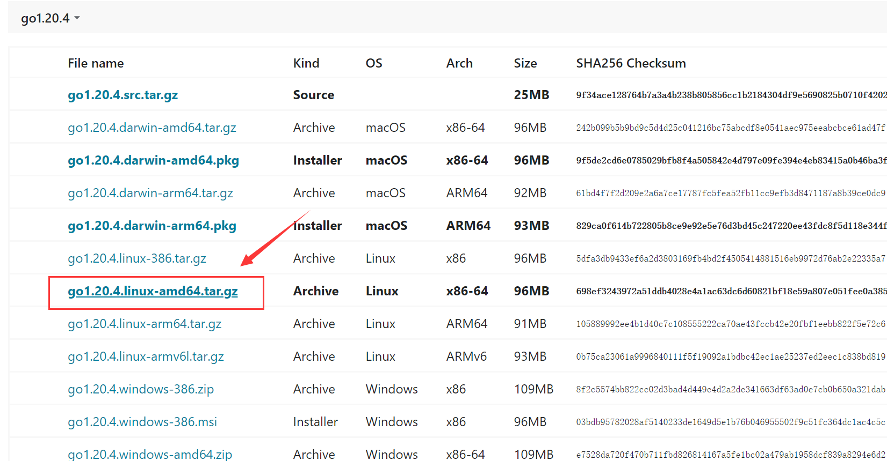
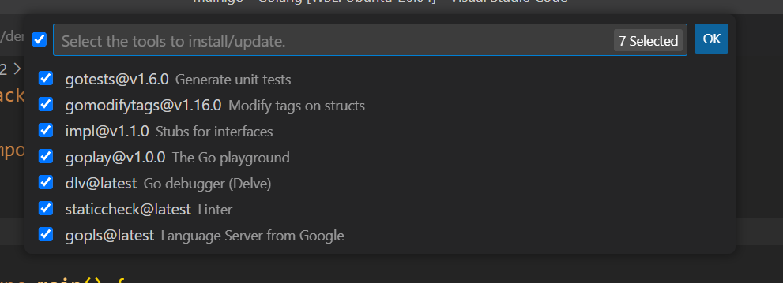

# 基于Cobra的Kubernetes插件开发指南

## 一、环境配置

（建议在Linux环境下开发）

### 1、Golang

#### （1）下载安装

从[官网](https://go.dev/dl/)下载`go1.20.4.linux-amd64.tar.gz`，上传到Linux系统（也可以直接wget指令）



执行如下指令解压：

```bash
$ sudo tar -C /usr/local -xzf go1.20.4.linux-amd64.tar.gz
```

因为这一步要修改`/usr/local`目录，需要root权限。

解压后可以在`/usr/local`目录下找到`go`目录（这里就是以后的`GOROOT`）

```bash
$ ls -l /usr/local | grep go
drwxr-xr-x 1 root root 4096 Apr 26 23:36 go
```

#### （2）配置

需要配置3项内容：环境变量GOROOT、环境变量GOPATH、与环境变量PATH（添加go相关目录）

这三项内容都是通过修改`/etc/profile`完成（root权限）：

```bash
$ sudo vi /etc/profile
```

添加如下两行：

```bash
export GOROOT=/usr/local/go
export GOPATH=/home/username/go		# 其中username是你的用户名（建议别用root）
```

并找到`export PATH`所在行并在原有基础上添加`$GOROOT/bin`与`$GOPATH/bin`，举个例子：

```bash
# 若原来的PATH如下
export PATH=$JAVA_HOME/bin:$JRE_HOME/bin:$PATH
# 则将其修改为：
export PATH=$JAVA_HOME/bin:$JRE_HOME/bin:$GOROOT/bin:$GOPATH/bin:$PATH
```

> Linux的PATH变量由多个entry组成，每个entry用`:`隔开

#### （3）测试

完成如上配置后，可以输入如下指令判断Golang环境是否正确：

```bash
$ go version
go version go1.20.4 linux/amd64
```

若正确显示版本则无误。

### 2、Go mod

Go mod不是一个需要安装的环境，是Golang自1.11版本后添加的一个特性，提供了类似maven的包管理能力。在较老的版本中，依赖管理是通过GOPATH手动管理的，同样新版本的go默认也是这种方式，如果想要使用go mod管理项目的依赖，需要进行如下配置：

#### （1）go env

设置如下三项内容：`GOBIN`、`GOPROXY`与`GO111MODULE`：

```bash
$ go env -w GOBIN=/usr/username/go/bin		# username为你的用户名，这个路径也就是$GOPATH/bin
$ go env -w GO111MODULE=on
$ go env -w GOPROXY="https://goproxy.cn,https://goproxy.io,direct"
```

设置完成后可通过`go env`指令查看是否成功：

```bash
$ go env | grep GOBIN
GOBIN="/home/jiadisu/go/bin"
$ go env | grep GOPROXY
GOPROXY="https://goproxy.cn,https://goproxy.io,direct"
$ go env | grep GO111
GO111MODULE="on"
```

#### （2）go mod init

上述go env仅仅完成了全局环境的配置，针对某个需要用go mod管理依赖的项目，还需要通过`go mod`进行初始化：

```bash
$ mkdir demo
$ cd demo
$ go mod init Demo	# 这里的Demo起的作用有点类似maven项目那个名字，为我们的项目设置一个坐标
```

至此Demo实现了go mod管理依赖。

#### （3）测试

（在vscode下就可以，vscode的Golang环境配置见后面）

创建一个Test项目：

```bash
$ mkdir test && cd test
$ go mod init Test
go: creating new go.mod: module Test
```

此时生成了一个`go.mod`文件，内容如下：

```tex
module Test

go 1.20

```

创建`main.go`如下：

```go
package main

import (
	"github.com/gin-gonic/gin"
)

func main() {
	r := gin.Default()
	r.GET("/ping", func(c *gin.Context) {
		c.JSON(200, gin.H{
			"message": "pong",
		})
	})
	r.Run() // listen and serve on 0.0.0.0:8080 (for windows "localhost:8080")
}

```

此时vscode可能会报错，因为找不到依赖`github.com/gin-gonic/gin`，执行如下命令：

```bash
$ go get
go: added github.com/bytedance/sonic v1.8.0
go: added github.com/chenzhuoyu/base64x v0.0.0-20221115062448-fe3a3abad311
go: added github.com/gin-contrib/sse v0.1.0
go: added github.com/gin-gonic/gin v1.9.0
go: added github.com/go-playground/locales v0.14.1
go: added github.com/go-playground/universal-translator v0.18.1
go: added github.com/go-playground/validator/v10 v10.11.2
go: added github.com/goccy/go-json v0.10.0
go: added github.com/json-iterator/go v1.1.12
go: added github.com/klauspost/cpuid/v2 v2.0.9
go: added github.com/leodido/go-urn v1.2.1
go: added github.com/mattn/go-isatty v0.0.17
go: added github.com/modern-go/concurrent v0.0.0-20180228061459-e0a39a4cb421
go: added github.com/modern-go/reflect2 v1.0.2
go: added github.com/pelletier/go-toml/v2 v2.0.6
go: added github.com/twitchyliquid64/golang-asm v0.15.1
go: added github.com/ugorji/go/codec v1.2.9
go: added golang.org/x/arch v0.0.0-20210923205945-b76863e36670
go: added golang.org/x/crypto v0.5.0
go: added golang.org/x/net v0.7.0
go: added golang.org/x/sys v0.5.0
go: added golang.org/x/text v0.7.0
go: added google.golang.org/protobuf v1.28.1
go: added gopkg.in/yaml.v3 v3.0.1
```

由于是go mod管理的依赖，项目会扫描获取安装所有的依赖，安装好之后vscode应该就不再报错了。（补充一句，go mod管理的依赖都在`$GOPATH/pkg/mod/`下可以找到）

执行：

```bash
$ go run main.go 
[GIN-debug] [WARNING] Creating an Engine instance with the Logger and Recovery middleware already attached.

[GIN-debug] [WARNING] Running in "debug" mode. Switch to "release" mode in production.
 - using env:   export GIN_MODE=release
 - using code:  gin.SetMode(gin.ReleaseMode)

[GIN-debug] GET    /ping                     --> main.main.func1 (3 handlers)
[GIN-debug] [WARNING] You trusted all proxies, this is NOT safe. We recommend you to set a value.
Please check https://pkg.go.dev/github.com/gin-gonic/gin#readme-don-t-trust-all-proxies for details.
[GIN-debug] Environment variable PORT is undefined. Using port :8080 by default
[GIN-debug] Listening and serving HTTP on :8080

```

访问`localhost:8080/ping`得到json字符串`{"message":"pong"}`，同时执行的终端下会有如下信息：

```bash
[GIN] 2023/05/15 - 22:37:42 | 200 |        75.3µs |             ::1 | GET      "/ping"
```

至此go mod搭建完成。

### 3、Cobra-CLI

Cobra是一个由Golang开发的命令行开发工具，可以方便地创建并实现命令行命令。Cobra-CLI是一个便于Cobra使用的脚手架，可以方便地创建一个项目框架。

可以去看原项目完整的[README](https://github.com/spf13/cobra-cli/blob/main/README.md)和[UserGuide](https://github.com/spf13/cobra/blob/main/user_guide.md)。

#### （1）安装

执行如下指令完成`cobra-cli`的安装：

```bash
$ go install github.com/spf13/cobra-cli@latest
```

安装完成后，可以在系统的`GOPATH/bin`下找到对应的文件：

```bash
$ ls -l /home/jiadisu/go/bin | grep cobra
-rwxr-xr-x 1 jiadisu jiadisu  8817295 May 15 18:06 cobra-cli
```

#### （2）配置

这一步配置其实在上面Golang配置的过程中已经配置过了，将`$GOPATH/bin`添加到系统的`PATH`中，从而可以在任何目录下执行`cobra-cli`指令。

#### （3）使用

创建一个myapp项目来介绍cobra-cli的使用：

```bash
$ mkdir myapp
$ cd myapp
```

第一步，初始化go mod：

```bash
$ go mod init myapp
go: creating new go.mod: module myapp
```

第二步，使用cobra脚手架初始化cobra：

```bash
$ cobra-cli init
Your Cobra application is ready at
/directory/myapp		# 其中directory是你的目录
```

此时脚手架结构如下：

```bash
$ tree
.
├── LICENSE
├── cmd
│   └── root.go
├── go.mod
└── main.go
```

简单介绍一下：

- main.go：入口函数，执行时执行这个；
- cmd：所有指令，每个文件对应了一个最终实现的指令；
- root.go：根指令，这个指令无效，不用管

第三步，执行

```bash
$ go run main.go 
A longer description that spans multiple lines and likely contains
examples and usage of using your application. For example:

Cobra is a CLI library for Go that empowers applications.
This application is a tool to generate the needed files
to quickly create a Cobra application.
```

此时相比原来会多出一个`go.sum`的文件，记录依赖（在run时会自动下载）。

第四步，添加指令

通过`cobra-cli add cmd`添加指令：

```bash
$ cobra-cli add serve					# 添加serve指令
serve created at /directory/myapp		# 其中directory是你的目录
```

执行serve指令：

```bash
$ go run main.go serve
serve called
```

到现在为止，完成初始化和添加指令，我们开发时添加指令即可。

#### （4）废话

初始化时，`--author`参数指定作者，`--license`参数指定license，例如我们的项目初始化时参数如下：

```bash
$ cobra-cli init --author "swz@fudan.edu.cn" --license apache
```

同样，添加指令时也可以指定：

```bash
$ cobra-cli add --author "jiadisu@fudan.edu.cn"
```

建议每个人添加不同指令时加上作者（文件中会有）：

```go
/*
Copyright © 2023 jiadisu@fudan.edu.cn

*/
```

## 二、vscode插件

参考：[vscode插件设置——Golang开发环境配置](https://juejin.cn/post/7121896806664896543)

建议用vscode进行开发（GoLand当然也可以），vscode可以安装这个插件：


安装好后还没有完成，这个插件有它依赖的其他包，按如下步骤安装：

`Ctrl + Shift + P`，打开搜索框，输入Go install，选择Install/Update Tools，出现如下选项：



全选然后点击OK。

如果安装失败（可能被墙了……），除了开vpn还有一种方式，利用先前设置的`GOPROXY`，

```bash
$ go env -w GOPROXY=https://goproxy.cn,https://goproxy.io,direct
```

然后清空缓存：

```bash
$ go clean --modcache
```

重新打开vscode，并安装上面的步骤全选安装，应该就会安装上了（全部都是SUCCEED）。

这时候应该就有正确的代码提示和报错了（可能有奇怪的报错，不用管）。

## 三、Cobra开发入门

见[Cobra入门](./note/Su/Cobra.md)

