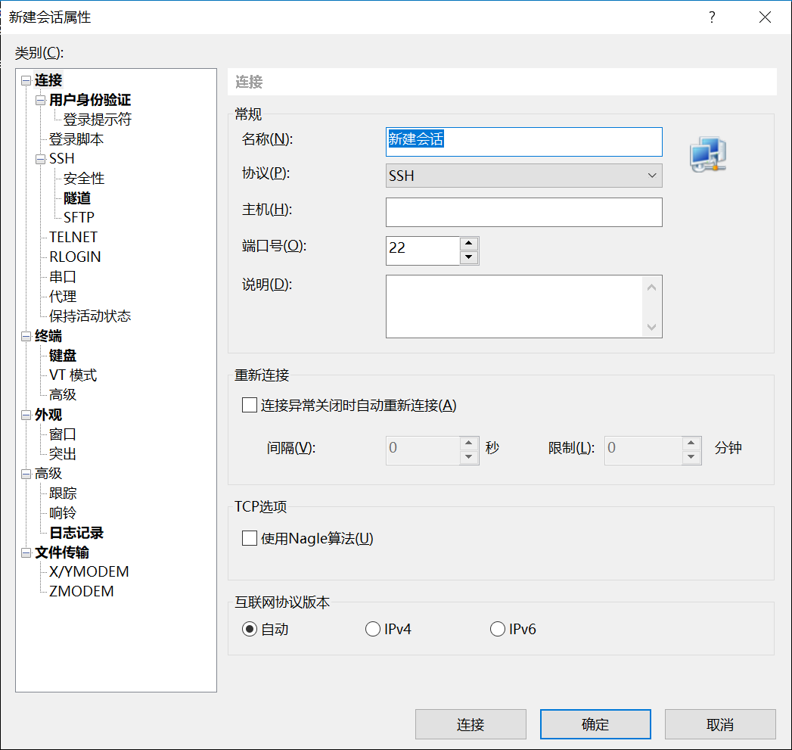
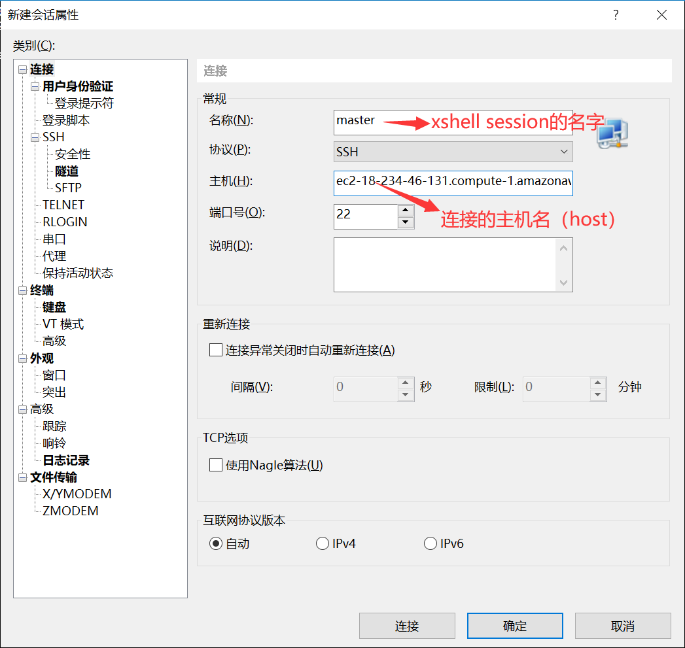
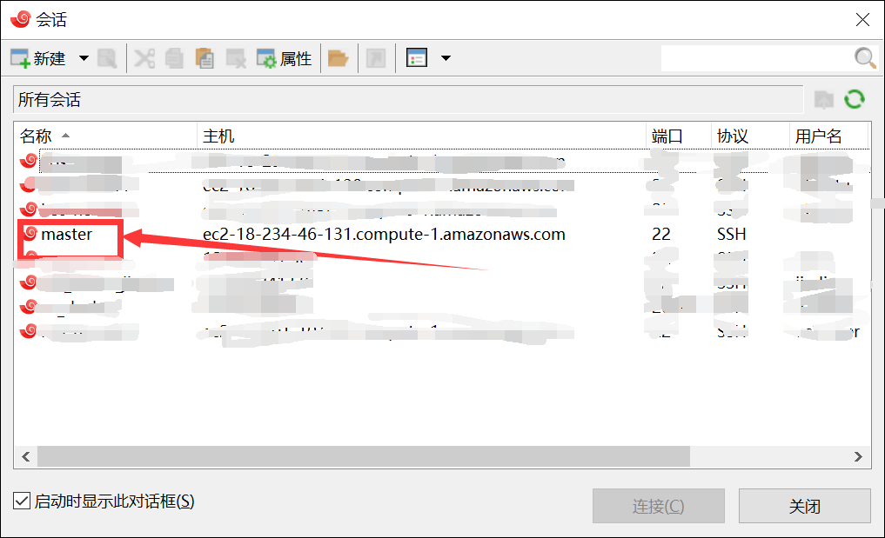
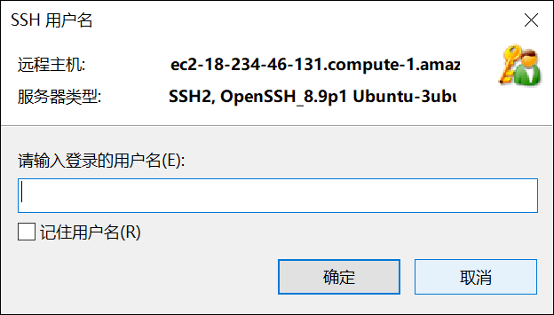
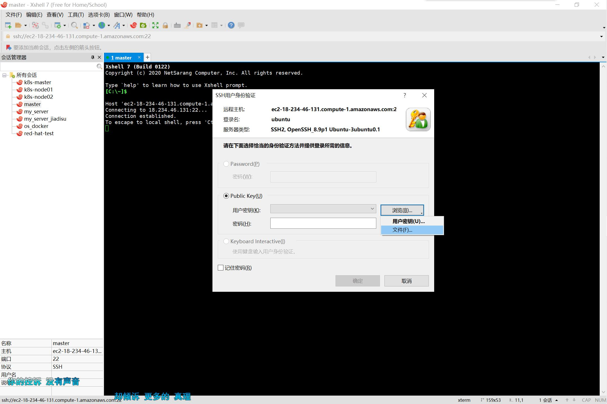
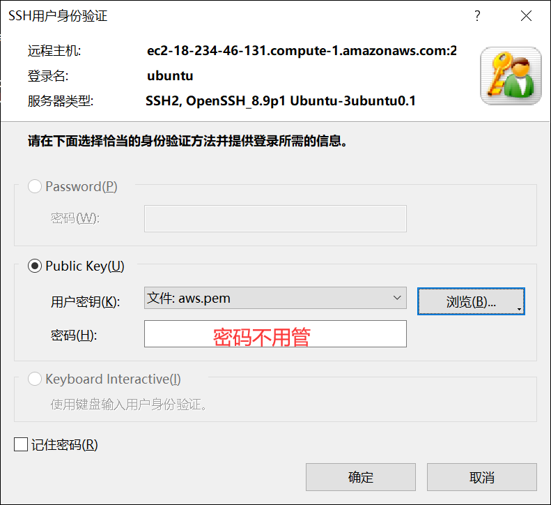
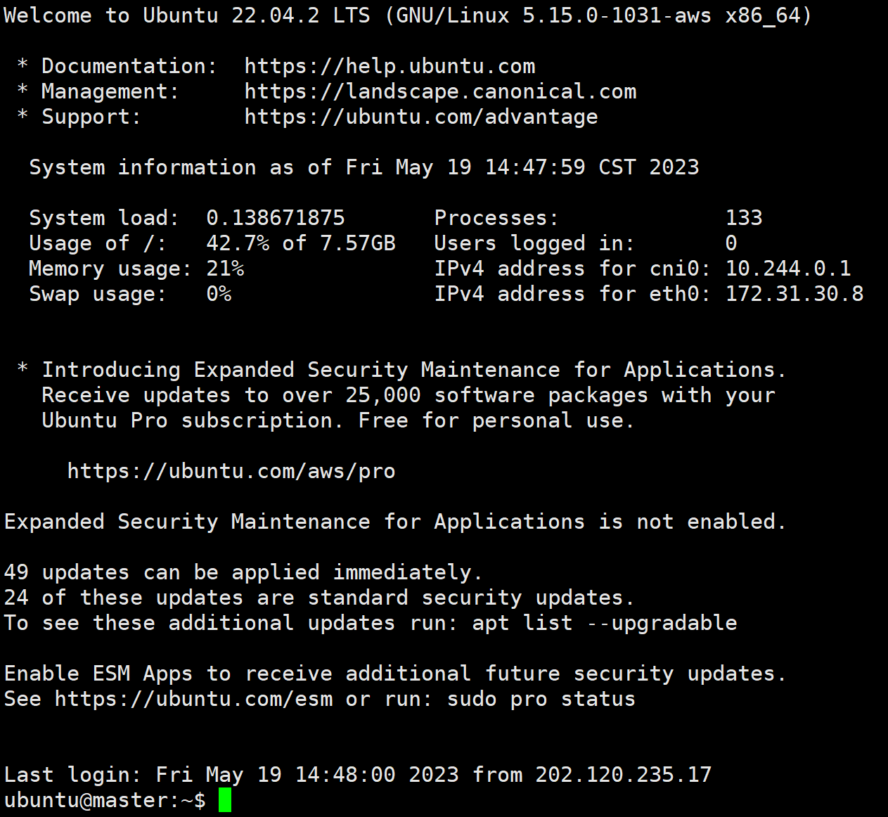

# 连接Kubernetes集群

搭建了一个由三台机器组成的集群，一个master两个node，Linux发行版为Ubuntu，内核版本5.15.0，可通过ssh连接。

### 参数

三个节点对应的ssh主机名，由于基于亚马逊的EC2平台，虚拟机每次重启后会重新分配公有IPv4 DNS，因此每次连接的参数可能不同，为了避免每次都需要人为询问，我部署了一个简单的[网页](http://121.36.241.50:20143)，访问该网页即可获取对应的IPv4 DNS进行连接。

连接用户名均为ubuntu

秘钥均为aws.pem（保存好）

### 连接

#### 方式一、xshell（推荐）

打开xshell，新建会话：



填写名称和主机（参照上面提供的参数）：



点击确定，会话的界面会出现刚才新建的master：



双击master，输入登陆的用户名，即ubuntu，然后确定



点击浏览，选择密钥，即aws.pem文件：



填写完如下，密码不用管，直接确定：



连接成功：



#### 方式二、命令行

ssh指令模板如下：

```bash
$ ssh -i "your key" username@host
```

其中：

- "your key"：本机上存放秘钥文件的路径；
- username：要登陆的用户名（ubuntu）；
- host：要登陆的主机，见上面的参数

例如要登陆master节点，在aws.pem所在的目录下：

```bash
$ ls -l | grep aws.pem
-rwxrwxrwx 1 jiadisu jiadisu  1674 May 18 23:34 aws.pem
# ssh指令，这一步要有root权限
$ ssh -i "aws.pem" ubuntu@ec2-18-234-46-131.compute-1.amazonaws.com
The authenticity of host 'ec2-18-234-46-131.compute-1.amazonaws.com (18.234.46.131)' can't be established.
ECDSA key fingerprint is SHA256:POaGxocKlBRj+dC7vMkjjo0PLwckOXM+U7tjFTMDBqU.
Are you sure you want to continue connecting (yes/no/[fingerprint])?	# yes
Warning: Permanently added 'ec2-18-234-46-131.compute-1.amazonaws.com,18.234.46.131' (ECDSA) to the list of known hosts.
Welcome to Ubuntu 22.04.2 LTS (GNU/Linux 5.15.0-1031-aws x86_64)

 * Documentation:  https://help.ubuntu.com
 * Management:     https://landscape.canonical.com
 * Support:        https://ubuntu.com/advantage

  System information as of Fri May 19 14:57:10 CST 2023

  System load:  0.1083984375      Processes:             132
  Usage of /:   42.7% of 7.57GB   Users logged in:       0
  Memory usage: 21%               IPv4 address for cni0: 10.244.0.1
  Swap usage:   0%                IPv4 address for eth0: 172.31.30.8


 * Introducing Expanded Security Maintenance for Applications.
   Receive updates to over 25,000 software packages with your
   Ubuntu Pro subscription. Free for personal use.

     https://ubuntu.com/aws/pro

Expanded Security Maintenance for Applications is not enabled.

49 updates can be applied immediately.
24 of these updates are standard security updates.
To see these additional updates run: apt list --upgradable

Enable ESM Apps to receive additional future security updates.
See https://ubuntu.com/esm or run: sudo pro status


Last login: Fri May 19 14:48:38 2023 from 202.120.235.17
ubuntu@master:~$			# 连接成功
```

### 提权

当需要执行root权限的指令时，直接sudo即可，这里的sudo不需要输入密码。

### 测试

当前集群部署了一个nginx服务，可以通过如下指令去查看

```bash
$ kubectl get pod
```

这两个服务对外暴露接口，通过NodePort的方式，绑定在宿主机的31905接口，可以通过如下方式访问：

```bash
$ curl node01:31905
```

一切正确的话应该会得到一个html文本：

```html
<!DOCTYPE html>
<html>
<head>
<title>Welcome to nginx!</title>
<style>
html { color-scheme: light dark; }
body { width: 35em; margin: 0 auto;
font-family: Tahoma, Verdana, Arial, sans-serif; }
</style>
</head>
<body>
<h1>Welcome to nginx!</h1>
<p>If you see this page, the nginx web server is successfully installed and
working. Further configuration is required.</p>

<p>For online documentation and support please refer to
<a href="http://nginx.org/">nginx.org</a>.<br/>
Commercial support is available at
<a href="http://nginx.com/">nginx.com</a>.</p>

<p><em>Thank you for using nginx.</em></p>
</body>
</html>
```